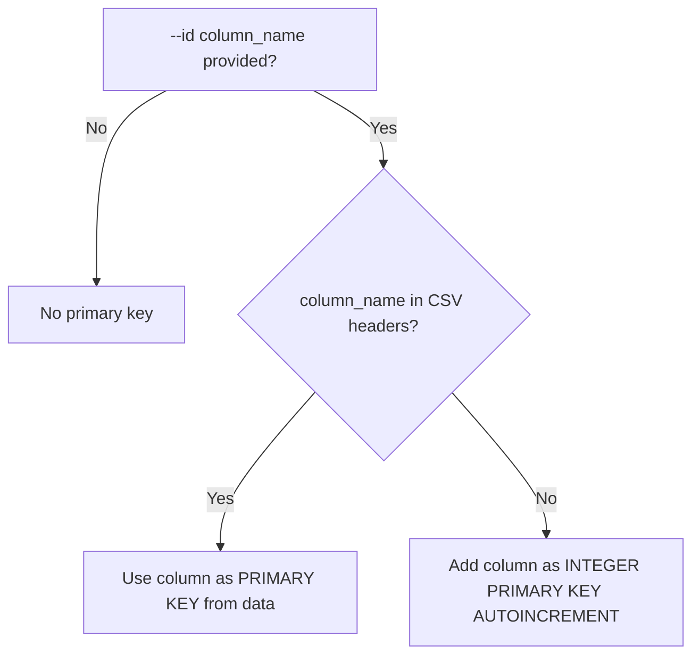
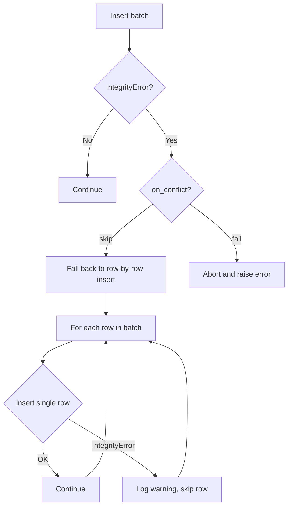
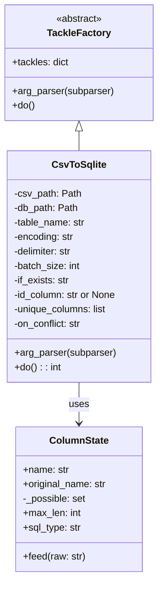
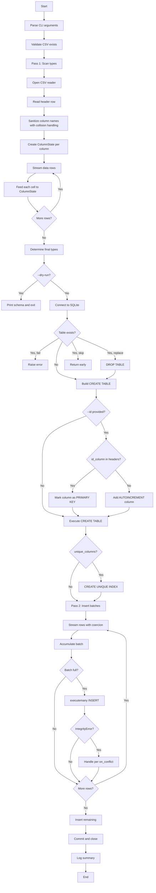

# CsvToSqlite Design Guide

**Status:** Planning  
**Created:** 2026-04-13

## Overview

`CsvToSqlite` is a tackle that streams **any CSV file with a header row** into a new SQLite table with automatic column type detection. It uses a two-pass streaming approach to ensure O(batch_size) peak memory regardless of file size.

### Key Features

- **Generic:** Works with any CSV file that has a header row
- **Two-pass streaming:** Pass 1 scans all rows to infer types; Pass 2 inserts in batches
- **Auto type detection:** DATETIME → INTEGER → REAL → TEXT(n) priority
- **Memory efficient:** Configurable batch size for insert operations
- **Smart ID handling:** Use existing column as primary key OR add auto-increment
- **Unique index support:** Optional unique constraint with duplicate handling
- **Column name sanitization:** Converts invalid characters to underscores
- **No pyTackle dependencies:** Standalone algorithm, no FileEntry or common module imports

## Type Detection Priority

Types are detected from most specific to least specific:

| Type | Pattern | Examples |
|------|---------|----------|
| `DATETIME` | ISO 8601 with optional timezone / 'Z' | `2024-06-15T12:00:00+00:00`, `2024-06-15T12:00:00Z` |
| `INTEGER` | Whole numbers with optional leading ± | `42`, `-100`, `+5` |
| `REAL` | Decimals with point or comma separator | `1.23`, `1,23` (European) |
| `TEXT(n)` | Fallback; n = max observed character length | any string |

### Type Detection Rules

1. Empty cells do not constrain type (treated as NULL)
2. Once a type is eliminated for a column, it cannot be added back
3. TEXT is the universal fallback and is never discarded
4. Comma-separated decimals (European format) are detected as REAL

## Column Name Sanitization

CSV headers may contain characters invalid for SQLite column names. The tackle sanitizes names:

### Sanitization Rules

1. Replace any character NOT in `[a-zA-Z0-9_]` with underscore `_`
2. Collapse consecutive underscores to single underscore
3. Strip leading/trailing underscores
4. If name starts with digit, prefix with underscore
5. If sanitized name is empty, use `col_N` where N is column index
6. **Collision handling:** If sanitized name already exists, use `col_N` instead

### Examples

| Original Header | Sanitized Name |
|-----------------|----------------|
| `First Name` | `First_Name` |
| `price ($)` | `price` |
| `création-date` | `cr_ation_date` |
| `123abc` | `_123abc` |
| `___` | `col_0` (if index 0) |
| `a, b, c` | `a_b_c` |
| `name` (collision) | `col_3` (if index 3 and `name` already taken) |

```python
def _sanitize_column_names(headers: list[str]) -> list[str]:
    """Sanitize column names for SQLite compatibility.
    
    Handles collisions by falling back to col_N naming.
    """
    import re
    result = []
    used_names: set[str] = set()
    
    for idx, raw in enumerate(headers):
        # Replace invalid chars with underscore
        name = re.sub(r'[^a-zA-Z0-9_]', '_', raw)
        # Collapse multiple underscores
        name = re.sub(r'_+', '_', name)
        # Strip leading/trailing underscores
        name = name.strip('_')
        # Handle empty result
        if not name:
            name = f'col_{idx}'
        # Prefix if starts with digit
        elif name[0].isdigit():
            name = f'_{name}'
        
        # Handle collision
        if name in used_names:
            name = f'col_{idx}'
        
        used_names.add(name)
        result.append(name)
    
    return result
```

## Primary Key / ID Column

Single option `--id` handles both scenarios intelligently:

| Option | Description |
|--------|-------------|
| `--id COLUMN` | Smart ID handling (see below) |

### Behavior

The `--id` option takes a column name and behaves differently based on whether that name exists in the CSV header:

| Scenario | Behavior |
|----------|----------|
| Column name **exists** in CSV header | Use that column as `PRIMARY KEY` (data from CSV, no auto-increment) |
| Column name **does NOT exist** in header | Add new column as `INTEGER PRIMARY KEY AUTOINCREMENT` |

### Examples

**Scenario 1: ID column exists in CSV**

CSV file `orders.csv`:
```csv
order_id,customer,total
1001,Alice,99.50
1002,Bob,150.00
```

Command:
```bash
pyTackle CsvToSqlite orders.csv shop.db --id order_id
```

Result:
```sql
CREATE TABLE "orders" (
    "order_id" INTEGER PRIMARY KEY,  -- from CSV data
    "customer" TEXT(5),
    "total" REAL
);
```

**Scenario 2: ID column does NOT exist in CSV**

CSV file `products.csv`:
```csv
name,price,stock
Widget,9.99,100
Gadget,19.99,50
```

Command:
```bash
pyTackle CsvToSqlite products.csv shop.db --id id
```

Result:
```sql
CREATE TABLE "products" (
    "id" INTEGER PRIMARY KEY AUTOINCREMENT,  -- auto-generated
    "name" TEXT(6),
    "price" REAL,
    "stock" INTEGER
);
```

### Decision Flow



## Unique Index Support

Optional feature to create a unique index on a column (separate from primary key).

| Option | Default | Description |
|--------|---------|-------------|
| `--unique COLUMN` | none | Column name(s) to create unique index on (comma-separated) |
| `--on-conflict ACTION` | `skip` | Action on uniqueness violation: `skip`, `fail` |

### On-Conflict Behavior

- **skip:** Log a warning and skip the row (continue processing)
- **fail:** Log an error and abort the entire import

When `--unique` is specified, the tackle creates a unique index:

```sql
CREATE UNIQUE INDEX "idx_tablename_colname" ON "tablename" ("colname");
```

For multi-column uniqueness:

```sql
-- With --unique "col1,col2"
CREATE UNIQUE INDEX "idx_tablename_col1_col2" ON "tablename" ("col1", "col2");
```

### Duplicate Handling Flow



## Progress Reporting

Uses **time-based progress reporting** (matching MediaIntegrityCheck pattern):

- Reports progress every **10 seconds** during insert phase
- Shows percentage, row counts, and skip count if applicable

```python
progress_interval = 10  # seconds
last_progress = time.monotonic()

for batch in batches:
    # ... insert batch ...
    
    now = time.monotonic()
    if now - last_progress >= progress_interval:
        pct = (inserted / total) * 100
        logger.info(
            'Progress: %d/%d (%.1f%%) | Skipped: %d',
            inserted, total, pct, skipped
        )
        last_progress = now
```

## Architecture

### Module Structure

```
tackles/CsvToSqlite.py          # Main tackle implementation (standalone)
tests/test_csv_to_sqlite.py     # Unit and integration tests
docs/CsvToSqlite.md             # User documentation
```

### Class Design



### Core Functions

```python
# Column name handling
def _sanitize_column_names(headers: list[str]) -> list[str]: ...

# Type detection predicates
def _is_datetime(value: str) -> bool: ...
def _is_int(value: str) -> bool: ...
def _is_float(value: str) -> bool: ...

# Value conversion
def _to_float(value: str) -> float: ...
def _coerce(value: str, col_type: str) -> int | float | str | None: ...

# SQL helpers
def _quote(name: str) -> str: ...

# Streaming helpers
def _iter_rows(csv_path, encoding, delimiter, skip_header) -> Iterator: ...
def _iter_batches(csv_path, encoding, delimiter, col_types, batch_size) -> Iterator: ...

# Pass 1
def _scan_types(csv_path, encoding, delimiter) -> tuple[list[str], list[ColumnState], int]: ...

# Main routine
def csv_to_sqlite(...) -> None: ...
```

### Processing Flow



## CLI Interface

```bash
pyTackle CsvToSqlite <csv_file> <db_file> [options]
```

### Positional Arguments

| Argument | Description |
|----------|-------------|
| `csv_file` | Input CSV file path (must have header row) |
| `db_file` | Output SQLite database path |

### Optional Arguments

| Option | Default | Description |
|--------|---------|-------------|
| `-t, --table NAME` | CSV filename stem | Target table name |
| `-d, --delimiter CHAR` | `,` | CSV field delimiter |
| `-e, --encoding ENC` | `utf-8-sig` | CSV file encoding (utf-8-sig strips Excel BOM) |
| `-b, --batch-size N` | 500 | Number of rows per INSERT batch |
| `--if-exists ACTION` | `fail` | Action when table exists: fail, replace, skip |
| `--id COLUMN` | none | Primary key column (use existing or add auto-increment) |
| `--unique COLUMNS` | none | Column(s) to create unique index on (comma-separated) |
| `--on-conflict ACTION` | `skip` | Action on uniqueness violation: skip, fail |
| `--dry-run` | off | Preview detected types and schema without writing to database |
| `--log-level LEVEL` | `INFO` | Logging verbosity: DEBUG, INFO, WARNING, ERROR |
| `-v` | - | Verbose output (same as --log-level DEBUG) |

## Implementation Notes

### Header Row Requirement

The first row of the CSV is **always** treated as the header containing column names. These names become:
- SQLite column names (sanitized and properly quoted)
- Used for logging detected types

### Python Compatibility

Remove the `#!/usr/bin/env python3.14` shebang — rely on pyTackle's entry point system for invocation.

### SQLite Pragmas

The following pragmas optimize write performance:
- `PRAGMA journal_mode = WAL;` — Write-Ahead Logging for better concurrency
- `PRAGMA synchronous = NORMAL;` — Balance between safety and speed

### Error Handling

- `FileNotFoundError` if CSV doesn't exist
- `ValueError` if table exists and `if_exists='fail'`
- `sqlite3.IntegrityError` on unique constraint violation (handled per `--on-conflict`)
- Graceful handling of malformed CSV rows (log and skip)

### Progress Reporting

- Time-based: reports every 10 seconds during insert phase
- Shows: percentage, inserted count, total count, skipped count
- DEBUG level logs each batch completion
- INFO level logs summary statistics

## Testing Strategy

### Unit Tests

1. **Column name sanitization:**
   - Various special characters replaced with underscore
   - Consecutive underscores collapsed
   - Leading/trailing underscores stripped
   - Digit-starting names prefixed
   - Empty result → col_N
   - Collision → col_N fallback

2. **Type detection predicates:**
   - `_is_datetime()` with various ISO 8601 formats, 'Z' suffix, timezones
   - `_is_int()` with positive, negative, edge cases
   - `_is_float()` with point and comma separators

3. **ColumnState class:**
   - Initial state has all types possible
   - Feeding values eliminates incompatible types
   - Empty values don't affect type detection
   - `sql_type` returns most specific surviving type
   - `max_len` tracks maximum string length

4. **Coercion functions:**
   - `_to_float()` handles both point and comma decimals
   - `_coerce()` maps to correct Python types

5. **SQL identifier quoting:**
   - Handles special characters in column names
   - Escapes embedded double quotes

### Integration Tests

1. **Simple CSV import:**
   - Create temp CSV with header + data, import to temp SQLite
   - Verify table structure and data

2. **ID from existing column:**
   - Import with `--id existing_column`
   - Verify column is PRIMARY KEY (no auto-increment)

3. **ID as new auto-increment:**
   - Import with `--id new_column` (not in CSV)
   - Verify column is INTEGER PRIMARY KEY AUTOINCREMENT

4. **Unique index:**
   - Import with `--unique column_name`
   - Verify unique index exists
   - Duplicate handling with `--on-conflict skip`
   - Duplicate handling with `--on-conflict fail`

5. **Column name sanitization:**
   - Headers with spaces, special chars, digits
   - Verify sanitized names in SQLite schema
   - Verify collision handling (col_N fallback)

6. **if_exists behaviors:**
   - `fail`: raises when table exists
   - `replace`: drops and recreates
   - `skip`: returns without error

7. **Edge cases:**
   - Empty CSV file (header only, no data)
   - Unicode content in headers and data
   - Very long text values
   - European decimal format (comma separator)

8. **Canonical format compatibility tests:**
   - Create CSV matching FileEntry schema (10 cols) → verify loads correctly
   - Create CSV matching DebugLog schema (18 cols) → verify loads correctly

### Fixtures

```python
@pytest.fixture
def temp_csv(tmp_path) -> Callable:
    """Factory fixture to create temporary CSV files."""
    def _make_csv(headers: list[str], rows: list[list[str]]) -> Path:
        path = tmp_path / 'test.csv'
        with open(path, 'w', newline='') as f:
            writer = csv.writer(f)
            writer.writerow(headers)
            writer.writerows(rows)
        return path
    return _make_csv

@pytest.fixture
def temp_db(tmp_path) -> Path:
    """Provide a temporary SQLite database path."""
    return tmp_path / 'test.db'
```

## File Deliverables

1. **`tackles/CsvToSqlite.py`** — Main implementation
   - Follow TackleFactory pattern for CLI integration
   - Self-contained algorithm (no common module dependencies for core logic)
   - Comprehensive docstrings

2. **`tests/test_csv_to_sqlite.py`** — Test suite
   - Unit tests for sanitization and type detection
   - Integration tests for CSV → SQLite flow
   - Compatibility tests with FileEntry and DebugLog schemas

3. **`docs/CsvToSqlite.md`** — User documentation
   - Usage examples
   - CLI reference
   - Type detection explanation
   - Column sanitization rules

4. **Update `docs/README.md`** — Add to available tackles table

## Example Usage

```bash
# Basic usage - table name from filename
pyTackle CsvToSqlite sales.csv analytics.db

# Custom table name
pyTackle CsvToSqlite data.csv shop.db -t orders

# Semicolon-delimited CSV (e.g., European export)
pyTackle CsvToSqlite export.csv warehouse.db -d ";"

# Large file with bigger batches
pyTackle CsvToSqlite bigfile.csv results.db -b 5000

# Use existing column as primary key
pyTackle CsvToSqlite orders.csv shop.db --id order_id

# Add auto-increment ID (column not in CSV)
pyTackle CsvToSqlite products.csv shop.db --id id

# Add unique constraint on email column
pyTackle CsvToSqlite users.csv app.db --unique email

# ID from CSV + unique on different column
pyTackle CsvToSqlite contacts.csv crm.db --id user_id --unique email

# Fail on duplicate (abort entire import)
pyTackle CsvToSqlite orders.csv shop.db --unique order_id --on-conflict fail

# Replace existing table
pyTackle CsvToSqlite updated.csv analytics.db --if-exists replace

# Debug mode to see detected types
pyTackle CsvToSqlite data.csv output.db --log-level DEBUG

# Dry run - preview schema without writing to database
pyTackle CsvToSqlite data.csv output.db --dry-run
```

## Sample Output

```
12:30:45  INFO      Source   : sales.csv
12:30:45  INFO      Target   : analytics.db  →  table 'sales'
12:30:45  INFO      Encoding : utf-8-sig  |  Delimiter : ','  |  Batch : 500
12:30:45  INFO      Options  : id=None | unique=None | on_conflict=skip
12:30:45  INFO      Pass 1/2 – scanning column types …
12:30:46  DEBUG     Pass 1 complete – 10000 rows scanned
12:30:46  INFO      Detected 5 column(s) across 10000 row(s):
12:30:46  INFO        'timestamp'                           →  DATETIME
12:30:46  INFO        'product_id'                          →  INTEGER
12:30:46  INFO        'quantity'                            →  INTEGER
12:30:46  INFO        'price'                               →  REAL
12:30:46  INFO        'description'                         →  TEXT(256)
12:30:46  INFO      Pass 2/2 – inserting rows in batches of 500 …
12:30:56  INFO      Progress: 5000/10000 (50.0%) | Skipped: 0
12:31:06  INFO      Progress: 10000/10000 (100.0%) | Skipped: 0
12:31:06  INFO      Done – 10000 rows inserted into table 'sales'.
```

### Sample Output with ID from CSV

```
12:30:45  INFO      Source   : orders.csv
12:30:45  INFO      Target   : shop.db  →  table 'orders'
12:30:45  INFO      Options  : id=order_id (from CSV) | unique=None | on_conflict=skip
12:30:46  INFO      Column 'order_id' found in CSV – using as PRIMARY KEY
...
```

### Sample Output with Auto-Increment ID

```
12:30:45  INFO      Source   : products.csv
12:30:45  INFO      Target   : shop.db  →  table 'products'
12:30:45  INFO      Options  : id=id (auto-increment) | unique=None | on_conflict=skip
12:30:46  INFO      Column 'id' not in CSV – adding as INTEGER PRIMARY KEY AUTOINCREMENT
...
```

### Sample Output with Unique Violations

```
12:30:45  INFO      Source   : contacts.csv
12:30:45  INFO      Target   : crm.db  →  table 'contacts'
12:30:45  INFO      Options  : id=None | unique=['email'] | on_conflict=skip
12:30:46  INFO      Pass 1/2 – scanning column types …
12:30:46  INFO      Detected 3 column(s) across 1000 row(s)
12:30:46  INFO      Pass 2/2 – inserting rows in batches of 500 …
12:30:47  WARNING   Skipping duplicate row (email='john@example.com') at line 423
12:30:47  WARNING   Skipping duplicate row (email='jane@example.com') at line 567
12:30:56  INFO      Progress: 1000/1000 (100.0%) | Skipped: 2
12:30:56  INFO      Done – 998 rows inserted, 2 skipped due to unique constraint.
```

### Sample Output with Dry Run

```
12:30:45  INFO      Source   : data.csv
12:30:45  INFO      Target   : output.db  →  table 'data' (DRY RUN)
12:30:45  INFO      Encoding : utf-8-sig  |  Delimiter : ','  |  Batch : 500
12:30:45  INFO      Pass 1/2 – scanning column types …
12:30:46  INFO      Detected 5 column(s) across 10000 row(s):
12:30:46  INFO        'timestamp'                           →  DATETIME
12:30:46  INFO        'product_id'                          →  INTEGER
12:30:46  INFO        'quantity'                            →  INTEGER
12:30:46  INFO        'price'                               →  REAL
12:30:46  INFO        'description'                         →  TEXT(256)
12:30:46  INFO
12:30:46  INFO      [DRY RUN] Would create table with schema:
12:30:46  INFO      CREATE TABLE "data" (
12:30:46  INFO          "timestamp" DATETIME,
12:30:46  INFO          "product_id" INTEGER,
12:30:46  INFO          "quantity" INTEGER,
12:30:46  INFO          "price" REAL,
12:30:46  INFO          "description" TEXT(256)
12:30:46  INFO      );
12:30:46  INFO
12:30:46  INFO      [DRY RUN] Would insert 10000 rows. No database written.
```

---

## Approval Checklist

- [ ] Design reviewed
- [ ] CLI interface approved
- [ ] Testing strategy approved
- [ ] Ready for implementation in Code mode
