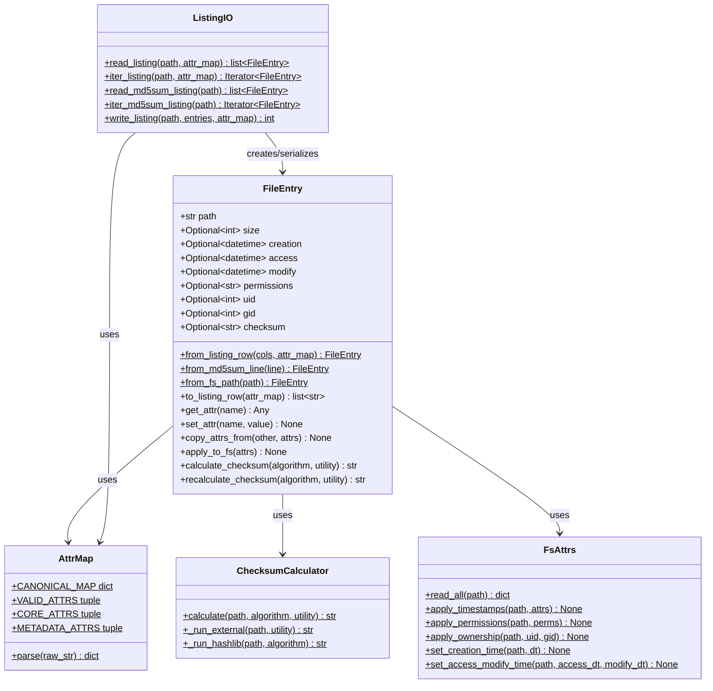
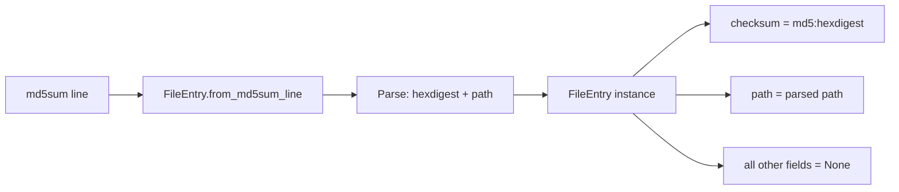
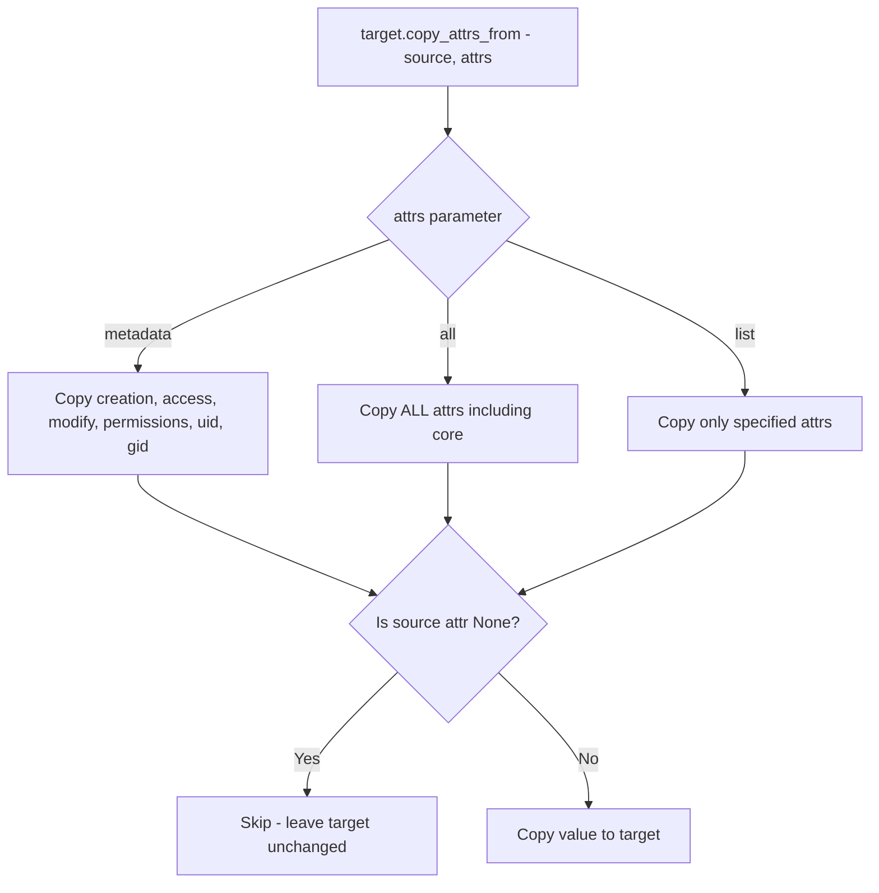
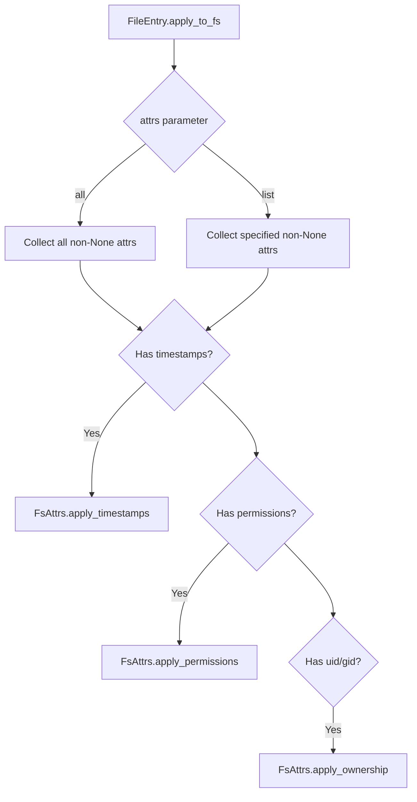
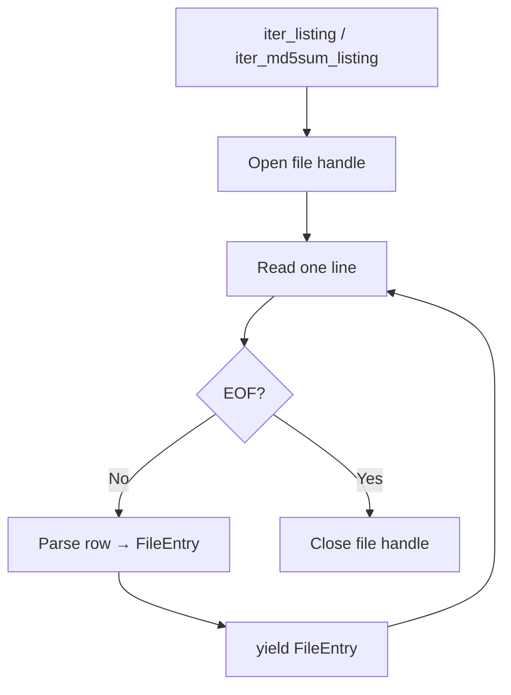
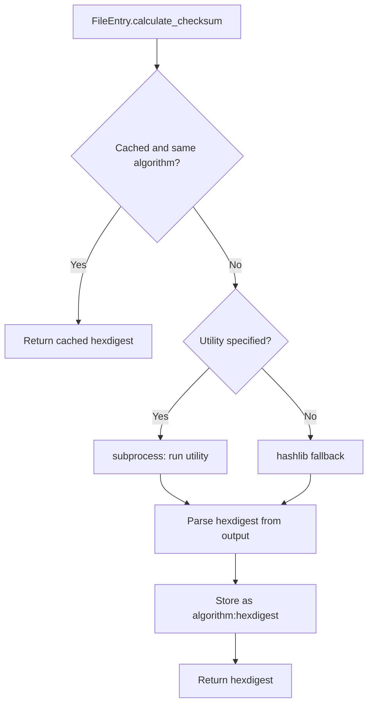

# FileEntry Object Model — Architecture Plan

## Overview

A shared `FileEntry` class living in a new `common/` package that represents a filesystem entry with rich metadata. It serves as the canonical data object for all tackles that need to reason about files — their paths, timestamps, permissions, sizes, and checksums.

The class supports:
- Construction from a CSV listing row (with configurable `--attr-map` column mapping)
- Construction from a native `md5sum` bulk format line (`<checksum>  <path>`)
- Construction from a real filesystem path (reading attributes via `os.stat`)
- Getting/setting individual attributes (returning `None` for unknown attrs)
- Copying selected or all metadata attributes from another `FileEntry`
- Applying a selected subset of attributes back to the real filesystem
- Calculating checksums via an external utility (e.g. `md5sum`), with caching
- Serializing to/from a canonical CSV listing format
- Streaming row-by-row reading for extremely large listings

---

## Package Structure

```
pyTackle/
├── common/
│   ├── __init__.py          # re-exports FileEntry and key helpers
│   ├── FileEntry.py         # FileEntry dataclass + factory methods
│   ├── attr_map.py          # --attr-map parsing, column mapping, meta-selectors
│   ├── checksum.py          # external checksum utility wrapper with caching
│   ├── fs_attrs.py          # read/apply filesystem attributes (timestamps, perms, uid/gid)
│   └── listing.py           # canonical CSV format: serialize/deserialize FileEntry rows
├── tackles/
│   ├── __init__.py
│   ├── _cli.py
│   ├── TackleFactory.py
│   ├── SetCreationTime.py   # future: refactor to use FileEntry
│   ├── CopyValidateMD5.py   # future: refactor to use FileEntry
│   └── ...
├── pyproject.toml            # updated to include common* in package discovery
└── ...
```

---

## Canonical CSV Listing Format

A header-less CSV where each column has a well-known position. Unknown/missing values are represented as empty strings. **Path is the last column** so that paths containing commas or special characters are easier to handle at the tail of the row.

| Column | Name         | Type / Format                                         | Example                              |
|--------|--------------|-------------------------------------------------------|--------------------------------------|
| 0      | `size`       | Integer bytes                                         | `1048576`                            |
| 1      | `creation`   | ISO 8601 with TZ: `YYYY-MM-DDTHH:MM:SS.ffffff+ZZ:ZZ` | `2020-08-20T06:15:03.491092+00:00`   |
| 2      | `access`     | ISO 8601 with TZ                                      | `2025-04-12T22:04:56.241322+00:00`   |
| 3      | `modify`     | ISO 8601 with TZ                                      | `2025-04-12T23:09:56.410644+00:00`   |
| 4      | `permissions`| Octal string                                          | `0755`                               |
| 5      | `uid`        | Integer                                               | `1000`                               |
| 6      | `gid`        | Integer                                               | `1000`                               |
| 7      | `checksum`   | `algorithm:hexdigest`                                 | `md5:d41d8cd98f00b204e9800998ecf8427e` |
| 8      | `path`       | Relative path, quoted if needed                       | `photos/2020/img.jpg`                |

**Design rationale:**
- **Path is last** (column 8) — paths may contain commas, quotes, or other special characters; placing them last simplifies parsing and visual inspection of the fixed-width metadata columns
- ISO 8601 timestamps are unambiguous, sortable, and include timezone
- Checksum includes algorithm prefix for future extensibility (sha256, etc.)
- Empty string = attribute not known/not applicable

### Default attr-map for canonical format

```
size:0, creation:1, access:2, modify:3, permissions:4, uid:5, gid:6, checksum:7, path:8
```

When reading non-canonical CSVs (e.g. the existing SetCreationTime formats), the user provides a custom `--attr-map` that maps only the columns that exist.

### Native md5sum bulk format

The class also supports loading from the standard `md5sum` output format:

```
d41d8cd98f00b204e9800998ecf8427e  photos/2020/img.jpg
e99a18c428cb38d5f260853678922e03  photos/2020/img2.jpg
```

This is a plaintext format with `<hexdigest>  <path>` (two spaces between checksum and path). When loading from this format, only `checksum` and `path` are populated; all other fields remain `None`.

---

## Core vs Metadata Attributes

Attributes are classified into two categories:

| Category | Attributes | Description |
|----------|-----------|-------------|
| **Core** | `path`, `checksum`, `size` | Define the identity of a specific file — these uniquely identify the exact file content and location |
| **Metadata** | `creation`, `access`, `modify`, `permissions`, `uid`, `gid` | Describe properties of the file that can be transferred between entries |

This distinction matters for the `copy_attrs_from()` method: by default it copies only **metadata** attributes, never core attributes. Core attributes define *which* file this is; metadata describes *how* it is stored.

---

## FileEntry Class Design



---

## Module Details

### `common/FileEntry.py`

The core dataclass with factory methods and instance operations.

```python
@dataclass
class FileEntry:
    path: str
    size: Optional[int] = None
    creation: Optional[datetime] = None
    access: Optional[datetime] = None
    modify: Optional[datetime] = None
    permissions: Optional[str] = None   # octal string e.g. "0755"
    uid: Optional[int] = None
    gid: Optional[int] = None
    checksum: Optional[str] = None      # "algorithm:hexdigest"
```

#### Constants

```python
# Core attributes — define file identity, not copyable by default
CORE_ATTRS = ('path', 'checksum', 'size')

# Metadata attributes — transferable between entries
METADATA_ATTRS = ('creation', 'access', 'modify', 'permissions', 'uid', 'gid')

# All attributes
ALL_ATTRS = CORE_ATTRS + METADATA_ATTRS
```

#### Factory Methods

**`from_listing_row(cols: list[str], attr_map: dict[str, str]) -> FileEntry`**
- Takes a list of CSV column values and an attr-map dict
- For each attr in attr_map, extracts the value from the corresponding column index
- Parses types appropriately: `int` for size/uid/gid, `datetime.fromisoformat` for timestamps, `str` for path/permissions/checksum
- Unknown/empty columns → `None`

**`from_md5sum_line(line: str) -> FileEntry`**
- Parses a single line in native `md5sum` format: `<hexdigest>  <path>`
- Sets `checksum` to `"md5:<hexdigest>"` and `path` to the parsed path
- All other fields remain `None`
- Raises `ValueError` if the line does not match the expected format

**`from_fs_path(path: str) -> FileEntry`**
- Calls `os.lstat(path)` to read all available attributes
- Populates size, timestamps, permissions, uid, gid from stat result
- Does NOT calculate checksum automatically (expensive operation)
- Uses `st_birthtime` on macOS/Windows for creation, falls back to `st_ctime` on Linux

#### Instance Methods

**`get_attr(name: str) -> Any`**
- Returns the value of the named attribute, or `None` if not set
- Validates attribute name against known set

**`set_attr(name: str, value: Any) -> None`**
- Sets the named attribute to the given value
- Accepts `None` to clear an attribute
- Validates attribute name and type
- Rejects setting `checksum` directly — must use `calculate_checksum()` / `recalculate_checksum()`

**`copy_attrs_from(other: FileEntry, attrs: list[str] | str = 'metadata') -> None`**
- Copies attribute values from another `FileEntry` instance into this one
- `attrs='metadata'` (default) — copies all metadata attrs (`creation`, `access`, `modify`, `permissions`, `uid`, `gid`), skipping core attrs (`path`, `checksum`, `size`)
- `attrs='all'` — copies ALL attributes including core (use with caution)
- `attrs=['modify', 'permissions', 'uid']` — copies only the specified attrs
- Only copies non-`None` values from `other`; if `other.uid` is `None`, `self.uid` is left unchanged
- Core attrs (`path`, `checksum`, `size`) are rejected unless explicitly listed or `attrs='all'`

**`apply_to_fs(attrs: list[str] | str = 'all') -> None`**
- Applies selected attributes to the real filesystem at `self.path`
- `attrs='all'` applies all non-null attributes
- `attrs=['modify', 'permissions']` applies only those
- Delegates to `FsAttrs` module functions
- Skips any attribute that is `None`
- Raises appropriate errors for unsupported operations (e.g. creation time on Linux)

**`calculate_checksum(algorithm: str = 'md5', utility: str | None = None) -> str`**
- If `self.checksum` is already set and matches the requested algorithm, returns cached value
- Otherwise calculates via external utility or hashlib fallback
- Stores result in `self.checksum` as `"algorithm:hexdigest"`
- Returns the hexdigest string

**`recalculate_checksum(algorithm: str = 'md5', utility: str | None = None) -> str`**
- Always recalculates, ignoring cached value
- Updates `self.checksum`
- Returns the hexdigest string

**`to_listing_row(attr_map: dict[str, str] | None = None) -> list[str]`**
- Serializes the entry to a list of string values
- If `attr_map` is None, uses canonical column order (path last)
- Formats datetimes as ISO 8601, ints as strings, None as empty string

---

### `common/attr_map.py`

Reuses and generalizes the `--attr-map` parsing from [`SetCreationTime.py`](tackles/SetCreationTime.py:257).

```python
# All valid attribute names for FileEntry
VALID_ATTRS = ('path', 'size', 'creation', 'access', 'modify',
               'permissions', 'uid', 'gid', 'checksum')

# Core vs metadata classification
CORE_ATTRS = ('path', 'checksum', 'size')
METADATA_ATTRS = ('creation', 'access', 'modify', 'permissions', 'uid', 'gid')

# Datetime attributes (eligible for meta-selectors)
DATETIME_ATTRS = ('creation', 'access', 'modify')

# Meta-selectors for datetime attributes
META_SELECTORS = ('earliest', 'latest')
_SELECTOR_ALIASES = {'e': 'earliest', 'l': 'latest'}

# Canonical column mapping (path last)
CANONICAL_MAP = {
    'size': '0', 'creation': '1', 'access': '2', 'modify': '3',
    'permissions': '4', 'uid': '5', 'gid': '6', 'checksum': '7',
    'path': '8',
}

def parse_attr_map(raw: str) -> dict[str, str]:
    """Parse 'attr:selector[,attr:selector,...]' into {attr: selector} dict.

    Selectors: 0-based column index, or 'earliest'/'latest' (aliases 'e'/'l')
    for datetime attributes only.
    """
    ...
```

**Key difference from current implementation**: supports all `VALID_ATTRS`, not just the three datetime attrs. Meta-selectors (`earliest`/`latest`) are only valid for datetime attributes (`creation`, `access`, `modify`).

---

### `common/checksum.py`

```python
def calculate(path: str, algorithm: str = 'md5',
              utility: str | None = None) -> str:
    """Calculate checksum of file at path.

    If utility is provided (e.g. 'md5sum', 'shasum'), runs it as subprocess.
    Otherwise falls back to hashlib.

    Returns hexdigest string.
    """
    if utility:
        return _run_external(path, utility)
    return _run_hashlib(path, algorithm)

def _run_external(path: str, utility: str) -> str:
    """Run external checksum utility and parse output.

    Expects standard output format: <hexdigest>  <filename>
    (as produced by md5sum, sha256sum, etc.)
    """
    ...

def _run_hashlib(path: str, algorithm: str) -> str:
    """Calculate checksum using Python hashlib as fallback."""
    ...
```

---

### `common/fs_attrs.py`

Consolidates filesystem attribute operations. Reuses patterns from [`SetCreationTime.py`](tackles/SetCreationTime.py:400) for timestamp setting.

```python
def read_all(path: str) -> dict:
    """Read all available filesystem attributes from path.

    Returns dict with keys matching FileEntry field names.
    """
    st = os.lstat(path)
    return {
        'size': st.st_size,
        'creation': _stat_creation_time(st),
        'access': datetime.fromtimestamp(st.st_atime, tz=timezone.utc),
        'modify': datetime.fromtimestamp(st.st_mtime, tz=timezone.utc),
        'permissions': oct(stat.S_IMODE(st.st_mode)),
        'uid': st.st_uid,
        'gid': st.st_gid,
    }

def apply_timestamps(path: str, attrs: dict) -> None:
    """Apply creation/access/modify timestamps to path."""
    if 'creation' in attrs and attrs['creation'] is not None:
        set_creation_time(path, attrs['creation'])
    access_dt = attrs.get('access')
    modify_dt = attrs.get('modify')
    if access_dt is not None or modify_dt is not None:
        set_access_modify_time(path, access_dt, modify_dt)

def apply_permissions(path: str, perms: str) -> None:
    """Apply permission string (octal) to path."""
    os.chmod(path, int(perms, 8))

def apply_ownership(path: str, uid: int | None, gid: int | None) -> None:
    """Apply uid/gid to path. Requires appropriate privileges."""
    current_uid = os.stat(path).st_uid if uid is None else uid
    current_gid = os.stat(path).st_gid if gid is None else gid
    os.chown(path, current_uid, current_gid)

# Platform-specific creation time setters (moved from SetCreationTime.py)
def set_creation_time(path: str, dt: datetime) -> None: ...
def set_creation_time_windows(path: str, dt: datetime) -> None: ...
def set_creation_time_macos(path: str, dt: datetime) -> None: ...
def set_access_modify_time(path, access_dt, modify_dt) -> None: ...
```

---

### `common/listing.py`

CSV I/O for `FileEntry` objects. Provides both bulk and streaming interfaces.

```python
def read_listing(
    listing_path: str,
    attr_map: dict[str, str] | None = None,
    encoding: str = 'utf-8-sig',
) -> list[FileEntry]:
    """Read a CSV listing and return all FileEntry objects at once.

    If attr_map is None, assumes canonical format.
    Loads entire file into memory — use iter_listing() for large files.
    """
    return list(iter_listing(listing_path, attr_map, encoding))


def iter_listing(
    listing_path: str,
    attr_map: dict[str, str] | None = None,
    encoding: str = 'utf-8-sig',
) -> Iterator[FileEntry]:
    """Yield FileEntry objects one row at a time from a CSV listing.

    Memory-efficient for extremely large listings — only one row
    is in memory at a time.

    If attr_map is None, assumes canonical format.
    """
    ...


def read_md5sum_listing(
    listing_path: str,
    encoding: str = 'utf-8-sig',
) -> list[FileEntry]:
    """Read a native md5sum bulk file and return all FileEntry objects.

    Format: <hexdigest>  <path> (two spaces between checksum and path)
    Loads entire file into memory — use iter_md5sum_listing() for large files.
    """
    return list(iter_md5sum_listing(listing_path, encoding))


def iter_md5sum_listing(
    listing_path: str,
    encoding: str = 'utf-8-sig',
) -> Iterator[FileEntry]:
    """Yield FileEntry objects one line at a time from a md5sum bulk file.

    Memory-efficient streaming for large checksum files.
    """
    ...


def write_listing(
    output_path: str,
    entries: list[FileEntry] | Iterator[FileEntry],
    attr_map: dict[str, str] | None = None,
    encoding: str = 'utf-8',
) -> int:
    """Write FileEntry objects to a CSV listing.

    Returns number of entries written.
    If attr_map is None, uses canonical format (path last).
    Accepts both lists and iterators for streaming writes.
    """
    ...
```

---

### `common/__init__.py`

```python
from common.FileEntry import FileEntry
from common.attr_map import (
    parse_attr_map, VALID_ATTRS, CANONICAL_MAP,
    CORE_ATTRS, METADATA_ATTRS,
)
from common.listing import (
    read_listing, iter_listing,
    read_md5sum_listing, iter_md5sum_listing,
    write_listing,
)

__all__ = [
    'FileEntry',
    'parse_attr_map', 'VALID_ATTRS', 'CANONICAL_MAP',
    'CORE_ATTRS', 'METADATA_ATTRS',
    'read_listing', 'iter_listing',
    'read_md5sum_listing', 'iter_md5sum_listing',
    'write_listing',
]
```

---

## Data Flow Diagrams

### Creating FileEntry from a listing row


### Creating FileEntry from md5sum format



### Creating FileEntry from filesystem


### Copying attributes between entries



### Applying attributes to filesystem



### Streaming large listings



### Checksum calculation



---

## Null Handling Policy

- Any attribute can be `None`, meaning "not known" or "not applicable"
- `get_attr()` returns `None` for unknown attributes — callers must handle this
- `set_attr()` accepts `None` to explicitly clear an attribute
- `copy_attrs_from()` skips `None` values in the source — does not overwrite target with `None`
- `apply_to_fs()` silently skips `None` attributes — no error, no warning
- `to_listing_row()` serializes `None` as empty string `""`
- `from_listing_row()` treats empty string columns as `None`
- Checksum can only be set via `calculate_checksum()` / `recalculate_checksum()`, not via `set_attr()` — this enforces that checksums are always computed, never manually assigned

---

## Integration with pyproject.toml

Add `common*` to the package discovery:

```toml
[tool.setuptools.packages.find]
where = ["."]
include = ["tackles*", "common*"]
```

---

## Future: Refactoring SetCreationTime

When refactoring [`SetCreationTime`](tackles/SetCreationTime.py:628) to use `FileEntry`:

1. Replace [`ListingEntry`](tackles/SetCreationTime.py:71) with `FileEntry`
2. Replace inline `parse_attr_map` with `common.attr_map.parse_attr_map`
3. Replace inline timestamp setters with `common.fs_attrs.*`
4. Replace `generate_listing` with `common.listing.write_listing`
5. Replace `parse_listing` with `common.listing.read_listing` + custom attr-maps for legacy formats

The existing format-detection logic (Format 1/2/3) can be preserved as pre-processing that produces the right `attr_map` for each format, then delegates to the generic `FileEntry.from_listing_row()`.

---

## File Changes Summary

| File | Action | Description |
|------|--------|-------------|
| `common/__init__.py` | **Create** | Package init, re-exports key classes and functions |
| `common/FileEntry.py` | **Create** | FileEntry dataclass with factory methods, copy_attrs_from, and operations |
| `common/attr_map.py` | **Create** | Attr-map parsing, validation, canonical map, core/metadata constants |
| `common/checksum.py` | **Create** | External checksum utility wrapper with hashlib fallback |
| `common/fs_attrs.py` | **Create** | Filesystem attribute read/apply (timestamps, perms, ownership) |
| `common/listing.py` | **Create** | CSV and md5sum listing I/O — bulk and streaming (iter) variants |
| `pyproject.toml` | **Modify** | Add `common*` to package discovery |

No existing files are modified beyond `pyproject.toml`. The `tackles/` directory is untouched — refactoring `SetCreationTime` is a separate future task.
