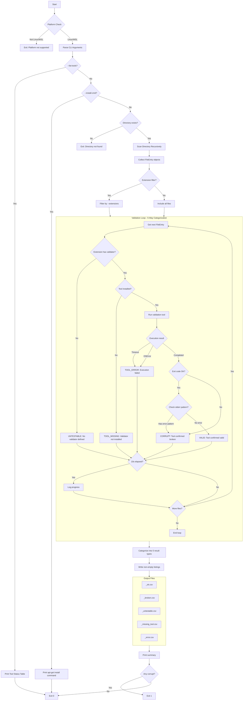

# MediaIntegrityCheck Tackle Architecture Plan

## Overview

**MediaIntegrityCheck** is a new tackle that validates media file integrity using Linux system tools. It scans directories recursively and categorizes files as valid, corrupt, or untestable based on external validation tools.

### Purpose

Media files can become corrupted due to storage failures, incomplete transfers, or filesystem issues. This tackle provides automated integrity checking using specialized tools for each file type, generating reports that integrate with pyTackle's ecosystem.

### Key Features

1. **Extensible tool registry** — Maps file extensions to validation tools
2. **System tool detection** — Checks tool availability and generates install commands
3. **Recursive scanning** — Uses `os.walk()` with FileEntry integration
4. **Special case handling** — ogg/opus stderr checking, qpdf exit code 3
5. **Five-category output** — Separate listings for valid, corrupt, untestable, missing tool, and error files

### Platform Restriction

- **Linux/WSL only** — Relies on Linux-native tools like `ffprobe`, `jpeginfo`, `mp3val`, etc.
- Platform check performed at startup with clear error message

---

## Tool Registry Design

### Data Structure

The tool registry maps file extensions to validation tool configurations:

```python
from dataclasses import dataclass, field
from typing import Optional, Callable


@dataclass
class ToolConfig:
    """Configuration for a validation tool."""
    binary: str                              # Binary name (e.g., 'ffprobe')
    apt_package: str                         # Package name for apt-get install
    args: list[str]                          # Command arguments (FILE placeholder)
    success_codes: set[int] = field(         # Exit codes that indicate success
        default_factory=lambda: {0}
    )
    check_stderr: Optional[str] = None       # Regex pattern to check in stderr for errors
    description: str = ''                    # Human-readable description


# File extension to tool mapping
TOOL_REGISTRY: dict[str, ToolConfig] = {
    # Video formats
    '.mp4':  ToolConfig('ffprobe', 'ffmpeg', ['-v', 'error', '-i', '{FILE}'],
                        description='MPEG-4 video'),
    '.mkv':  ToolConfig('ffprobe', 'ffmpeg', ['-v', 'error', '-i', '{FILE}'],
                        description='Matroska video'),
    '.avi':  ToolConfig('ffprobe', 'ffmpeg', ['-v', 'error', '-i', '{FILE}'],
                        description='AVI video'),
    '.mov':  ToolConfig('ffprobe', 'ffmpeg', ['-v', 'error', '-i', '{FILE}'],
                        description='QuickTime video'),
    '.webm': ToolConfig('ffprobe', 'ffmpeg', ['-v', 'error', '-i', '{FILE}'],
                        description='WebM video'),
    '.wmv':  ToolConfig('ffprobe', 'ffmpeg', ['-v', 'error', '-i', '{FILE}'],
                        description='Windows Media Video'),
    '.flv':  ToolConfig('ffprobe', 'ffmpeg', ['-v', 'error', '-i', '{FILE}'],
                        description='Flash Video'),
    '.m4v':  ToolConfig('ffprobe', 'ffmpeg', ['-v', 'error', '-i', '{FILE}'],
                        description='iTunes Video'),

    # Audio formats
    '.mp3':  ToolConfig('mp3val', 'mp3val', ['-si', '{FILE}'],
                        description='MP3 audio'),
    '.flac': ToolConfig('flac', 'flac', ['-ts', '{FILE}'],
                        description='FLAC audio'),
    '.ogg':  ToolConfig('ogginfo', 'vorbis-tools', ['{FILE}'],
                        check_stderr=r'error',
                        description='Ogg Vorbis audio'),
    '.opus': ToolConfig('opusinfo', 'opus-tools', ['{FILE}'],
                        check_stderr=r'error',
                        description='Opus audio'),
    '.wav':  ToolConfig('ffprobe', 'ffmpeg', ['-v', 'error', '-i', '{FILE}'],
                        description='WAV audio'),
    '.m4a':  ToolConfig('ffprobe', 'ffmpeg', ['-v', 'error', '-i', '{FILE}'],
                        description='AAC audio'),
    '.aac':  ToolConfig('ffprobe', 'ffmpeg', ['-v', 'error', '-i', '{FILE}'],
                        description='AAC audio'),
    '.wma':  ToolConfig('ffprobe', 'ffmpeg', ['-v', 'error', '-i', '{FILE}'],
                        description='Windows Media Audio'),

    # Image formats
    '.jpg':  ToolConfig('jpeginfo', 'jpeginfo', ['-c', '{FILE}'],
                        description='JPEG image'),
    '.jpeg': ToolConfig('jpeginfo', 'jpeginfo', ['-c', '{FILE}'],
                        description='JPEG image'),
    '.png':  ToolConfig('pngcheck', 'pngcheck', ['-q', '{FILE}'],
                        description='PNG image'),
    '.gif':  ToolConfig('identify', 'imagemagick', ['-regard-warnings', '{FILE}'],
                        description='GIF image'),
    '.bmp':  ToolConfig('identify', 'imagemagick', ['-regard-warnings', '{FILE}'],
                        description='BMP image'),
    '.tiff': ToolConfig('identify', 'imagemagick', ['-regard-warnings', '{FILE}'],
                        description='TIFF image'),
    '.tif':  ToolConfig('identify', 'imagemagick', ['-regard-warnings', '{FILE}'],
                        description='TIFF image'),
    '.webp': ToolConfig('identify', 'imagemagick', ['-regard-warnings', '{FILE}'],
                        description='WebP image'),

    # Archive formats
    '.zip':  ToolConfig('unzip', 'unzip', ['-t', '{FILE}'],
                        description='ZIP archive'),
    '.tar':  ToolConfig('tar', 'tar', ['-tf', '{FILE}'],
                        description='TAR archive'),
    '.gz':   ToolConfig('gzip', 'gzip', ['-t', '{FILE}'],
                        description='GZIP compressed'),
    '.bz2':  ToolConfig('bzip2', 'bzip2', ['-t', '{FILE}'],
                        description='BZIP2 compressed'),
    '.xz':   ToolConfig('xz', 'xz', ['-t', '{FILE}'],
                        description='XZ compressed'),
    '.7z':   ToolConfig('7z', 'p7zip-full', ['t', '{FILE}'],
                        description='7-Zip archive'),
    '.rar':  ToolConfig('unrar', 'unrar', ['t', '{FILE}'],
                        description='RAR archive'),

    # Document formats
    '.pdf':  ToolConfig('qpdf', 'qpdf', ['--check', '{FILE}'],
                        success_codes={0, 3},  # Exit 3 = valid with warnings
                        description='PDF document'),
    '.epub': ToolConfig('epubcheck', 'epubcheck', ['{FILE}'],
                        description='EPUB document'),
    '.docx': ToolConfig('unzip', 'unzip', ['-t', '{FILE}'],
                        description='Word document'),
    '.xlsx': ToolConfig('unzip', 'unzip', ['-t', '{FILE}'],
                        description='Excel spreadsheet'),
    '.pptx': ToolConfig('unzip', 'unzip', ['-t', '{FILE}'],
                        description='PowerPoint presentation'),
    '.odt':  ToolConfig('unzip', 'unzip', ['-t', '{FILE}'],
                        description='OpenDocument text'),
    '.ods':  ToolConfig('unzip', 'unzip', ['-t', '{FILE}'],
                        description='OpenDocument spreadsheet'),
    '.odp':  ToolConfig('unzip', 'unzip', ['-t', '{FILE}'],
                        description='OpenDocument presentation'),
}

# Compound archive extensions (multi-part extensions)
COMPOUND_EXTENSIONS: dict[str, ToolConfig] = {
    '.tar.gz':  ToolConfig('tar', 'tar', ['-tzf', '{FILE}'],
                           description='Gzipped TAR archive'),
    '.tar.bz2': ToolConfig('tar', 'tar', ['-tjf', '{FILE}'],
                           description='Bzipped TAR archive'),
    '.tar.xz':  ToolConfig('tar', 'tar', ['-tJf', '{FILE}'],
                           description='XZ TAR archive'),
    '.tgz':     ToolConfig('tar', 'tar', ['-tzf', '{FILE}'],
                           description='Gzipped TAR archive'),
}
```

### Registry Methods

```python
def get_tool_config(path: str) -> Optional[ToolConfig]:
    """Get the tool configuration for a file path.
    
    Checks compound extensions first, then single extensions.
    Returns None if no validator is registered for the file type.
    """
    path_lower = path.lower()
    
    # Check compound extensions first (e.g., .tar.gz)
    for ext, config in COMPOUND_EXTENSIONS.items():
        if path_lower.endswith(ext):
            return config
    
    # Check single extension
    _, ext = os.path.splitext(path_lower)
    return TOOL_REGISTRY.get(ext)


def get_all_extensions() -> list[str]:
    """Get list of all supported extensions."""
    extensions = list(TOOL_REGISTRY.keys())
    extensions.extend(COMPOUND_EXTENSIONS.keys())
    return sorted(set(extensions))


def get_required_packages() -> set[str]:
    """Get unique set of required apt packages."""
    packages = {cfg.apt_package for cfg in TOOL_REGISTRY.values()}
    packages.update(cfg.apt_package for cfg in COMPOUND_EXTENSIONS.values())
    return packages
```

---

## Tool Availability Checking

### Design

```python
import shutil
from dataclasses import dataclass


@dataclass
class ToolStatus:
    """Status of a validation tool."""
    binary: str
    apt_package: str
    available: bool
    path: Optional[str] = None  # Full path if available
    extensions: list[str] = field(default_factory=list)


def check_tool_available(binary: str) -> tuple[bool, Optional[str]]:
    """Check if a tool binary is available in PATH.
    
    Returns:
        Tuple of (is_available, full_path_or_None)
    """
    path = shutil.which(binary)
    return (path is not None, path)


def get_tools_status() -> list[ToolStatus]:
    """Get availability status for all registered tools.
    
    Returns list of ToolStatus objects with availability info.
    """
    # Collect unique binaries and their extensions
    binary_info: dict[str, tuple[str, list[str]]] = {}  # binary -> (package, [extensions])
    
    for ext, config in TOOL_REGISTRY.items():
        if config.binary not in binary_info:
            binary_info[config.binary] = (config.apt_package, [])
        binary_info[config.binary][1].append(ext)
    
    for ext, config in COMPOUND_EXTENSIONS.items():
        if config.binary not in binary_info:
            binary_info[config.binary] = (config.apt_package, [])
        binary_info[config.binary][1].append(ext)
    
    # Check each binary
    statuses = []
    for binary, (package, extensions) in sorted(binary_info.items()):
        available, path = check_tool_available(binary)
        statuses.append(ToolStatus(
            binary=binary,
            apt_package=package,
            available=available,
            path=path,
            extensions=sorted(extensions),
        ))
    
    return statuses


def get_missing_tools() -> list[ToolStatus]:
    """Get list of tools that are not available."""
    return [s for s in get_tools_status() if not s.available]


def generate_install_command() -> Optional[str]:
    """Generate apt-get install command for missing tools.
    
    Returns None if all tools are available.
    """
    missing = get_missing_tools()
    if not missing:
        return None
    
    packages = sorted(set(s.apt_package for s in missing))
    return f"sudo apt-get install {' '.join(packages)}"


def print_tools_status() -> None:
    """Print a formatted table of tool availability."""
    statuses = get_tools_status()
    
    print("Tool Availability Status")
    print("=" * 70)
    print(f"{'Binary':<15} {'Package':<20} {'Status':<10} {'Extensions'}")
    print("-" * 70)
    
    for s in statuses:
        status = "✓ OK" if s.available else "✗ MISSING"
        exts = ', '.join(s.extensions[:5])
        if len(s.extensions) > 5:
            exts += f" (+{len(s.extensions) - 5} more)"
        print(f"{s.binary:<15} {s.apt_package:<20} {status:<10} {exts}")
    
    print("-" * 70)
    
    missing = [s for s in statuses if not s.available]
    if missing:
        print(f"\n{len(missing)} tool(s) missing. Install with:")
        print(f"  {generate_install_command()}")
    else:
        print("\nAll tools available!")
```

---

## Class Structure

### Main Tackle Class

```python
import logging
import os
import re
import subprocess
import sys
import time
from dataclasses import dataclass, field
from enum import Enum
from typing import Iterator, Optional

from common.FileEntry import FileEntry
from common.listing import write_listing
from tackles.TackleFactory import TackleFactory

logger = logging.getLogger(__name__)


class ValidationResult(Enum):
    VALID = auto()        # Tool confirmed file is valid
    CORRUPT = auto()      # Tool confirmed file is corrupt
    UNTESTABLE = auto()   # No validator defined for this extension
    TOOL_MISSING = auto() # Validator exists but not installed
    TOOL_ERROR = auto()   # Tool execution failed (timeout, exception, etc.)


@dataclass
class ValidationOutcome:
    """Detailed outcome of validating a single file."""
    entry: FileEntry
    result: ValidationResult
    tool: Optional[str] = None
    exit_code: Optional[int] = None
    stderr_snippet: Optional[str] = None
    error_message: Optional[str] = None


class MediaIntegrityCheck(TackleFactory):
    """Validate media file integrity using Linux system tools."""

    @classmethod
    def arg_parser(cls, subparser):
        # Positional argument: directory to scan
        subparser.add_argument(
            'directory',
            help='Directory to scan recursively for media files',
        )

        # Output options
        subparser.add_argument(
            '-o', '--output',
            type=str,
            required=True,
            metavar='BASE',
            help='Base name for output files (produces BASE_ok.csv and BASE_broken.csv)',
        )

        # Tool management
        subparser.add_argument(
            '--list-tools',
            action='store_true',
            help='List all supported tools and their availability, then exit',
        )
        subparser.add_argument(
            '--install-cmd',
            action='store_true',
            help='Print apt-get install command for missing tools, then exit',
        )

        # Filtering
        subparser.add_argument(
            '--extensions',
            type=str,
            default=None,
            metavar='EXT[,EXT,...]',
            help='Filter which file extensions to include in the integrity check. '
                 'Only files matching these extensions will be scanned and validated. '
                 'Example: --extensions mp4,mp3,jpg. '
                 'If not specified, all files are scanned and checked with available validators.',
        )

        # Progress and output
        subparser.add_argument(
            '--progress-interval',
            type=int,
            default=10,
            help='Progress update interval in seconds (default: 10)',
        )
        subparser.add_argument(
            '-v', '--verbose',
            action='store_true',
            help='Verbose output (show each file as processed)',
        )
        subparser.add_argument(
            '-q', '--quiet',
            action='store_true',
            help='Quiet mode (minimal output)',
        )

        # Timeout
        subparser.add_argument(
            '--timeout',
            type=int,
            default=300,
            help='Timeout per file validation in seconds (default: 300)',
        )

    def __init__(self, parser):
        super().__init__(parser)
        options, _ = parser.parse_known_args()

        # Platform check
        if sys.platform not in ('linux', 'linux2') and 'microsoft' not in os.uname().release.lower():
            logger.error('MediaIntegrityCheck requires Linux or WSL')
            sys.exit(1)

        # Store options
        self.directory: str = os.path.abspath(options.directory)
        self.output_base: str = options.output
        self.list_tools: bool = options.list_tools
        self.install_cmd: bool = options.install_cmd
        self.progress_interval: int = options.progress_interval
        self.verbose: bool = options.verbose
        self.quiet: bool = options.quiet
        self.timeout: int = options.timeout

        # Parse extensions filter
        if options.extensions:
            self.allowed_extensions: Optional[set[str]] = set(
                '.' + e.strip().lstrip('.').lower()
                for e in options.extensions.split(',')
            )
        else:
            self.allowed_extensions = None

        # Configure logging
        if self.verbose:
            logger.setLevel(logging.DEBUG)
        elif self.quiet:
            logger.setLevel(logging.WARNING)

    def do(self) -> int:
        """Execute the tackle."""
        # Handle info commands first
        if self.list_tools:
            print_tools_status()
            return 0

        if self.install_cmd:
            cmd = generate_install_command()
            if cmd:
                print(cmd)
            else:
                print("# All tools are available")
            return 0

        # Validate directory
        if not os.path.isdir(self.directory):
            logger.error('Directory not found: %s', self.directory)
            return 1

        # Run validation
        return self._run_validation()

    def _run_validation(self) -> int:
        """Main validation workflow."""
        # 1. Scan directory
        logger.info('Scanning directory: %s', self.directory)
        entries = self._scan_directory()
        logger.info('Found %d files to check', len(entries))

        if not entries:
            logger.warning('No files to validate')
            return 0

        # 2. Validate files
        logger.info('Starting validation...')
        outcomes = self._validate_entries(entries)

        # 3. Categorize results into 5 categories
        valid_entries = [o.entry for o in outcomes if o.result == ValidationResult.VALID]
        corrupt_entries = [o.entry for o in outcomes if o.result == ValidationResult.CORRUPT]
        untestable_entries = [o.entry for o in outcomes if o.result == ValidationResult.UNTESTABLE]
        missing_tool_entries = [o.entry for o in outcomes if o.result == ValidationResult.TOOL_MISSING]
        error_entries = [o.entry for o in outcomes if o.result == ValidationResult.TOOL_ERROR]

        # 4. Write output files (only create non-empty listings)
        ok_path = f"{self.output_base}_ok.csv"
        broken_path = f"{self.output_base}_broken.csv"
        untestable_path = f"{self.output_base}_untestable.csv"
        missing_tool_path = f"{self.output_base}_missing_tool.csv"
        error_path = f"{self.output_base}_error.csv"

        ok_count = write_listing(ok_path, valid_entries) if valid_entries else 0
        broken_count = write_listing(broken_path, corrupt_entries) if corrupt_entries else 0
        untestable_count = write_listing(untestable_path, untestable_entries) if untestable_entries else 0
        missing_tool_count = write_listing(missing_tool_path, missing_tool_entries) if missing_tool_entries else 0
        error_count = write_listing(error_path, error_entries) if error_entries else 0

        # 5. Summary
        logger.info('=' * 60)
        logger.info('Validation complete')
        if ok_count:
            logger.info('  Valid:        %d files -> %s', ok_count, ok_path)
        if broken_count:
            logger.info('  Corrupt:      %d files -> %s', broken_count, broken_path)
        if untestable_count:
            logger.info('  Untestable:   %d files -> %s', untestable_count, untestable_path)
        if missing_tool_count:
            logger.info('  Missing tool: %d files -> %s', missing_tool_count, missing_tool_path)
        if error_count:
            logger.info('  Tool error:   %d files -> %s', error_count, error_path)
        logger.info('=' * 60)

        return 0 if broken_count == 0 else 1

    def _scan_directory(self) -> list[FileEntry]:
        """Recursively scan directory and collect FileEntry objects."""
        entries: list[FileEntry] = []
        scan_count = 0
        last_progress = time.monotonic()

        for dirpath, dirnames, filenames in os.walk(self.directory):
            for filename in filenames:
                full_path = os.path.join(dirpath, filename)
                
                # Skip symlinks
                if os.path.islink(full_path):
                    continue

                if self.allowed_extensions:
                    ext = os.path.splitext(filename.lower())[1]
                    if ext not in self.allowed_extensions:
                        continue

                try:
                    fe = FileEntry.from_fs_path(full_path)
                    entries.append(fe)
                    scan_count += 1

                    # Time-based progress
                    now = time.monotonic()
                    if now - last_progress >= self.progress_interval:
                        logger.info('Scanning: %d files found...', scan_count)
                        last_progress = now

                except OSError as exc:
                    logger.warning('Cannot stat %s: %s', full_path, exc)

        return entries

    def _validate_entries(self, entries: list[FileEntry]) -> list[ValidationOutcome]:
        """Validate all entries and return outcomes."""
        outcomes: list[ValidationOutcome] = []
        total = len(entries)
        processed = 0
        last_progress = time.monotonic()

        for entry in entries:
            outcome = self._validate_single(entry)
            outcomes.append(outcome)
            processed += 1

            # Per-file verbose output
            if self.verbose:
                status = outcome.result.value.upper()
                logger.debug('%s: %s', status, entry.path)

            # Time-based progress
            now = time.monotonic()
            if now - last_progress >= self.progress_interval:
                pct = (processed / total) * 100
                valid_count = sum(1 for o in outcomes if o.result == ValidationResult.VALID)
                corrupt_count = sum(1 for o in outcomes if o.result == ValidationResult.CORRUPT)
                logger.info(
                    'Progress: %d/%d (%.1f%%) — %d valid, %d corrupt',
                    processed, total, pct, valid_count, corrupt_count
                )
                last_progress = now

        return outcomes

    def _validate_single(self, entry: FileEntry) -> ValidationOutcome:
        """Validate a single file entry."""
        config = get_tool_config(entry.path)

        if config is None:
            return ValidationOutcome(
                entry=entry,
                result=ValidationResult.UNTESTABLE,
                error_message='No validator defined for this file extension',
            )

        # Check if tool is available
        available, tool_path = check_tool_available(config.binary)
        if not available:
            return ValidationOutcome(
                entry=entry,
                result=ValidationResult.TOOL_MISSING,
                tool=config.binary,
                error_message=f'Tool not installed: {config.binary} (apt-get install {config.apt_package})',
            )

        # Build command
        cmd = [config.binary]
        for arg in config.args:
            cmd.append(arg.replace('{FILE}', entry.path))

        try:
            result = subprocess.run(
                cmd,
                capture_output=True,
                timeout=self.timeout,
                text=True,
            )

            exit_code = result.returncode
            stderr = result.stderr[:500] if result.stderr else None

            # Check for success
            is_valid = exit_code in config.success_codes

            # Special stderr checking (for ogg/opus)
            if is_valid and config.check_stderr and stderr:
                if re.search(config.check_stderr, stderr, re.IGNORECASE):
                    is_valid = False

            return ValidationOutcome(
                entry=entry,
                result=ValidationResult.VALID if is_valid else ValidationResult.CORRUPT,
                tool=config.binary,
                exit_code=exit_code,
                stderr_snippet=stderr,
            )

        except subprocess.TimeoutExpired:
            return ValidationOutcome(
                entry=entry,
                result=ValidationResult.TOOL_ERROR,
                tool=config.binary,
                error_message=f'Validation timed out after {self.timeout}s',
            )
        except OSError as exc:
            return ValidationOutcome(
                entry=entry,
                result=ValidationResult.TOOL_ERROR,
                tool=config.binary,
                error_message=str(exc),
            )
```

---

## CLI Arguments Design

### Command Synopsis

```
pyTackle MediaIntegrityCheck [OPTIONS] DIRECTORY -o OUTPUT_BASE
```

### Arguments Table

| Argument | Type | Required | Default | Description |
|----------|------|----------|---------|-------------|
| `directory` | positional | yes | — | Directory to scan recursively |
| `-o, --output` | string | yes | — | Base name for output files |
| `--list-tools` | flag | no | false | List tools and availability |
| `--install-cmd` | flag | no | false | Print apt install command |
| `--extensions` | string | no | all | Filter which file extensions to include in the integrity check |
| `--progress-interval` | int | no | 10 | Progress update seconds |
| `-v, --verbose` | flag | no | false | Show each file result |
| `-q, --quiet` | flag | no | false | Minimal output |
| `--timeout` | int | no | 300 | Per-file timeout in seconds |

### Example Commands

```bash
# Basic usage
pyTackle MediaIntegrityCheck /media/videos -o /tmp/video_check

# Check only images
pyTackle MediaIntegrityCheck /photos -o /tmp/photos --extensions jpg,png,gif

# List available tools
pyTackle MediaIntegrityCheck --list-tools .

# Get install command for missing tools
pyTackle MediaIntegrityCheck --install-cmd .

# Verbose mode with shorter progress interval
pyTackle MediaIntegrityCheck /media -o /tmp/media -v --progress-interval 5
```

---

## Processing Flow Diagram



---

## Error Handling Strategy

### Error Categories

| Category | Handling | Result | Example |
|----------|----------|--------|---------|
| **Platform error** | Exit immediately with clear message | Exit 1 | Running on macOS |
| **Missing directory** | Exit with error code 1 | Exit 1 | Path doesn't exist |
| **Permission denied** | Log warning, skip file | TOOL_ERROR | Unreadable file |
| **No validator defined** | Categorize and continue | UNTESTABLE | Unknown .xyz extension |
| **Tool not installed** | Categorize and continue | TOOL_MISSING | `jpeginfo` not found |
| **Tool execution error** | Categorize and continue | TOOL_ERROR | Segfault in tool |
| **Tool timeout** | Categorize and continue | TOOL_ERROR | Large file takes >300s |
| **Invalid file** | Categorize and continue | CORRUPT | Truncated MP4 |
| **Valid file** | Categorize and continue | VALID | Well-formed MP4 |

### Error Messages

```python
# Platform check
logger.error('MediaIntegrityCheck requires Linux or WSL. Current platform: %s', sys.platform)

# Directory not found
logger.error('Directory not found: %s', self.directory)

# Permission denied during scan
logger.warning('Cannot stat %s: %s', full_path, exc)

# Tool not installed
logger.debug('Tool %s not available for %s', config.binary, entry.path)

# Timeout
logger.warning('Validation timed out for %s after %ds', entry.path, self.timeout)

# Tool crash
logger.warning('Tool %s failed for %s: %s', config.binary, entry.path, exc)
```

### Recovery Strategies

1. **Continue on error** — Never abort the entire scan for a single file failure
2. **Categorize failures** — Distinguish CORRUPT (file problem) from ERROR (tool problem)
3. **Log context** — Include tool name, exit code, stderr snippet
4. **Timeout protection** — Prevent infinite hangs on malformed files

---

## Output Format

### File Naming

Given `--output /tmp/media_check`:

| Listing File | Category | Description |
|--------------|----------|-------------|
| `/tmp/media_check_ok.csv` | VALID | Files confirmed valid by the tool |
| `/tmp/media_check_broken.csv` | CORRUPT | Files confirmed broken by the tool |
| `/tmp/media_check_untestable.csv` | UNTESTABLE | Files with extensions that have no validator defined in registry |
| `/tmp/media_check_missing_tool.csv` | TOOL_MISSING | Files where the required tool is not installed on the system |
| `/tmp/media_check_error.csv` | TOOL_ERROR | Files where tool execution failed (timeout, crash, permission denied, etc.) |

**Note:** Only non-empty listings are created. If all files are valid, only `_ok.csv` will exist.

### CSV Format

Uses canonical 10-column format via [`write_listing()`](../common/listing.py:162):

| Column | Index | Description |
|--------|-------|-------------|
| creation | 0 | Creation timestamp |
| access | 1 | Access timestamp |
| modify | 2 | Modification timestamp |
| checksum | 3 | Empty (not calculated) |
| entry_type | 4 | Always `f` |
| permissions | 5 | File permissions |
| uid | 6 | Owner UID |
| gid | 7 | Owner GID |
| size | 8 | File size in bytes |
| path | 9 | Relative file path |

### Example Output

```csv
2024-01-15T10:30:00.000000+00:00,2024-01-15T10:30:00.000000+00:00,2024-01-15T10:30:00.000000+00:00,,f,0o644,1000,1000,1048576,videos/valid.mp4
2024-01-15T11:00:00.000000+00:00,2024-01-15T11:00:00.000000+00:00,2024-01-15T11:00:00.000000+00:00,,f,0o644,1000,1000,524288,images/good.jpg
```

---

## Testing Strategy

### Unit Tests

#### 1. Tool Registry Tests

```python
def test_get_tool_config_video():
    """Video extensions return ffprobe config."""
    config = get_tool_config('/path/to/file.mp4')
    assert config is not None
    assert config.binary == 'ffprobe'
    assert config.apt_package == 'ffmpeg'


def test_get_tool_config_compound():
    """Compound extensions like .tar.gz work correctly."""
    config = get_tool_config('/path/to/archive.tar.gz')
    assert config is not None
    assert config.binary == 'tar'
    assert '-tzf' in config.args


def test_get_tool_config_unknown():
    """Unknown extensions return None."""
    assert get_tool_config('/path/to/file.xyz') is None
```

#### 2. Tool Availability Tests

```python
def test_check_tool_available_existing():
    """Existing tools are detected."""
    available, path = check_tool_available('ls')
    assert available is True
    assert path is not None


def test_check_tool_available_missing():
    """Missing tools return False."""
    available, path = check_tool_available('nonexistent_tool_xyz')
    assert available is False
    assert path is None
```

#### 3. Validation Result Tests

```python
def test_validate_valid_file(tmp_path, mocker):
    """Valid file returns VALID result."""
    # Create test file
    test_file = tmp_path / "test.mp4"
    test_file.write_bytes(b"fake mp4 content")
    
    # Mock subprocess to return success
    mocker.patch('subprocess.run', return_value=Mock(returncode=0, stderr=''))
    
    entry = FileEntry.from_fs_path(str(test_file))
    outcome = MediaIntegrityCheck._validate_single(None, entry)
    assert outcome.result == ValidationResult.VALID


def test_validate_corrupt_file(tmp_path, mocker):
    """Corrupt file returns CORRUPT result."""
    test_file = tmp_path / "test.mp4"
    test_file.write_bytes(b"corrupt")
    
    mocker.patch('subprocess.run', return_value=Mock(returncode=1, stderr='Error'))
    
    entry = FileEntry.from_fs_path(str(test_file))
    outcome = MediaIntegrityCheck._validate_single(None, entry)
    assert outcome.result == ValidationResult.CORRUPT
```

#### 4. Special Case Tests

```python
def test_qpdf_exit_3_is_valid(tmp_path, mocker):
    """qpdf exit code 3 (warnings) is treated as valid."""
    test_file = tmp_path / "test.pdf"
    test_file.write_bytes(b"%PDF-1.4")
    
    mocker.patch('subprocess.run', return_value=Mock(returncode=3, stderr='Warning'))
    
    config = get_tool_config(str(test_file))
    assert 3 in config.success_codes


def test_ogg_stderr_error_detection(tmp_path, mocker):
    """OGG files with 'error' in stderr are marked corrupt."""
    test_file = tmp_path / "test.ogg"
    test_file.write_bytes(b"OggS")
    
    mocker.patch('subprocess.run', return_value=Mock(
        returncode=0, 
        stderr='Warning: error in stream'
    ))
    
    config = get_tool_config(str(test_file))
    assert config.check_stderr is not None
```

### Integration Tests

```python
def test_end_to_end_scan(tmp_path):
    """End-to-end test with real files."""
    # Create test directory structure
    (tmp_path / "valid.txt").write_text("text file")
    (tmp_path / "sub").mkdir()
    (tmp_path / "sub" / "image.jpg").write_bytes(b"\xff\xd8\xff")
    
    # Run tackle
    # ... would require mocking tool execution
    pass


def test_output_files_created(tmp_path):
    """Output CSV files are created correctly."""
    output_base = str(tmp_path / "results")
    # ... run tackle
    assert os.path.exists(f"{output_base}_ok.csv")
    assert os.path.exists(f"{output_base}_broken.csv")
```

### Test Fixtures

```python
@pytest.fixture
def sample_video_file(tmp_path):
    """Create a minimal valid MP4 file."""
    # Minimal ftyp box for MP4
    ftyp = bytes([
        0x00, 0x00, 0x00, 0x14,  # Size: 20 bytes
        0x66, 0x74, 0x79, 0x70,  # 'ftyp'
        0x69, 0x73, 0x6f, 0x6d,  # 'isom'
        0x00, 0x00, 0x00, 0x01,  # Version
        0x69, 0x73, 0x6f, 0x6d,  # 'isom'
    ])
    path = tmp_path / "test.mp4"
    path.write_bytes(ftyp)
    return path


@pytest.fixture
def mock_tools_available(mocker):
    """Mock all tools as available."""
    mocker.patch(
        'tackles.MediaIntegrityCheck.check_tool_available',
        return_value=(True, '/usr/bin/mock')
    )
```

---

## Dependencies

### Internal

| Module | Usage |
|--------|-------|
| [`common/FileEntry.py`](../common/FileEntry.py) | `FileEntry.from_fs_path()` |
| [`common/listing.py`](../common/listing.py) | `write_listing()` |
| [`tackles/TackleFactory.py`](../tackles/TackleFactory.py) | Base class |

### External

- Standard library: `subprocess`, `shutil`, `time`, `re`, `os`, `sys`
- No new pip dependencies required

### System Tools

| Package | Tools | File Types |
|---------|-------|------------|
| `ffmpeg` | ffprobe | Video, some audio |
| `mp3val` | mp3val | MP3 |
| `flac` | flac | FLAC |
| `vorbis-tools` | ogginfo | OGG |
| `opus-tools` | opusinfo | Opus |
| `jpeginfo` | jpeginfo | JPEG |
| `pngcheck` | pngcheck | PNG |
| `imagemagick` | identify | GIF, BMP, TIFF, WebP |
| `unzip` | unzip | ZIP, Office docs |
| `tar` | tar | TAR archives |
| `gzip` | gzip | GZIP |
| `bzip2` | bzip2 | BZIP2 |
| `xz` | xz | XZ |
| `p7zip-full` | 7z | 7-Zip |
| `unrar` | unrar | RAR |
| `qpdf` | qpdf | PDF |
| `epubcheck` | epubcheck | EPUB |

---

## Future Improvements

### Phase 1: Core Implementation
- [ ] Basic tool registry with common formats
- [ ] Directory scanning with FileEntry
- [ ] Validation loop with progress
- [ ] Dual CSV output

### Phase 2: Enhanced Features
- [ ] **Parallel validation** — Use multiprocessing for faster scanning
- [ ] **JSON output** — Machine-readable summary alongside CSV
- [ ] **Detailed report** — Include validation error messages in output
- [ ] **Resume capability** — Skip already-validated files

### Phase 3: Advanced Integration
- [ ] **Custom tool definitions** — Load additional tools from config file
- [ ] **Checksum integration** — Calculate checksums for valid files
- [ ] **ValidateCopy pipeline** — Direct integration with ValidateCopy
- [ ] **Docker support** — Container with all tools pre-installed

---

## Summary

MediaIntegrityCheck provides automated media file validation using Linux system tools:

1. **Extensible architecture** — Easy to add new file types and tools
2. **Robust error handling** — Distinguishes file corruption from tool failures
3. **Progress tracking** — Time-based updates during long scans
4. **Five-category output** — Separate listings for VALID, CORRUPT, UNTESTABLE, TOOL_MISSING, and TOOL_ERROR
5. **Tool management** — Built-in availability checking and install commands
6. **pyTackle integration** — Uses FileEntry and write_listing() for compatibility
