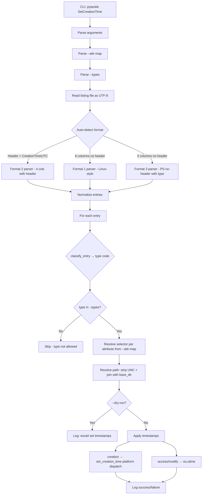

# SetCreationTime Tackle — Architecture Plan

## Overview

A pyTackle command (`SetCreationTime`) that reads a file listing CSV, parses timestamps, and applies them to **files, directories, and/or symlinks** on the local filesystem.  Supports setting **creation time**, **access time**, and **modification time** via a flexible attribute-mapping option.  Cross-platform: Windows and macOS for creation time; access/modify work everywhere via `os.utime`.  Linux is best-effort for creation time (no standard API).

---

## Listing Formats (Auto-Detected)

### Format 1 — Linux-style, no header

```
2020-08-20 06:15:03.491092220 +0000,2025-04-12 22:04:56.241322916 +0000,2025-04-12 23:09:56.410644878 +0000,2025-04-12 23:09:56.410644878 +0000,directory,"."
```

Fields: `<created>, <not_used>, <not_used>, <not_used>, <type>, <file>`

- 6 columns, no header
- Timestamps are ISO-ish with nanosecond precision and timezone offset
- Type field: `directory` or `file`
- **Filter**: only process rows where type == `directory`

### Format 2 — PowerShell-style, with header

```
CreationTimeUTC,LastAccessTimeUTC,LastWriteTimeUTC,FullPath
02/24/2023 14:04:32,04/11/2025 16:27:37,04/11/2025 16:27:36,"\\192.168.50.238\Timemachine\images"
```

Fields: `CreationTimeUTC, LastAccessTimeUTC, LastWriteTimeUTC, FullPath`

- 4 columns, has header row starting with `CreationTimeUTC`
- Timestamps are `MM/DD/YYYY HH:MM:SS` in UTC
- No type column — **must check filesystem** to determine if path is a directory
- Paths may be UNC paths

### Format 3 — PowerShell-style with type marker, no header

```
06/10/2019 08:34:49,04/12/2025 09:07:07,06/10/2019 08:34:49,D,"\\192.168.50.238\Timemachine\test\hack"
```

Fields: `<created>, <not_used>, <not_used>, <type>, <file>`

- 5 columns, no header
- Timestamps are `MM/DD/YYYY HH:MM:SS` in UTC
- Type field: `D` for directory, `F` for file (or similar)
- **Filter**: only process rows where type == `D`

### Auto-Detection Logic

```
read first line:
  if starts with "CreationTimeUTC" -> Format 2 (skip header, 4 columns)
  else:
    count columns:
      6 columns -> Format 1 (Linux-style)
      5 columns -> Format 3 (PowerShell no-header with type)
```

---

## CLI Interface

```
# Apply mode (default):
pytackle SetCreationTime \
    --listing <path-to-csv-file> \
    --base-dir <local-base-directory> \
    [--attr-map "creation:1,access:2,modify:e"] \
    [--types "f,d,l"] \
    [--script-base-path <prefix>] \
    [--dry-run] \
    [-v]

# Generate-listing mode:
pytackle SetCreationTime \
    --base-dir <local-base-directory> \
    --generate-listing <output-csv-path> \
    [--types "f,d,l"] \
    [-v]
```

| Argument              | Required | Default        | Description                                                                                                  |
|-----------------------|----------|----------------|--------------------------------------------------------------------------------------------------------------|
| `--listing`           | Cond.    | —              | Path to the CSV listing file.  Required unless `--generate-listing` is used.                                 |
| `--base-dir`          | Yes      | —              | Local directory to resolve relative paths against                                                            |
| `--generate-listing`  | No       | —              | Generate a Format-3 CSV listing of `--base-dir` and write it to the given path (see below)                   |
| `--attr-map`          | No       | `creation:e`   | Comma-separated `attr:selector` pairs mapping filesystem attributes to listing columns (see below)           |
| `--types`             | No       | `d`            | Comma-separated entry types to process: `f` (file), `d` (directory), `l` (symlink)                          |
| `--script-base-path`  | No       | —              | Leading directory prefix to strip from listing paths before resolving against `--base-dir`                    |
| `--dry-run`           | No       | False          | Preview changes without modifying timestamps                                                                 |
| `-v`                  | No       | False          | Verbose logging output                                                                                       |

### `--attr-map`

Maps filesystem timestamp attributes to listing column selectors.

**Attributes:** `creation`, `access`, `modify`

**Selectors:**
- A **0-based column index** (e.g., `0`, `1`, `2`, `3`) — use that specific date column from the listing row
- `earliest` (alias `e`) — pick the **minimum** (oldest) date from all date columns in the row
- `latest` (alias `l`) — pick the **maximum** (newest) date from all date columns in the row

**Default:** `creation:e` — sets creation time to the earliest date in the row.

**Examples:**

```bash
# Set creation time from column 1, access from column 2, modify from earliest
--attr-map="creation:1,access:2,modify:e"

# Set only modification time to the latest date in the row
--attr-map="modify:l"

# Set all three attributes from specific columns
--attr-map="creation:0,access:1,modify:2"

# Set all three to earliest (using alias)
--attr-map="creation:e,access:e,modify:e"
```

### `--types`

Controls which filesystem entry types are processed.

| Code | Meaning   |
|------|-----------|
| `f`  | File      |
| `d`  | Directory |
| `l`  | Symlink   |

**Default:** `d` (directories only).

**Examples:**

```bash
# Process only directories (default)
--types="d"

# Process files and directories
--types="f,d"

# Process everything
--types="f,d,l"
```

### `--generate-listing`

Walks `--base-dir` recursively and writes a **Format 3** CSV listing to the
specified output path.  The listing contains creation, access, and modification
timestamps (in UTC) with relative paths and type markers.

**Output format** (Format 3 — PowerShell-style with type marker, no header):

```
MM/DD/YYYY HH:MM:SS,MM/DD/YYYY HH:MM:SS,MM/DD/YYYY HH:MM:SS,<D|F|L>,<relative-path>
```

- Column 0: creation time (UTC) — uses `st_birthtime` on macOS/Windows, falls back to `st_ctime` on Linux
- Column 1: last access time (UTC)
- Column 2: last modification time (UTC)
- Column 3: type marker — `D` (directory), `F` (file), `L` (symlink)
- Column 4: path relative to `--base-dir`

Respects `--types` for filtering which entry types to include.

**Examples:**

```bash
# Generate listing of directories only (default --types=d)
pytackle SetCreationTime --base-dir /data/photos --generate-listing listing.csv

# Generate listing of all entry types
pytackle SetCreationTime --base-dir /data/photos --generate-listing listing.csv --types="f,d,l"
```

The generated listing is compatible with the apply mode — it can be fed back
via `--listing` to restore timestamps on another machine or after a copy.

---

## Architecture



---

## Key Components

### 1. File: `tackles/SetCreationTime.py`

Single file containing the tackle class and all helpers.

#### Class: `SetCreationTime` extends `TackleFactory`

- **`arg_parser`** — registers CLI arguments (including `--attr-map`, `--types`)
- **`__init__`** — parses args, validates paths, parses `--attr-map` and `--types`
- **`do`** — iterates entries and applies timestamps via `_do_attr_map`
- **`_do_attr_map`** — applies per-attribute timestamps according to `--attr-map`
- **`_apply_attrs`** — static method that calls the appropriate setter for each attribute

#### Data class: `ListingEntry`

```python
@dataclass
class ListingEntry:
    dates: list[datetime]      # all parsed date columns
    entry_type: str | None     # directory/D/file/F or None for format 2
    raw_path: str              # original path from listing
```

#### Helper functions inside the module:

- **`detect_format`** — reads first line, returns format identifier
- **`parse_listing`** — dispatches to format-specific parser, returns list of `ListingEntry`
- **`_parse_row_linux`** — parses format 1 row
- **`_parse_row_ps_header`** — parses format 2 row
- **`_parse_row_ps_type`** — parses format 3 row
- **`parse_timestamp_linux`** — parses `2020-08-20 06:15:03.491092220 +0000`
- **`parse_timestamp_powershell`** — parses `02/24/2023 14:04:32`
- **`normalize_path`** — strips UNC prefix, converts backslashes to forward slashes
- **`parse_attr_map`** — parses `--attr-map` string into `{attr: selector}` dict; expands aliases `e`→`earliest`, `l`→`latest`
- **`parse_types`** — parses `--types` string into a set of type codes
- **`resolve_selector`** — resolves a single attr-map selector (`earliest`/`latest`/index) against an entry
- **`classify_entry`** — returns `'d'`/`'f'`/`'l'` type code for an entry
- **`is_directory_entry`** — backward-compatible directory check
- **`set_creation_time`** — dispatcher for platform-specific creation-time implementation
- **`set_creation_time_windows`** — Windows ctypes implementation
- **`set_creation_time_macos`** — macOS SetFile implementation
- **`set_access_modify_time`** — cross-platform access/modify time setter via `os.utime`
- **`generate_listing`** — walks a directory tree and writes a Format-3 CSV listing
- **`_get_creation_time`** — cross-platform creation time from stat result (`st_birthtime` or `st_ctime`)
- **`_format_ts_utc`** — formats epoch timestamp as `MM/DD/YYYY HH:MM:SS` in UTC
- **`_entry_type_code`** — returns `D`/`F`/`L` type code for a filesystem path

### 2. Platform-Specific Creation Time Setting

#### Windows — `set_creation_time_windows`

Uses `ctypes` to call Win32 API directly from Python:

```python
import ctypes
from ctypes import wintypes

kernel32 = ctypes.WinDLL('kernel32', use_last_error=True)
```

Key steps:
1. Open directory with `CreateFileW` using `GENERIC_WRITE` + `FILE_FLAG_BACKUP_SEMANTICS` (required for directories)
2. Convert Python `datetime` to `FILETIME` struct — 100-nanosecond intervals since 1601-01-01
3. Call `SetFileTime` with creation time, passing `NULL` for access/write times to keep them unchanged
4. Close handle with `CloseHandle`

#### macOS — `set_creation_time_macos`

Uses `SetFile` command from Xcode command line tools:

```python
subprocess.run(['SetFile', '-d', formatted_date, filepath])
```

`SetFile -d` sets the creation date. Format: `"MM/DD/YYYY HH:MM:SS"`.

Falls back to a warning if `SetFile` is not available (user needs Xcode CLI tools).

#### Linux

Log a warning that setting creation time is not supported on Linux via standard APIs. The entry will be skipped.

### 3. UNC Path Stripping

For paths like `\\192.168.50.238\Timemachine\images` or `\\192.168.50.238\Timemachine\test\hack`:

```python
def normalize_path(raw_path: str) -> str:
    # Strip UNC prefix: \\server\share\rest\of\path -> rest/of/path
    path = raw_path.strip('"').strip()
    if path.startswith('\\\\') or path.startswith('//'):
        parts = path.replace('\\', '/').lstrip('/').split('/')
        # parts[0] = server, parts[1] = share, parts[2:] = relative path
        if len(parts) > 2:
            return os.path.join(*parts[2:])
        return '.'
    # Convert backslashes to forward slashes for consistency
    return path.replace('\\', '/')
```

### 4. Timestamp Parsing

#### Format 1 — Linux timestamps
```
2020-08-20 06:15:03.491092220 +0000
```
- Truncate nanoseconds to microseconds (Python datetime max precision)
- Parse with regex + `datetime` constructor
- Timezone-aware (UTC offset provided)

#### Format 2 & 3 — PowerShell timestamps
```
02/24/2023 14:04:32
```
- Parse with `datetime.strptime('%m/%d/%Y %H:%M:%S')`
- Assumed UTC

Both are normalized to timezone-aware `datetime` objects in UTC.

### 5. Entry-Type Filtering

The `--types` option controls which entry types are processed.  Classification
uses `classify_entry()` which returns `'d'`, `'f'`, or `'l'`:

1. **Symlinks** are detected first via `os.path.islink()` — a symlink to a directory is classified as `'l'`, not `'d'`
2. **Directories vs files** — if the listing has a type column it is used; otherwise `os.path.isdir()` is consulted

| Format   | How type is determined                                                    |
|----------|---------------------------------------------------------------------------|
| Format 1 | Column 4: `directory` → `d`, else `f`; symlinks detected via filesystem  |
| Format 2 | No type column — filesystem check (`islink` → `l`, `isdir` → `d`, else `f`) |
| Format 3 | Column 3: `D` → `d`, else `f`; symlinks detected via filesystem          |

### 6. Access & Modification Time Setting

When `--attr-map` includes `access` and/or `modify`, `set_access_modify_time()` is called.
This uses `os.utime()` which works on **all platforms** (Windows, macOS, Linux).
The current stat values are read first so that only the requested timestamps are changed.

### 7. UTF-8 and Network Path Support

- Listing file opened with `encoding='utf-8-sig'` to handle optional BOM from Windows tools
- All path operations use `str` (Python 3 native Unicode)
- On Windows, `CreateFileW` (wide-char version) handles Unicode paths natively
- On macOS, `SetFile` handles UTF-8 paths via the shell

---

## Error Handling

- Path not found on filesystem → log error, count as failed, skip entry, continue
- Entry is not a directory → log debug, skip entry, continue
- Permission denied → log error, skip entry, continue
- Unsupported platform → log warning per-entry
- Invalid timestamp format → log error, skip entry, continue
- Unrecognized listing format → log error and exit
- All per-entry errors are non-fatal; the tackle processes as many entries as possible

---

## Dependencies

No new external dependencies required. Uses only stdlib:
- `csv` — CSV parsing
- `datetime`, `timezone` — timestamp handling
- `ctypes` — Windows API calls (conditional import)
- `subprocess` — macOS SetFile (conditional import)
- `logging` — structured output
- `pathlib`, `os`, `sys`, `platform` — path and platform handling
- `dataclasses` — ListingEntry data class
- `re` — timestamp parsing

---

## File Changes Summary

| File | Action | Description |
|------|--------|-------------|
| `tackles/SetCreationTime.py` | **Create** | New tackle with all logic |
| No other files need modification | — | Auto-discovery in `__init__.py` handles registration |

The existing [`__init__.py`](tackles/__init__.py) auto-imports all `.py` files matching `^[a-zA-Z0-9]*\.py$` in the `tackles/` directory, so `SetCreationTime.py` will be automatically discovered and registered.
