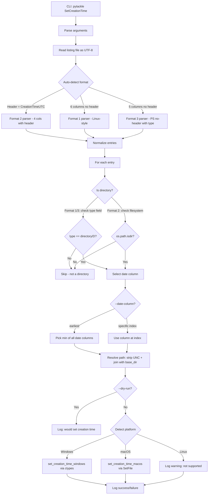

# SetCreationTime Tackle — Architecture Plan

## Overview

A new pyTackle command (`SetCreationTime`) that reads a file listing CSV, parses creation timestamps, and applies them as the **creation time** (aka birth time) to **directories** on the local filesystem. Cross-platform: Windows and macOS. Linux is best-effort (no standard API to set creation time).

---

## Listing Formats (Auto-Detected)

### Format 1 — Linux-style, no header

```
2020-08-20 06:15:03.491092220 +0000,2025-04-12 22:04:56.241322916 +0000,2025-04-12 23:09:56.410644878 +0000,2025-04-12 23:09:56.410644878 +0000,directory,"."
```

Fields: `<created>, <not_used>, <not_used>, <not_used>, <type>, <file>`

- 6 columns, no header
- Timestamps are ISO-ish with nanosecond precision and timezone offset
- Type field: `directory` or `file`
- **Filter**: only process rows where type == `directory`

### Format 2 — PowerShell-style, with header

```
CreationTimeUTC,LastAccessTimeUTC,LastWriteTimeUTC,FullPath
02/24/2023 14:04:32,04/11/2025 16:27:37,04/11/2025 16:27:36,"\\192.168.50.238\Timemachine\images"
```

Fields: `CreationTimeUTC, LastAccessTimeUTC, LastWriteTimeUTC, FullPath`

- 4 columns, has header row starting with `CreationTimeUTC`
- Timestamps are `MM/DD/YYYY HH:MM:SS` in UTC
- No type column — **must check filesystem** to determine if path is a directory
- Paths may be UNC paths

### Format 3 — PowerShell-style with type marker, no header

```
06/10/2019 08:34:49,04/12/2025 09:07:07,06/10/2019 08:34:49,D,"\\192.168.50.238\Timemachine\test\hack"
```

Fields: `<created>, <not_used>, <not_used>, <type>, <file>`

- 5 columns, no header
- Timestamps are `MM/DD/YYYY HH:MM:SS` in UTC
- Type field: `D` for directory, `F` for file (or similar)
- **Filter**: only process rows where type == `D`

### Auto-Detection Logic

```
read first line:
  if starts with "CreationTimeUTC" -> Format 2 (skip header, 4 columns)
  else:
    count columns:
      6 columns -> Format 1 (Linux-style)
      5 columns -> Format 3 (PowerShell no-header with type)
```

---

## CLI Interface

```
pytackle SetCreationTime \
    --listing <path-to-csv-file> \
    --base-dir <local-base-directory> \
    [--date-column <0-based-index>] \
    [--dry-run] \
    [-v]
```

| Argument         | Required | Default   | Description                                                              |
|------------------|----------|-----------|--------------------------------------------------------------------------|
| `--listing`      | Yes      | —         | Path to the CSV listing file                                             |
| `--base-dir`     | Yes      | —         | Local directory to resolve relative paths against                        |
| `--date-column`  | No       | `earliest`| 0-based column index for the date to use, or `earliest` to pick minimum  |
| `--dry-run`      | No       | False     | Preview changes without modifying timestamps                             |
| `-v`             | No       | False     | Verbose logging output                                                   |

### `--date-column` behavior

- Default `earliest`: scan all date columns in the row and pick the **earliest** (minimum) timestamp
- If a number is provided (e.g., `0`, `1`, `2`): use that specific 0-based column index as the creation time source

---

## Architecture



---

## Key Components

### 1. File: `tackles/SetCreationTime.py`

Single file containing the tackle class and all helpers.

#### Class: `SetCreationTime` extends `TackleFactory`

- **`arg_parser`** — registers CLI arguments
- **`__init__`** — parses args, validates paths, reads and parses listing
- **`do`** — iterates entries and applies creation times

#### Data class: `ListingEntry`

```python
@dataclass
class ListingEntry:
    dates: list[datetime]      # all parsed date columns
    entry_type: str | None     # directory/D/file/F or None for format 2
    raw_path: str              # original path from listing
```

#### Helper functions inside the module:

- **`detect_format`** — reads first line, returns format identifier
- **`parse_listing`** — dispatches to format-specific parser, returns list of `ListingEntry`
- **`parse_linux_row`** — parses format 1 row
- **`parse_powershell_header_row`** — parses format 2 row
- **`parse_powershell_notype_row`** — parses format 3 row
- **`parse_timestamp_linux`** — parses `2020-08-20 06:15:03.491092220 +0000`
- **`parse_timestamp_powershell`** — parses `02/24/2023 14:04:32`
- **`normalize_path`** — strips UNC prefix, converts backslashes to forward slashes
- **`select_date`** — picks earliest or specific column date
- **`set_creation_time`** — dispatcher for platform-specific implementation
- **`set_creation_time_windows`** — Windows ctypes implementation
- **`set_creation_time_macos`** — macOS SetFile implementation

### 2. Platform-Specific Creation Time Setting

#### Windows — `set_creation_time_windows`

Uses `ctypes` to call Win32 API directly from Python:

```python
import ctypes
from ctypes import wintypes

kernel32 = ctypes.WinDLL('kernel32', use_last_error=True)
```

Key steps:
1. Open directory with `CreateFileW` using `GENERIC_WRITE` + `FILE_FLAG_BACKUP_SEMANTICS` (required for directories)
2. Convert Python `datetime` to `FILETIME` struct — 100-nanosecond intervals since 1601-01-01
3. Call `SetFileTime` with creation time, passing `NULL` for access/write times to keep them unchanged
4. Close handle with `CloseHandle`

#### macOS — `set_creation_time_macos`

Uses `SetFile` command from Xcode command line tools:

```python
subprocess.run(['SetFile', '-d', formatted_date, filepath])
```

`SetFile -d` sets the creation date. Format: `"MM/DD/YYYY HH:MM:SS"`.

Falls back to a warning if `SetFile` is not available (user needs Xcode CLI tools).

#### Linux

Log a warning that setting creation time is not supported on Linux via standard APIs. The entry will be skipped.

### 3. UNC Path Stripping

For paths like `\\192.168.50.238\Timemachine\images` or `\\192.168.50.238\Timemachine\test\hack`:

```python
def normalize_path(raw_path: str) -> str:
    # Strip UNC prefix: \\server\share\rest\of\path -> rest/of/path
    path = raw_path.strip('"').strip()
    if path.startswith('\\\\') or path.startswith('//'):
        parts = path.replace('\\', '/').lstrip('/').split('/')
        # parts[0] = server, parts[1] = share, parts[2:] = relative path
        if len(parts) > 2:
            return os.path.join(*parts[2:])
        return '.'
    # Convert backslashes to forward slashes for consistency
    return path.replace('\\', '/')
```

### 4. Timestamp Parsing

#### Format 1 — Linux timestamps
```
2020-08-20 06:15:03.491092220 +0000
```
- Truncate nanoseconds to microseconds (Python datetime max precision)
- Parse with regex + `datetime` constructor
- Timezone-aware (UTC offset provided)

#### Format 2 & 3 — PowerShell timestamps
```
02/24/2023 14:04:32
```
- Parse with `datetime.strptime('%m/%d/%Y %H:%M:%S')`
- Assumed UTC

Both are normalized to timezone-aware `datetime` objects in UTC.

### 5. Directory-Only Filtering

| Format | How to determine directory |
|--------|--------------------------|
| Format 1 | Column 4 == `directory` |
| Format 2 | No type column — check `os.path.isdir(resolved_path)` on local filesystem |
| Format 3 | Column 3 == `D` |

### 6. UTF-8 and Network Path Support

- Listing file opened with `encoding='utf-8-sig'` to handle optional BOM from Windows tools
- All path operations use `str` (Python 3 native Unicode)
- On Windows, `CreateFileW` (wide-char version) handles Unicode paths natively
- On macOS, `SetFile` handles UTF-8 paths via the shell

---

## Error Handling

- File/directory not found → log warning, skip entry, continue
- Permission denied → log error, skip entry, continue
- Unsupported platform → log warning per-entry
- Invalid timestamp format → log error, skip entry, continue
- Unrecognized listing format → log error and exit
- All per-entry errors are non-fatal; the tackle processes as many entries as possible

---

## Dependencies

No new external dependencies required. Uses only stdlib:
- `csv` — CSV parsing
- `datetime`, `timezone` — timestamp handling
- `ctypes` — Windows API calls (conditional import)
- `subprocess` — macOS SetFile (conditional import)
- `logging` — structured output
- `pathlib`, `os`, `sys`, `platform` — path and platform handling
- `dataclasses` — ListingEntry data class
- `re` — timestamp parsing

---

## File Changes Summary

| File | Action | Description |
|------|--------|-------------|
| `tackles/SetCreationTime.py` | **Create** | New tackle with all logic |
| No other files need modification | — | Auto-discovery in `__init__.py` handles registration |

The existing [`__init__.py`](tackles/__init__.py) auto-imports all `.py` files matching `^[a-zA-Z0-9]*\.py$` in the `tackles/` directory, so `SetCreationTime.py` will be automatically discovered and registered.
