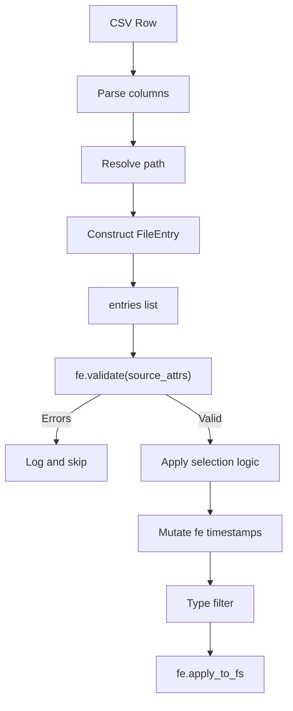

# SetCreationTime Refactoring — Use FileEntry.apply_to_fs()

## Design Principles

**FileEntry's role:**
- A pure data container for filesystem metadata
- Parses CSV columns → attributes (column index mapping only)
- No business logic (no `earliest`/`latest` selection)
- `apply_to_fs()` applies attributes to the filesystem
- `validate()` verifies attributes against the filesystem

**SetCreationTime's role:**
- Parse listing with path resolution
- Construct FileEntry with full resolved paths
- Filter using `fe.validate()`
- Apply selection logic (`earliest`/`latest`/index)
- Call `fe.apply_to_fs()`

---

## New FileEntry Method: validate()

The method should:
1. Check path existence
2. Check that required attributes are not None in the entry
3. Optionally compare attributes against actual filesystem values
4. Return useful information about what passed/failed

### Option A: Return list of violations

```python
def validate(
    self,
    attrs: list[str] | None = None,
    check_fs: bool = False,
) -> list[str]:
    """Validate this entry.
    
    Args:
        attrs: List of attributes to validate. If None, checks only path existence.
        check_fs: If True, compare attribute values against filesystem. If False,
                  only check that attributes are not None.
    
    Returns:
        List of validation error messages. Empty list means valid.
        
    Example::
    
        errors = fe.validate(['creation', 'modify'])
        if errors:
            for err in errors:
                logger.warning(err)
        else:
            fe.apply_to_fs(attrs=['creation', 'modify'])
    """
    errors: list[str] = []
    
    # Path existence
    if not os.path.exists(self.path):
        errors.append(f"path does not exist: {self.path}")
        return errors  # Can't check further
    
    if not attrs:
        return errors
    
    if check_fs:
        # Compare against actual filesystem
        fs_entry = FileEntry.from_fs_path(self.path)
        for attr in attrs:
            my_val = getattr(self, attr, None)
            fs_val = getattr(fs_entry, attr, None)
            
            if my_val is None:
                errors.append(f"{attr}: not set in entry")
            elif attr == 'checksum':
                # Special: recalculate and compare
                fs_checksum = fs_entry.calculate_checksum()
                if my_val != f"md5:{fs_checksum}":
                    errors.append(f"checksum mismatch: expected {my_val}, got md5:{fs_checksum}")
            elif my_val != fs_val:
                errors.append(f"{attr}: entry={my_val!r}, fs={fs_val!r}")
    else:
        # Just check attrs are not None
        for attr in attrs:
            if getattr(self, attr, None) is None:
                errors.append(f"{attr}: not set in entry")
    
    return errors
```

### Option B: Return a ValidationResult object

```python
from dataclasses import dataclass, field

@dataclass
class ValidationResult:
    """Result of FileEntry.validate()."""
    path_exists: bool
    validated_attrs: dict[str, bool] = field(default_factory=dict)
    errors: list[str] = field(default_factory=list)
    
    @property
    def valid(self) -> bool:
        """True if no validation errors."""
        return self.path_exists and all(self.validated_attrs.values()) and not self.errors
    
    def __bool__(self) -> bool:
        return self.valid

# Usage:
result = fe.validate(['creation', 'modify'], check_fs=True)
if result:
    fe.apply_to_fs(attrs=['creation', 'modify'])
else:
    for err in result.errors:
        logger.warning(err)
```

### Recommendation: Option A (list of errors)

- Simpler API
- Empty list is truthy-falsy friendly: `if not fe.validate(attrs):`
- Easy to log: `for err in errors: logger.warning(err)`
- No extra dataclass needed

---

## Naming Discussion

| Name | Pros | Cons |
|------|------|------|
| `validate()` | Clear intent, common pattern | Might suggest it changes state |
| `verify()` | Implies checking against something | Less common |
| `check()` | Simple, widely understood | Too generic |
| `is_valid()` | Pythonic for boolean | But we return errors, not bool |
| `errors()` | Clear about return type | Doesn't convey validation |

**Recommendation: `validate()`** — it's the standard term for this kind of operation.

---

## Usage Patterns

### SetCreationTime — Pre-apply validation

```python
def _do_attr_map(self, entries: list[FileEntry]) -> None:
    source_attrs = ['creation', 'access', 'modify']
    
    for fe in entries:
        # Validate: path exists, source attrs present
        errors = fe.validate(source_attrs)
        if errors:
            for err in errors:
                logger.error('%s: %s', fe.path, err)
            failed += 1
            continue
        
        # ... selection logic, type filtering ...
        
        fe.apply_to_fs(attrs=attrs_to_apply)
```

### CopyValidateMD5 — Post-copy verification

```python
def verify_copy(src_entry: FileEntry, dst_path: str) -> bool:
    """Verify destination matches source."""
    dst_entry = FileEntry.from_fs_path(dst_path)
    dst_entry.checksum = src_entry.checksum  # Expected value
    
    errors = dst_entry.validate(['checksum'], check_fs=True)
    if errors:
        for err in errors:
            logger.error('Verification failed: %s', err)
        return False
    return True
```

---

## Code Changes

### FileEntry — Add validate() method

```python
def validate(
    self,
    attrs: list[str] | None = None,
    check_fs: bool = False,
) -> list[str]:
    """Validate this entry against the filesystem.
    
    Args:
        attrs: Attributes to validate. If None, only checks path existence.
        check_fs: If True, compare values against actual filesystem.
                  If False, only check that attrs are not None.
    
    Returns:
        List of validation error strings. Empty means valid.
    
    Examples::
    
        # Check path exists
        errors = fe.validate()
        
        # Check path exists and timestamps are set
        errors = fe.validate(['creation', 'modify'])
        
        # Verify timestamps match filesystem
        errors = fe.validate(['creation', 'modify'], check_fs=True)
        
        # Verify checksum
        errors = fe.validate(['checksum'], check_fs=True)
    """
    import os
    
    errors: list[str] = []
    
    if not os.path.exists(self.path):
        errors.append(f"path does not exist: {self.path}")
        return errors
    
    if not attrs:
        return errors
    
    if check_fs:
        fs_entry = FileEntry.from_fs_path(self.path)
        for attr in attrs:
            my_val = getattr(self, attr, None)
            
            if my_val is None:
                errors.append(f"{attr}: not set in entry")
                continue
            
            if attr == 'checksum':
                # Checksum needs special handling - calculate on demand
                algo = my_val.split(':')[0] if ':' in my_val else 'md5'
                fs_digest = fs_entry.calculate_checksum(algorithm=algo)
                expected = my_val.split(':')[1] if ':' in my_val else my_val
                if fs_digest != expected:
                    errors.append(f"checksum mismatch: expected {expected}, got {fs_digest}")
            else:
                fs_val = getattr(fs_entry, attr, None)
                if my_val != fs_val:
                    errors.append(f"{attr} mismatch: entry={my_val!r}, fs={fs_val!r}")
    else:
        for attr in attrs:
            if getattr(self, attr, None) is None:
                errors.append(f"{attr}: not set in entry")
    
    return errors
```

### FileEntry — Remove meta-selector support

Remove the second pass from `from_listing_row()` that handles `'earliest'`/`'latest'`.

---

## Updated Flow



---

## Files Modified

| File | Changes |
|------|---------|
| [`common/FileEntry.py`](common/FileEntry.py) | Add `validate()` method, remove meta-selector support from `from_listing_row()` |
| [`tackles/SetCreationTime.py`](tackles/SetCreationTime.py) | Update parsing, use `validate()` and `apply_to_fs()`, delete `_apply_attrs()` |

---

## Migration Steps

1. Add `validate()` method to FileEntry
2. Remove meta-selector support from `FileEntry.from_listing_row()`
3. Update `parse_listing()` to accept `base_dir` and `script_base_path`, resolve paths during parsing
4. Simplify row parsers to return `FileEntry` only
5. Update `_do_attr_map()` to use `validate()` and `apply_to_fs()`
6. Delete `_apply_attrs()`
7. Update `do()` method to pass new args to `parse_listing()`
8. Update tests
9. Run test suite

---

## Approval

- [ ] Design approach approved
- [ ] `validate()` method signature approved
- [ ] Ready for implementation in Code mode
