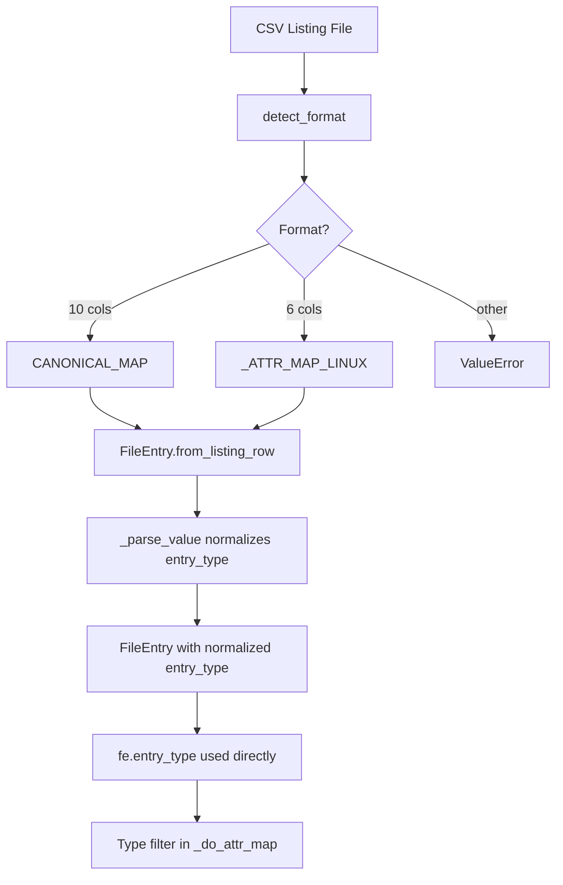

# SetCreationTime Refactoring — Comprehensive Plan

This plan covers:
1. Replacing `classify_entry`/`is_directory_entry` with direct `fe.entry_type` usage
2. Dropping PowerShell format support (FORMAT_PS_HEADER, FORMAT_PS_TYPE)
3. Updating canonical format column order

---

## 1. New Canonical Format Column Order

### Current Order (10 columns)

| Col | Attr        |
|-----|-------------|
| 0   | size        |
| 1   | creation    |
| 2   | access      |
| 3   | modify      |
| 4   | permissions |
| 5   | uid         |
| 6   | gid         |
| 7   | checksum    |
| 8   | entry_type  |
| 9   | path        |

### New Order (10 columns)

User requirements:
- **checksum and entry_type should go right after timestamps**
- **size should go right before path**
- **path stays last**

| Col | Attr        | Rationale |
|-----|-------------|-----------|
| 0   | creation    | Timestamps first |
| 1   | access      | Timestamps first |
| 2   | modify      | Timestamps first |
| 3   | checksum    | Right after timestamps |
| 4   | entry_type  | Right after timestamps |
| 5   | permissions | Ownership/perms group |
| 6   | uid         | Ownership/perms group |
| 7   | gid         | Ownership/perms group |
| 8   | size        | Right before path |
| 9   | path        | Always last |

### Updated CANONICAL_MAP

```python
CANONICAL_MAP: dict[str, str] = {
    'creation': '0',
    'access': '1',
    'modify': '2',
    'checksum': '3',
    'entry_type': '4',
    'permissions': '5',
    'uid': '6',
    'gid': '7',
    'size': '8',
    'path': '9',
}
```

---

## 2. Supported Listing Formats

### Formats to Keep

| Format | Columns | Description |
|--------|---------|-------------|
| **canonical** | 10 | Full pyTackle format with all attributes |
| **linux** | 6 | Linux stat output: creation, access, modify, ctime, entry_type, path |

### Formats to Remove

- **FORMAT_PS_HEADER** — PowerShell 4-column format with header
- **FORMAT_PS_TYPE** — PowerShell 5-column format with type marker

### Format Detection Logic

```python
FORMAT_CANONICAL = 'canonical'  # 10 columns
FORMAT_LINUX = 'linux'          # 6 columns

def detect_format(first_line: str) -> str:
    """Return format identifier based on column count."""
    reader = csv.reader(io.StringIO(first_line.strip()))
    cols = next(reader, [])
    n = len(cols)
    
    if n == 10:
        return FORMAT_CANONICAL
    if n == 6:
        return FORMAT_LINUX
    
    raise ValueError(
        f'Unsupported listing format: {n} columns. '
        f'Expected 10 (canonical) or 6 (linux).'
    )
```

### Linux Format Attribute Map

```python
# Linux stat output: creation, access, modify, ctime, entry_type, path
# Note: ctime (column 3) is ignored — it's metadata change time, not useful
_ATTR_MAP_LINUX = {
    'creation': '0',
    'access': '1',
    'modify': '2',
    'entry_type': '4',
    'path': '5',
}
```

---

## 3. Entry Type Handling — Simplified Approach

### Key Insight

Since we're dropping PowerShell formats, **every supported listing format now includes `entry_type`**:
- Canonical (10 cols) has `entry_type` at column 4
- Linux (6 cols) has `entry_type` at column 4

Therefore, we can **trust `fe.entry_type` directly** without needing filesystem detection fallback. The old `classify_entry()` function was only needed because `FORMAT_PS_HEADER` had no type column.

### Move normalize_entry_type to FileEntry.py

```python
def normalize_entry_type(raw: str | None) -> str | None:
    """Normalize entry type to single-char code: f, d, or l.
    
    Accepts various formats from listing files:
    - f, F, file → f
    - d, D, directory → d
    - l, L, symlink, link → l
    
    Returns None if input is None or empty.
    """
    if raw is None:
        return None
    raw = raw.strip().lower()
    if not raw:
        return None
    if raw in ('f', 'file'):
        return 'f'
    if raw in ('d', 'directory'):
        return 'd'
    if raw in ('l', 'symlink', 'link'):
        return 'l'
    return raw[0] if raw else None
```

### Update _parse_value

```python
def _parse_value(attr: str, raw: str) -> Any:
    if attr in _INT_ATTRS:
        return int(raw)
    if attr in _DATETIME_ATTRS:
        return parse_datetime(raw)
    if attr == 'entry_type':
        return normalize_entry_type(raw)  # Normalize during parsing
    return raw
```

### No effective_entry_type Method Needed

**Simplified approach:** Just use `fe.entry_type` directly instead of `classify_entry(fe, fe.path)`.

**Rationale:**
- `FileEntry.from_fs_path()` already populates `entry_type` correctly from filesystem
- `FileEntry.from_listing_row()` will normalize `entry_type` during parsing
- All supported listing formats include `entry_type`
- No need for filesystem fallback detection

### Update _do_attr_map in SetCreationTime

Replace:
```python
etype = classify_entry(fe, fe.path)
if etype not in self.allowed_types:
```

With simply:
```python
if fe.entry_type not in self.allowed_types:
```

---

## 4. Files to Modify

### common/attr_map.py

- Update `CANONICAL_MAP` with new column order

### common/FileEntry.py

- Add `normalize_entry_type()` function
- Update `_parse_value()` to normalize entry_type
- Update `_STR_ATTRS` to remove entry_type (now handled specially)

### tackles/SetCreationTime.py

**Remove:**
- `FORMAT_PS_HEADER` constant
- `FORMAT_PS_TYPE` constant
- `_ATTR_MAP_PS_HEADER` constant
- `_ATTR_MAP_PS_TYPE` constant
- `_parse_row_ps_header()` function
- `_parse_row_ps_type()` function
- `normalize_entry_type()` function
- `classify_entry()` function
- `is_directory_entry()` function

**Update:**
- `detect_format()` — simplify to canonical/linux only
- `parse_listing()` — remove PowerShell format handling
- `_do_attr_map()` — use `fe.entry_type` directly instead of `classify_entry()`
- Module docstring — remove PowerShell format references

### tests/test_file_entry.py

- Update tests using `CANONICAL_MAP` to use new column indices
- Add tests for `normalize_entry_type()`

### tests/test_attr_map.py

- Update any tests referencing CANONICAL_MAP column indices

---

## 5. Flow Diagram



---

## 6. Test Cases

### Entry Type Normalization

```python
class TestNormalizeEntryType:
    def test_file_variants(self):
        assert normalize_entry_type('f') == 'f'
        assert normalize_entry_type('F') == 'f'
        assert normalize_entry_type('file') == 'f'

    def test_directory_variants(self):
        assert normalize_entry_type('d') == 'd'
        assert normalize_entry_type('directory') == 'd'

    def test_symlink_variants(self):
        assert normalize_entry_type('l') == 'l'
        assert normalize_entry_type('symlink') == 'l'
        assert normalize_entry_type('link') == 'l'

    def test_none_and_empty(self):
        assert normalize_entry_type(None) is None
        assert normalize_entry_type('') is None
        assert normalize_entry_type('  ') is None

    def test_from_listing_row_normalizes(self):
        # 'directory' in listing → 'd' in FileEntry
        cols = ['./mydir', 'directory']
        attr_map = {'path': '0', 'entry_type': '1'}
        fe = FileEntry.from_listing_row(cols, attr_map)
        assert fe.entry_type == 'd'
```

### New CANONICAL_MAP Order

```python
class TestCanonicalMapNewOrder:
    def test_column_order(self):
        assert CANONICAL_MAP['creation'] == '0'
        assert CANONICAL_MAP['access'] == '1'
        assert CANONICAL_MAP['modify'] == '2'
        assert CANONICAL_MAP['checksum'] == '3'
        assert CANONICAL_MAP['entry_type'] == '4'
        assert CANONICAL_MAP['permissions'] == '5'
        assert CANONICAL_MAP['uid'] == '6'
        assert CANONICAL_MAP['gid'] == '7'
        assert CANONICAL_MAP['size'] == '8'
        assert CANONICAL_MAP['path'] == '9'
```

---

## 7. Migration Checklist

- [x] Analyze current implementation
- [ ] Update CANONICAL_MAP in common/attr_map.py
- [ ] Add normalize_entry_type() to common/FileEntry.py
- [ ] Update _parse_value() to normalize entry_type
- [ ] Remove PowerShell format support from SetCreationTime.py
- [ ] Simplify detect_format() and parse_listing()
- [ ] Update _do_attr_map() to use fe.entry_type directly
- [ ] Remove deprecated functions from SetCreationTime.py
- [ ] Update tests for new CANONICAL_MAP order
- [ ] Add tests for normalize_entry_type()
- [ ] Run full test suite

---

## 8. Breaking Changes

⚠️ **The CANONICAL_MAP column order change is a breaking change** for any existing canonical format listing files. Existing files will need to be regenerated.

However, the Linux format is unchanged and will continue to work.

---

## Approval

- [ ] New CANONICAL_MAP column order approved
- [ ] Dropping PowerShell formats approved
- [ ] Design approach approved
- [ ] Ready for implementation in Code mode
