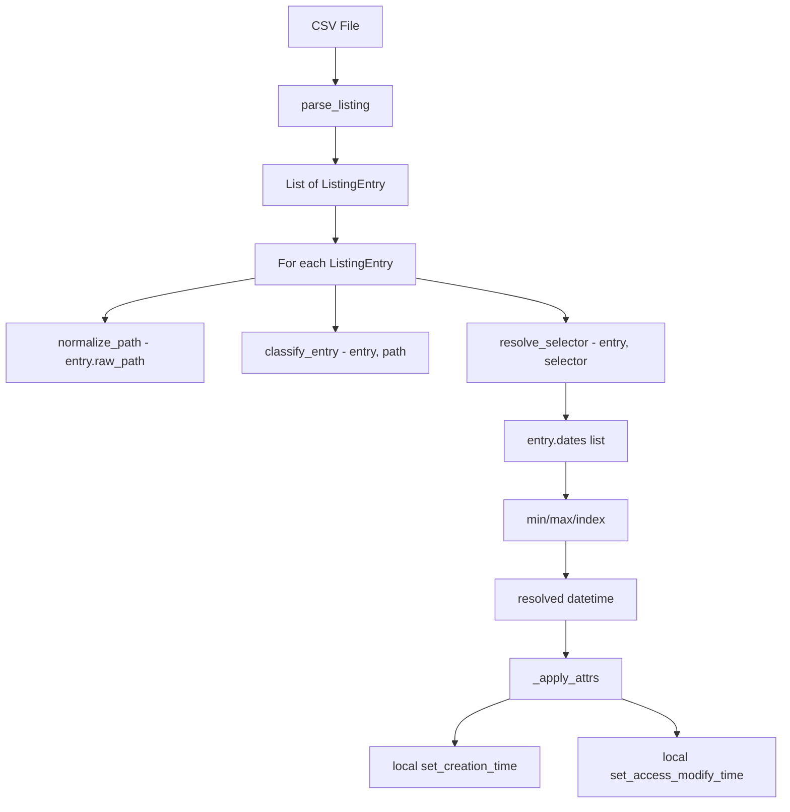
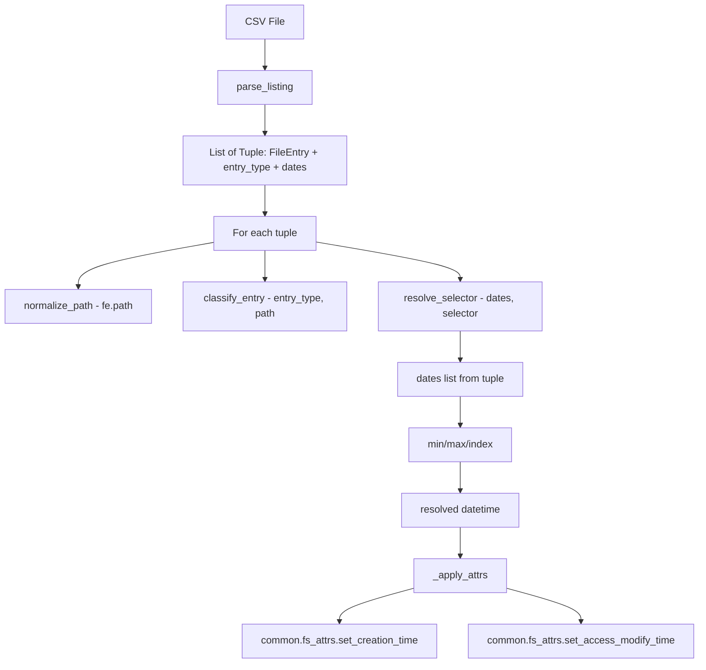

# SetCreationTime Refactoring Plan — Migrate to FileEntry

## Goal

Refactor [`tackles/SetCreationTime.py`](tackles/SetCreationTime.py) (883 lines) to use [`FileEntry`](common/FileEntry.py) from `common/`, eliminating duplicated code while preserving all existing behaviour. All 47 integration tests must continue to pass.

---

## Design Decisions

### D1. How should parse_listing be refactored?

**Decision: Return `List[Tuple[FileEntry, Optional[str], List[datetime]]]`**

A 3-tuple of `(FileEntry, entry_type, dates_list)`:

- **`FileEntry`** — carries `path`, `creation`, `access`, `modify` from the parsed row
- **`entry_type`** — raw string from CSV: `'f'`, `'directory'`, `'D'`, `'F'`, or `None` for Format 2. Consumed only by [`classify_entry()`](tackles/SetCreationTime.py:362). Not stored on `FileEntry` because it is SetCreationTime-specific.
- **`dates_list`** — the raw positional list of all parsed timestamps in column order. Needed because Format 1 has 4 date columns but `FileEntry` only has 3 datetime fields, and index-based selectors in `--attr-map` reference column positions.

```python
# Before
def parse_listing(listing_path: str) -> List[ListingEntry]: ...

# After
def parse_listing(listing_path: str) -> List[Tuple[FileEntry, Optional[str], List[datetime]]]: ...
```

**Why not just `Tuple[FileEntry, Optional[str]]`?** Because `resolve_selector` with index-based selectors like `'3'` needs access to the 4th date column in Format 1, which cannot be stored on `FileEntry` — it only has `creation`, `access`, `modify`. The dates list preserves exact positional semantics.

### D2. How should generate_listing be refactored?

**Decision: Keep the existing Format-3 CSV writer; do NOT use `common.listing.write_listing()`**

The existing [`generate_listing()`](tackles/SetCreationTime.py:561) writes Format-3 CSV with PowerShell-style timestamps (`MM/DD/YYYY HH:MM:SS`), type markers (`D`/`F`/`L`), and relative paths. This is a **different format** from the canonical CSV in [`common/listing.py`](common/listing.py) which uses ISO 8601 timestamps and the 9-column layout.

Changing the output format would break round-trip compatibility: a listing generated by `--generate-listing` must be readable by the same tackle's `--listing` mode.

However, we **will** replace the inline filesystem timestamp setters with [`common.fs_attrs`](common/fs_attrs.py) imports in `_apply_attrs`.

### D3. How should resolve_selector work with FileEntry?

**Decision: Keep the dates list as the primary input**

The `resolve_selector` function takes a `List[datetime]` instead of a `ListingEntry`. This is the minimal change — the function's core logic is identical, just the container changes from `entry.dates` to a bare list parameter.

```python
# Before
def resolve_selector(entry: ListingEntry, selector: str) -> Optional[datetime]:

# After
def resolve_selector(dates: List[datetime], selector: str) -> Optional[datetime]:
```

Meta-selectors (`earliest`/`latest`) use `min(dates)`/`max(dates)`. Index selectors use `dates[idx]`. Both work identically to the current implementation.

### D4. Should format-specific row parsers return FileEntry directly?

**Decision: Yes, with the dates list and entry_type as side-channels**

Each row parser returns `Tuple[FileEntry, Optional[str], List[datetime]]`. The `FileEntry` gets `creation`, `access`, `modify` populated from the appropriate columns. The `dates` list preserves all parsed timestamps in column order.

### D5. How should --attr-map work after migration?

**Decision: No change to the CLI interface or parsing**

The `--attr-map` argument continues to accept the same syntax. The local [`parse_attr_map()`](tackles/SetCreationTime.py:257) is replaced by [`common.attr_map.parse_attr_map()`](common/attr_map.py:60).

The common version accepts all 9 attributes while the old version only accepted 3. This is a **superset** — existing inputs work identically. If a user passes `size:0` it will be accepted by the parser but ignored by the apply logic. The common version also correctly validates that meta-selectors are only used with datetime attributes.

---

## What Gets Deleted vs Kept vs Replaced

### Deleted — replaced by common/ equivalents

| Function/Constant | Lines | Replacement |
|---|---|---|
| [`VALID_ATTRS`](tackles/SetCreationTime.py:42) | 42 | [`common.attr_map.VALID_ATTRS`](common/attr_map.py:15) |
| [`META_SELECTORS`](tackles/SetCreationTime.py:43) | 43 | [`common.attr_map.META_SELECTORS`](common/attr_map.py:36) |
| [`_SELECTOR_ALIASES`](tackles/SetCreationTime.py:45) | 45 | [`common.attr_map._SELECTOR_ALIASES`](common/attr_map.py:37) |
| [`_EPOCH_1601`](tackles/SetCreationTime.py:55) | 55 | [`common.fs_attrs._EPOCH_1601`](common/fs_attrs.py:28) |
| [`ListingEntry`](tackles/SetCreationTime.py:70) dataclass | 70-76 | [`FileEntry`](common/FileEntry.py:48) + tuple side-channels |
| [`parse_attr_map()`](tackles/SetCreationTime.py:257) | 257-303 | [`common.attr_map.parse_attr_map()`](common/attr_map.py:60) |
| [`_datetime_to_filetime_int()`](tackles/SetCreationTime.py:394) | 394-397 | [`common.fs_attrs._datetime_to_filetime_int()`](common/fs_attrs.py:71) |
| [`set_creation_time_windows()`](tackles/SetCreationTime.py:400) | 400-472 | [`common.fs_attrs._set_creation_time_windows()`](common/fs_attrs.py:84) |
| [`set_creation_time_macos()`](tackles/SetCreationTime.py:475) | 475-489 | [`common.fs_attrs._set_creation_time_macos()`](common/fs_attrs.py:159) |
| [`set_creation_time()`](tackles/SetCreationTime.py:492) | 492-502 | [`common.fs_attrs.set_creation_time()`](common/fs_attrs.py:176) |
| [`set_access_modify_time()`](tackles/SetCreationTime.py:505) | 505-521 | [`common.fs_attrs.set_access_modify_time()`](common/fs_attrs.py:196) |

### Kept — unique to SetCreationTime

| Function/Constant | Lines | Notes |
|---|---|---|
| [`FORMAT_LINUX`](tackles/SetCreationTime.py:51), [`FORMAT_PS_HEADER`](tackles/SetCreationTime.py:52), [`FORMAT_PS_TYPE`](tackles/SetCreationTime.py:53) | 51-53 | Format constants — unchanged |
| [`_RE_LINUX_TS`](tackles/SetCreationTime.py:58) | 58-63 | Linux timestamp regex — unchanged |
| [`parse_timestamp_linux()`](tackles/SetCreationTime.py:82) | 82-93 | Unchanged |
| [`parse_timestamp_powershell()`](tackles/SetCreationTime.py:96) | 96-100 | Unchanged |
| [`normalize_path()`](tackles/SetCreationTime.py:107) | 107-140 | Unchanged |
| [`detect_format()`](tackles/SetCreationTime.py:147) | 147-167 | Unchanged |
| [`_parse_row_linux()`](tackles/SetCreationTime.py:170) | 170-180 | Modified return type |
| [`_parse_row_ps_header()`](tackles/SetCreationTime.py:183) | 183-192 | Modified return type |
| [`_parse_row_ps_type()`](tackles/SetCreationTime.py:195) | 195-205 | Modified return type |
| [`parse_listing()`](tackles/SetCreationTime.py:208) | 208-250 | Modified return type |
| [`parse_types()`](tackles/SetCreationTime.py:306) | 306-326 | Unchanged |
| [`resolve_selector()`](tackles/SetCreationTime.py:333) | 333-355 | Modified: takes `List[datetime]` |
| [`classify_entry()`](tackles/SetCreationTime.py:362) | 362-379 | Modified: takes `Optional[str]` |
| [`is_directory_entry()`](tackles/SetCreationTime.py:382) | 382-387 | Modified to match new classify_entry |
| [`_get_creation_time()`](tackles/SetCreationTime.py:528) | 528-537 | Kept for generate_listing |
| [`_format_ts_utc()`](tackles/SetCreationTime.py:540) | 540-543 | Kept for generate_listing |
| [`_entry_type_code()`](tackles/SetCreationTime.py:546) | 546-552 | Kept for generate_listing |
| [`_type_code_to_filter()`](tackles/SetCreationTime.py:555) | 555-558 | Kept |
| [`generate_listing()`](tackles/SetCreationTime.py:561) | 561-621 | Kept as-is |
| [`SetCreationTime`](tackles/SetCreationTime.py:628) class | 628-883 | Modified internals |

---

## Function Signature Changes — Before/After

### Row Parsers

```python
# BEFORE
def _parse_row_linux(cols: List[str]) -> ListingEntry:
def _parse_row_ps_header(cols: List[str]) -> ListingEntry:
def _parse_row_ps_type(cols: List[str]) -> ListingEntry:

# AFTER
def _parse_row_linux(cols: List[str]) -> Tuple[FileEntry, Optional[str], List[datetime]]:
def _parse_row_ps_header(cols: List[str]) -> Tuple[FileEntry, Optional[str], List[datetime]]:
def _parse_row_ps_type(cols: List[str]) -> Tuple[FileEntry, Optional[str], List[datetime]]:
```

### parse_listing

```python
# BEFORE
def parse_listing(listing_path: str) -> List[ListingEntry]:

# AFTER
def parse_listing(listing_path: str) -> List[Tuple[FileEntry, Optional[str], List[datetime]]]:
```

### resolve_selector

```python
# BEFORE
def resolve_selector(entry: ListingEntry, selector: str) -> Optional[datetime]:

# AFTER
def resolve_selector(dates: List[datetime], selector: str) -> Optional[datetime]:
```

### classify_entry

```python
# BEFORE
def classify_entry(entry: ListingEntry, resolved_path: str) -> str:

# AFTER
def classify_entry(entry_type: Optional[str], resolved_path: str) -> str:
```

### is_directory_entry

```python
# BEFORE
def is_directory_entry(entry: ListingEntry, resolved_path: str) -> bool:

# AFTER
def is_directory_entry(entry_type: Optional[str], resolved_path: str) -> bool:
```

### _do_attr_map

```python
# BEFORE
def _do_attr_map(self, entries: List[ListingEntry]) -> None:

# AFTER
def _do_attr_map(self, entries: List[Tuple[FileEntry, Optional[str], List[datetime]]]) -> None:
```

### _apply_attrs — signature unchanged, implementation delegates to common

```python
# Signature unchanged
@staticmethod
def _apply_attrs(path: str, attrs: Dict[str, datetime]) -> None:

# Implementation changes: calls common.fs_attrs instead of local functions
```

---

## Imports — Before/After

```python
# ---- BEFORE ----
import csv
import io
import logging
import os
import pathlib
import platform
import re
import subprocess
import sys
from dataclasses import dataclass, field
from datetime import datetime, timezone
from typing import Dict, List, Optional

from tackles.TackleFactory import TackleFactory

# ---- AFTER ----
import csv
import io
import logging
import os
import pathlib
import re
import sys
from datetime import datetime, timezone
from typing import Dict, List, Optional, Tuple

from common.attr_map import parse_attr_map          # replaces local version
from common.FileEntry import FileEntry               # replaces ListingEntry
from common.fs_attrs import (
    set_creation_time,                               # replaces local version
    set_access_modify_time,                          # replaces local version
)
from tackles.TackleFactory import TackleFactory

# Removed: dataclass, field (ListingEntry deleted)
# Removed: platform, subprocess (used only by deleted creation-time setters)
# Removed: ctypes imports (were inside deleted functions)
```

---

## Test Impact Analysis

### Symbols imported by tests

The integration tests in [`tests/test_tackles_integration.py`](tests/test_tackles_integration.py:23) import:

```python
from tackles.SetCreationTime import (
    FORMAT_LINUX,              # constant — unchanged ✅
    FORMAT_PS_HEADER,          # constant — unchanged ✅
    FORMAT_PS_TYPE,            # constant — unchanged ✅
    ListingEntry,              # DELETED — must update tests ❌
    classify_entry,            # signature changes ⚠️
    detect_format,             # unchanged ✅
    generate_listing,          # unchanged ✅
    normalize_path,            # unchanged ✅
    parse_attr_map,            # re-exported from common ✅
    parse_listing,             # return type changes ⚠️
    parse_timestamp_linux,     # unchanged ✅
    parse_timestamp_powershell,# unchanged ✅
    parse_types,               # unchanged ✅
    resolve_selector,          # signature changes ⚠️
    set_access_modify_time,    # re-exported from common ✅
)
```

### Re-export strategy

To minimize test churn, [`SetCreationTime.py`](tackles/SetCreationTime.py) will re-export common symbols:

```python
# These are imported from common but re-exported so existing
# import paths in tests and external code continue to work.
from common.attr_map import parse_attr_map          # noqa: F401
from common.fs_attrs import set_creation_time       # noqa: F401
from common.fs_attrs import set_access_modify_time  # noqa: F401
```

### Tests that need updating

| Test | Issue | Fix |
|---|---|---|
| [`test_parse_listing_linux_format`](tests/test_tackles_integration.py:86) | Checks `isinstance(e, ListingEntry)`, accesses `e.dates`, `e.entry_type`, `e.raw_path` | Unpack `(fe, entry_type, dates)` tuple. Check `isinstance(fe, FileEntry)`. Use `fe.path` instead of `e.raw_path`. Use `dates[0]` instead of `e.dates[0]`. Use `entry_type` instead of `e.entry_type`. |
| [`test_parse_listing_powershell_header_format`](tests/test_tackles_integration.py:114) | Same pattern | Same fix |
| [`test_parse_listing_powershell_type_format`](tests/test_tackles_integration.py:139) | Same pattern | Same fix |
| [`test_meta_selectors_earliest`](tests/test_tackles_integration.py:287) | Creates `ListingEntry`, calls `resolve_selector(entry, ...)` | Create a `dates` list directly, call `resolve_selector(dates, ...)` |
| [`test_meta_selectors_latest`](tests/test_tackles_integration.py:301) | Same | Same |
| [`test_resolve_selector_by_index`](tests/test_tackles_integration.py:315) | Same | Same |
| [`test_resolve_selector_out_of_range`](tests/test_tackles_integration.py:330) | Same | Same |
| [`test_resolve_selector_empty_dates`](tests/test_tackles_integration.py:339) | Same | Same |
| [`test_apply_timestamps_from_listing`](tests/test_tackles_integration.py:443) | Uses `parse_listing` return, `entry.raw_path`, `resolve_selector(entry, ...)` | Unpack tuple, use `fe.path`, pass `dates` to `resolve_selector` |
| [`test_dry_run_no_changes`](tests/test_tackles_integration.py:486) | Same pattern | Same fix |
| [`test_type_filtering`](tests/test_tackles_integration.py:543) | Creates `ListingEntry`, calls `classify_entry(entry, path)` | Pass `entry_type` string directly to `classify_entry(entry_type, path)` |
| [`test_classify_entry_no_type_marker`](tests/test_tackles_integration.py:594) | Same | Pass `None` to `classify_entry(None, path)` |
| [`test_classify_entry_directory_variants`](tests/test_tackles_integration.py:611) | Same | Pass marker string to `classify_entry(marker, path)` |

### Import line change in tests

```python
# BEFORE
from tackles.SetCreationTime import (
    ...
    ListingEntry,
    ...
)

# AFTER
from tackles.SetCreationTime import (
    ...
    # ListingEntry removed
    ...
)
from common.FileEntry import FileEntry  # if isinstance checks are kept
```

### parse_attr_map error message compatibility

The common [`parse_attr_map()`](common/attr_map.py:60) produces slightly different error messages than the old version. Checking test assertions:

- [`test_parse_attr_map_invalid_attr`](tests/test_tackles_integration.py:255): `pytest.raises(ValueError, match='Unknown attribute')` — same substring in both versions ✅
- [`test_parse_attr_map_missing_colon`](tests/test_tackles_integration.py:260): `match='expected "attr:selector"'` — same substring ✅
- [`test_parse_attr_map_empty`](tests/test_tackles_integration.py:265): `match='empty mapping'` — same substring ✅

---

## Step-by-Step Execution Order

### Phase 1: Delete duplicated code, add common imports

**Step 1.1** — Add new imports at the top of [`SetCreationTime.py`](tackles/SetCreationTime.py):
- `from common.FileEntry import FileEntry`
- `from common.attr_map import parse_attr_map`
- `from common.fs_attrs import set_creation_time, set_access_modify_time`
- Add `Tuple` to the typing imports

**Step 1.2** — Remove unused imports:
- `dataclass`, `field` from dataclasses — no longer needed since `ListingEntry` is deleted
- `platform` — only used by deleted `set_creation_time()`
- `subprocess` — only used by deleted `set_creation_time_macos()`

**Step 1.3** — Delete the following blocks:
- Lines 42-45: `VALID_ATTRS`, `META_SELECTORS`, `_SELECTOR_ALIASES`
- Line 55: `_EPOCH_1601`
- Lines 70-76: `ListingEntry` dataclass
- Lines 257-303: `parse_attr_map()` function
- Lines 394-397: `_datetime_to_filetime_int()`
- Lines 400-472: `set_creation_time_windows()`
- Lines 475-489: `set_creation_time_macos()`
- Lines 492-502: `set_creation_time()`
- Lines 505-521: `set_access_modify_time()`

**Checkpoint**: ~200 lines deleted. File should be ~680 lines. Tests will fail at this point — that is expected.

### Phase 2: Rewrite row parsers

**Step 2.1** — Rewrite [`_parse_row_linux()`](tackles/SetCreationTime.py:170):

```python
def _parse_row_linux(cols: List[str]) -> Tuple[FileEntry, Optional[str], List[datetime]]:
    """Format 1: 6 columns — 4 dates, type, path."""
    dates: List[datetime] = []
    for i in range(4):
        try:
            dates.append(parse_timestamp_linux(cols[i]))
        except (ValueError, IndexError):
            pass
    entry_type = cols[4].strip().lower() if len(cols) > 4 else None
    raw_path = cols[5].strip().strip('"') if len(cols) > 5 else ''

    fe = FileEntry(
        path=raw_path,
        creation=dates[0] if len(dates) > 0 else None,
        access=dates[1] if len(dates) > 1 else None,
        modify=dates[2] if len(dates) > 2 else None,
    )
    return fe, entry_type, dates
```

**Step 2.2** — Rewrite [`_parse_row_ps_header()`](tackles/SetCreationTime.py:183):

```python
def _parse_row_ps_header(cols: List[str]) -> Tuple[FileEntry, Optional[str], List[datetime]]:
    """Format 2: 4 columns — 3 dates, path (no type)."""
    dates: List[datetime] = []
    for i in range(3):
        try:
            dates.append(parse_timestamp_powershell(cols[i]))
        except (ValueError, IndexError):
            pass
    raw_path = cols[3].strip().strip('"') if len(cols) > 3 else ''

    fe = FileEntry(
        path=raw_path,
        creation=dates[0] if len(dates) > 0 else None,
        access=dates[1] if len(dates) > 1 else None,
        modify=dates[2] if len(dates) > 2 else None,
    )
    return fe, None, dates
```

**Step 2.3** — Rewrite [`_parse_row_ps_type()`](tackles/SetCreationTime.py:195):

```python
def _parse_row_ps_type(cols: List[str]) -> Tuple[FileEntry, Optional[str], List[datetime]]:
    """Format 3: 5 columns — 3 dates, type, path."""
    dates: List[datetime] = []
    for i in range(3):
        try:
            dates.append(parse_timestamp_powershell(cols[i]))
        except (ValueError, IndexError):
            pass
    entry_type = cols[3].strip().upper() if len(cols) > 3 else None
    raw_path = cols[4].strip().strip('"') if len(cols) > 4 else ''

    fe = FileEntry(
        path=raw_path,
        creation=dates[0] if len(dates) > 0 else None,
        access=dates[1] if len(dates) > 1 else None,
        modify=dates[2] if len(dates) > 2 else None,
    )
    return fe, entry_type, dates
```

### Phase 3: Update parse_listing

**Step 3.1** — Update [`parse_listing()`](tackles/SetCreationTime.py:208) type annotations:

```python
def parse_listing(listing_path: str) -> List[Tuple[FileEntry, Optional[str], List[datetime]]]:
    """Read and parse a listing file, auto-detecting the format."""
    entries: List[Tuple[FileEntry, Optional[str], List[datetime]]] = []
    # ... rest of logic unchanged — row_parser already returns the right type
```

The internal logic is identical. The `entries.append(entry)` call inside the try block already appends whatever the row parser returns, which is now a tuple.

### Phase 4: Update resolve_selector and classify_entry

**Step 4.1** — Rewrite [`resolve_selector()`](tackles/SetCreationTime.py:333):

```python
def resolve_selector(
    dates: List[datetime],
    selector: str,
) -> Optional[datetime]:
    """Resolve a single attr-map selector against a date list.

    selector is 'earliest', 'latest', or a 0-based column index string.
    """
    if not dates:
        return None
    if selector == 'earliest':
        return min(dates)
    if selector == 'latest':
        return max(dates)
    idx = int(selector)
    if 0 <= idx < len(dates):
        return dates[idx]
    logger.warning(
        'Column index %d out of range (entry has %d date columns)',
        idx, len(dates),
    )
    return None
```

**Step 4.2** — Rewrite [`classify_entry()`](tackles/SetCreationTime.py:362):

```python
def classify_entry(entry_type: Optional[str], resolved_path: str) -> str:
    """Return a single-char type code: 'd', 'f', or 'l'.

    Symlinks are detected via the filesystem. If the listing carries a type
    marker it is used for the file-vs-directory distinction; otherwise the
    filesystem is consulted.
    """
    if os.path.islink(resolved_path):
        return 'l'
    if entry_type is not None:
        if entry_type.lower() in ('directory', 'd'):
            return 'd'
        return 'f'
    if os.path.isdir(resolved_path):
        return 'd'
    return 'f'
```

**Step 4.3** — Update [`is_directory_entry()`](tackles/SetCreationTime.py:382):

```python
def is_directory_entry(entry_type: Optional[str], resolved_path: str) -> bool:
    """Decide whether entry represents a directory."""
    return classify_entry(entry_type, resolved_path) == 'd'
```

### Phase 5: Update the SetCreationTime class

**Step 5.1** — Update [`_do_attr_map()`](tackles/SetCreationTime.py:797) to unpack tuples:

```python
def _do_attr_map(self, entries: List[Tuple[FileEntry, Optional[str], List[datetime]]]) -> None:
    """Apply timestamps according to --attr-map."""
    success = 0
    skipped = 0
    failed = 0

    for fe, entry_type, dates in entries:
        rel_path = normalize_path(fe.path, self.script_base_path)
        resolved = os.path.normpath(os.path.join(self.base_dir, rel_path))

        if not os.path.exists(resolved):
            logger.error('Path not found locally, skipping: %s', resolved)
            failed += 1
            continue

        # Type filter
        etype = classify_entry(entry_type, resolved)
        if etype not in self.allowed_types:
            logger.debug(
                'Skipping %s (type=%s, allowed=%s)',
                rel_path, etype, self.allowed_types,
            )
            skipped += 1
            continue

        # Resolve dates for each requested attribute
        resolved_attrs: Dict[str, datetime] = {}
        skip_entry = False
        for attr, selector in self.attr_map.items():
            dt = resolve_selector(dates, selector)
            if dt is None:
                logger.warning(
                    'No valid date for attr=%s selector=%s on %s, skipping entry',
                    attr, selector, rel_path,
                )
                skip_entry = True
                break
            resolved_attrs[attr] = dt

        if skip_entry:
            skipped += 1
            continue

        if self.dry_run:
            parts = ', '.join(
                f'{a}={d.isoformat()}' for a, d in resolved_attrs.items()
            )
            logger.info('[DRY-RUN] Would set %s on %s', parts, resolved)
            success += 1
            continue

        # Apply timestamps
        try:
            self._apply_attrs(resolved, resolved_attrs)
            parts = ', '.join(
                f'{a}={d.isoformat()}' for a, d in resolved_attrs.items()
            )
            logger.info('Set %s on %s', parts, resolved)
            success += 1
        except NotImplementedError as exc:
            logger.warning('%s — skipping %s', exc, resolved)
            skipped += 1
        except OSError as exc:
            logger.error('Failed for %s: %s', resolved, exc)
            failed += 1
        except Exception as exc:
            logger.error('Unexpected error for %s: %s', resolved, exc)
            failed += 1

    logger.info(
        'Done. success=%d  skipped=%d  failed=%d',
        success, skipped, failed,
    )
```

Key changes from the original:
- Loop unpacks `(fe, entry_type, dates)` instead of iterating `ListingEntry`
- Uses `fe.path` instead of `entry.raw_path`
- Passes `entry_type` to `classify_entry()` instead of the whole entry
- Passes `dates` to `resolve_selector()` instead of the whole entry

**Step 5.2** — Update [`_apply_attrs()`](tackles/SetCreationTime.py:871) to use common imports:

The method body is unchanged — it already calls `set_creation_time()` and `set_access_modify_time()` by name. Since we import these from `common.fs_attrs` at module level, the method automatically uses the common versions. No code change needed in the method body.

### Phase 6: Update integration tests

**Step 6.1** — Update imports in [`tests/test_tackles_integration.py`](tests/test_tackles_integration.py:23):

```python
# Remove ListingEntry from imports
# Add FileEntry import
from common.FileEntry import FileEntry

from tackles.SetCreationTime import (
    FORMAT_LINUX,
    FORMAT_PS_HEADER,
    FORMAT_PS_TYPE,
    # ListingEntry removed
    classify_entry,
    detect_format,
    generate_listing,
    normalize_path,
    parse_attr_map,
    parse_listing,
    parse_timestamp_linux,
    parse_timestamp_powershell,
    parse_types,
    resolve_selector,
    set_access_modify_time,
)
```

**Step 6.2** — Update `parse_listing` tests to unpack tuples:

Example for [`test_parse_listing_linux_format`](tests/test_tackles_integration.py:86):

```python
def test_parse_listing_linux_format(self, tmp_path):
    # ... csv_file creation unchanged ...
    entries = parse_listing(str(csv_file))
    assert len(entries) == 1

    fe, entry_type, dates = entries[0]
    assert isinstance(fe, FileEntry)
    assert len(dates) == 4
    assert dates[0] == datetime(2024, 1, 15, 10, 30, 0, tzinfo=timezone.utc)
    assert dates[1] == datetime(2024, 1, 10, 8, 0, 0, tzinfo=timezone.utc)
    assert entry_type == 'f'
    assert fe.path == './test.txt'
```

**Step 6.3** — Update `resolve_selector` tests to pass dates lists:

Example for [`test_meta_selectors_earliest`](tests/test_tackles_integration.py:287):

```python
def test_meta_selectors_earliest(self):
    """earliest meta-selector resolves to min date."""
    dates = [
        datetime(2024, 3, 1, tzinfo=timezone.utc),
        datetime(2024, 1, 1, tzinfo=timezone.utc),
        datetime(2024, 2, 1, tzinfo=timezone.utc),
    ]
    result = resolve_selector(dates, 'earliest')
    assert result == datetime(2024, 1, 1, tzinfo=timezone.utc)
```

Example for [`test_resolve_selector_empty_dates`](tests/test_tackles_integration.py:339):

```python
def test_resolve_selector_empty_dates(self):
    """Empty dates list returns None for any selector."""
    assert resolve_selector([], 'earliest') is None
    assert resolve_selector([], 'latest') is None
    assert resolve_selector([], '0') is None
```

**Step 6.4** — Update `classify_entry` tests to pass entry_type strings:

Example for [`test_type_filtering`](tests/test_tackles_integration.py:543):

```python
# BEFORE
file_entry = ListingEntry(
    dates=[datetime(2024, 1, 1, tzinfo=timezone.utc)],
    entry_type='f',
    raw_path='file.txt',
)
assert classify_entry(file_entry, str(test_file)) == 'f'

# AFTER
assert classify_entry('f', str(test_file)) == 'f'
```

Example for [`test_classify_entry_no_type_marker`](tests/test_tackles_integration.py:594):

```python
# BEFORE
file_entry = ListingEntry(dates=[], entry_type=None, raw_path='nomarker.txt')
assert classify_entry(file_entry, str(test_file)) == 'f'

# AFTER
assert classify_entry(None, str(test_file)) == 'f'
```

**Step 6.5** — Update [`test_apply_timestamps_from_listing`](tests/test_tackles_integration.py:443) and [`test_dry_run_no_changes`](tests/test_tackles_integration.py:486):

```python
# BEFORE
entry = entries[0]
rel_path = normalize_path(entry.raw_path)
access_dt = resolve_selector(entry, '1')
modify_dt = resolve_selector(entry, '2')

# AFTER
fe, entry_type, dates = entries[0]
rel_path = normalize_path(fe.path)
access_dt = resolve_selector(dates, '1')
modify_dt = resolve_selector(dates, '2')
```

### Phase 7: Final verification

**Step 7.1** — Run the full test suite:
```bash
python -m pytest tests/test_tackles_integration.py -v
```

**Step 7.2** — Run all tests to check for regressions:
```bash
python -m pytest -v
```

**Step 7.3** — Verify line count reduction. Expected: ~680 lines (down from 883), approximately 200 lines of duplicated code removed.

---

## Risks and Edge Cases

### R1. Format 1 fourth date column

Format 1 (Linux) has 4 date columns. The current code parses all 4 into `ListingEntry.dates`. After migration, only 3 are stored on `FileEntry` (`creation`, `access`, `modify`), but all 4 are preserved in the `dates` list. If a user has `--attr-map="creation:3"` (referencing the 4th column), it will work correctly because `resolve_selector` uses the `dates` list, not the `FileEntry` attributes.

**Risk level**: Low — the dates list preserves exact positional semantics.

### R2. parse_attr_map accepts more attributes

The common [`parse_attr_map()`](common/attr_map.py:60) accepts all 9 attributes (`path`, `size`, `creation`, `access`, `modify`, `permissions`, `uid`, `gid`, `checksum`), while the old version only accepted 3 (`creation`, `access`, `modify`). If a user passes `--attr-map="size:0"`, it will be parsed successfully but then ignored by `_apply_attrs()` which only handles `creation`, `access`, and `modify`.

**Risk level**: Low — this is a superset, not a breaking change. The `_apply_attrs` method acts as a filter. No existing test or usage passes non-datetime attributes.

**Mitigation**: Optionally add a validation step in `__init__` that warns if the attr-map contains non-datetime attributes:

```python
for attr in self.attr_map:
    if attr not in ('creation', 'access', 'modify'):
        logger.warning(
            'Attribute %r in --attr-map is not a timestamp attribute '
            'and will be ignored by SetCreationTime', attr
        )
```

### R3. Error message differences

The common `parse_attr_map` produces slightly different error messages. All existing test assertions use substring matching (`match='Unknown attribute'`, etc.) which works with both versions.

**Risk level**: Very low — verified all test assertions use compatible substrings.

### R4. FileEntry.path vs ListingEntry.raw_path

`ListingEntry.raw_path` was a raw string from the CSV. `FileEntry.path` serves the same purpose — it is set to the raw path string from the CSV column. The `normalize_path()` function is called on it identically.

**Risk level**: None — semantically identical.

### R5. ListingEntry import in external code

Any code outside the test suite that imports `ListingEntry` from `tackles.SetCreationTime` will break. Based on the project structure, only the integration tests import it.

**Risk level**: Low — only tests are affected, and they are updated in Phase 6.

### R6. generate_listing format stability

The [`generate_listing()`](tackles/SetCreationTime.py:561) function is kept as-is. It writes Format-3 CSV with PowerShell timestamps. This is intentional — changing it would break round-trip compatibility.

**Risk level**: None — no changes to this function.

### R7. Re-export stability

The re-exports (`parse_attr_map`, `set_creation_time`, `set_access_modify_time`) ensure backward compatibility for external imports. If `common.fs_attrs` changes its API in the future, the re-exports will automatically pick up the changes.

**Risk level**: Low — standard Python re-export pattern.

---

## Data Flow — Before and After

### Before: ListingEntry-based flow



### After: FileEntry-based flow



---

## Summary of Changes by File

| File | Lines removed | Lines added | Net change |
|---|---|---|---|
| [`tackles/SetCreationTime.py`](tackles/SetCreationTime.py) | ~200 | ~30 | ~-170 |
| [`tests/test_tackles_integration.py`](tests/test_tackles_integration.py) | ~40 | ~30 | ~-10 |
| **Total** | **~240** | **~60** | **~-180** |

The refactored [`SetCreationTime.py`](tackles/SetCreationTime.py) should be approximately **710 lines** (down from 883), with all duplicated code replaced by imports from `common/`.