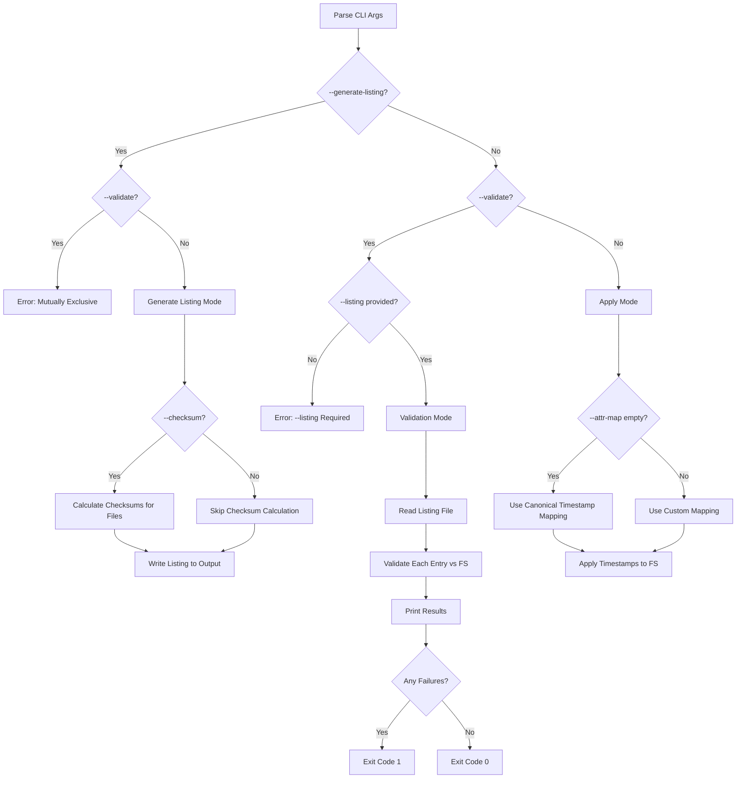
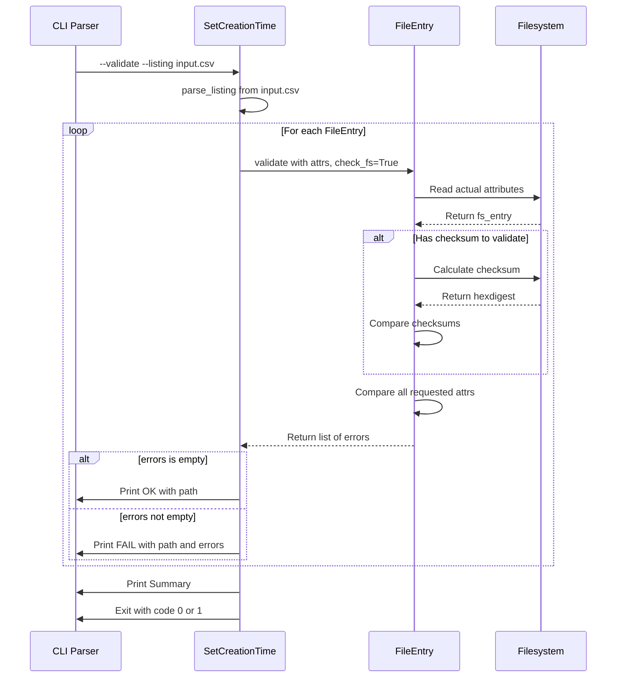

# SetCreationTime: Validation, Checksum, and Attr-Map Default Changes

## Overview

This plan documents three new features for the `SetCreationTime` tackle:

1. **MD5sum Calculation During Listing Generation** — Add `--checksum` option
2. **Change `--attr-map` Default** — From `'creation:e'` to `""` (empty string)
3. **Validation Mode** — Add `--validate` flag with reporting

---

## Feature 1: MD5sum Calculation During Listing Generation

### Goal

Enable checksum calculation during `--generate-listing` to produce complete canonical listings with file integrity data.

### CLI Changes

```bash
# Generate listing with checksums (default md5)
pyTackle SetCreationTime --generate-listing output.csv --base-dir /path --checksum

# Generate listing with specific algorithm
pyTackle SetCreationTime --generate-listing output.csv --base-dir /path \
    --checksum --checksum-algorithm sha256
```

| Option | Type | Default | Description |
|--------|------|---------|-------------|
| `--checksum` | flag | `False` | Calculate checksums during listing generation |
| `--checksum-algorithm` | str | `md5` | Hash algorithm (md5, sha256, sha1, etc.) |

### Implementation Details

#### File: [`tackles/SetCreationTime.py`](tackles/SetCreationTime.py)

**1. Add CLI arguments in [`arg_parser()`](tackles/SetCreationTime.py:310):**

```python
subparser.add_argument(
    '--checksum',
    action='store_true',
    default=False,
    help=(
        'Calculate checksums during --generate-listing. '
        'Only applies to files (entry_type=f), not directories or symlinks. '
        'Requires --generate-listing.'
    ),
)
subparser.add_argument(
    '--checksum-algorithm',
    type=str,
    default='md5',
    help=(
        'Hash algorithm for --checksum. '
        'Supports any algorithm available in hashlib (md5, sha256, sha1, etc.). '
        'Default: md5'
    ),
)
```

**2. Store options in [`__init__()`](tackles/SetCreationTime.py:388):**

```python
self.calculate_checksum = options.checksum
self.checksum_algorithm = options.checksum_algorithm

# Validate: --checksum requires --generate-listing
if self.calculate_checksum and self.generate_listing_path is None:
    logger.error('--checksum requires --generate-listing')
    sys.exit(1)
```

**3. Modify [`generate_listing()`](tackles/SetCreationTime.py:245) signature:**

```python
def generate_listing(
    base_dir: str,
    output_path: str,
    allowed_types: set,
    calculate_checksum: bool = False,
    checksum_algorithm: str = 'md5',
) -> int:
```

**4. Add checksum calculation in [`_collect_entries()`](tackles/SetCreationTime.py:259):**

```python
for full_path in paths:
    try:
        fe = FileEntry.from_fs_path(full_path)
    except OSError as exc:
        logger.warning('Cannot stat %s: %s', full_path, exc)
        continue
    
    # Calculate checksum for files only
    if calculate_checksum and fe.entry_type == 'f':
        try:
            fe.calculate_checksum(algorithm=checksum_algorithm)
            logger.debug('Calculated %s checksum for %s', checksum_algorithm, full_path)
        except OSError as exc:
            logger.warning('Cannot calculate checksum for %s: %s', full_path, exc)
            # Continue with empty checksum
    
    # Store relative path from base_dir
    fe.path = os.path.relpath(full_path, base)
    yield fe
```

**5. Update call in [`do()`](tackles/SetCreationTime.py:456):**

```python
count = generate_listing(
    self.base_dir,
    self.generate_listing_path,
    self.allowed_types,
    calculate_checksum=self.calculate_checksum,
    checksum_algorithm=self.checksum_algorithm,
)
```

### Performance Considerations

- Checksum calculation is I/O bound — large files will significantly increase listing generation time
- Consider adding a progress indicator for large directories
- The [`checksum.calculate()`](common/checksum.py:17) function already reads files in 8KB chunks for efficiency

### Backwards Compatibility

- **No breaking changes** — `--checksum` is opt-in
- Existing workflows without `--checksum` behave identically

---

## Feature 2: Change `--attr-map` Default

### Goal

Change the default `--attr-map` from `'creation:e'` to `""` (empty string), enabling:

- **Generate mode**: Write all canonical columns when `--attr-map` is empty
- **Apply mode**: Use canonical mapping (each attribute maps to its canonical column index)

### Current Behavior

| Mode | Current Default | Effect |
|------|-----------------|--------|
| Generate | `'creation:e'` | Writes all columns (ignores attr-map) |
| Apply | `'creation:e'` | Sets creation time to earliest date |

### New Behavior

| Mode | New Default | Effect |
|------|-------------|--------|
| Generate | `""` (empty) | Writes all canonical columns |
| Apply | `""` (empty) | Canonical mapping: creation→col0, access→col1, modify→col2 |

### Implementation Details

#### File: [`common/attr_map.py`](common/attr_map.py)

**1. Modify [`parse_attr_map()`](common/attr_map.py:64) to handle empty string:**

```python
def parse_attr_map(raw: str, allow_empty: bool = False) -> dict[str, str]:
    """Parse an ``--attr-map`` string into an ``{attr_name: selector}`` dict.

    ...existing docstring...

    Parameters
    ----------
    raw:
        The attr-map specification string.
    allow_empty:
        If ``True`` and *raw* is empty/whitespace, return an empty dict
        instead of raising ValueError.

    Raises :exc:`ValueError` for:
    * missing ``:`` separator in a token
    * unknown attribute name
    * meta-selector used on a non-datetime attribute
    * selector that is neither a non-negative integer nor a meta-selector
    * empty result (no valid pairs parsed) — **unless** *allow_empty* is True
    """
    attr_map: dict[str, str] = {}

    for token in raw.split(','):
        token = token.strip()
        if not token:
            continue
        # ... existing parsing logic ...

    if not attr_map and not allow_empty:
        raise ValueError('--attr-map produced an empty mapping')

    return attr_map
```

**2. Add canonical timestamp mapping constant:**

```python
# Canonical mapping for timestamp attributes only (used in apply mode)
CANONICAL_TIMESTAMP_MAP: dict[str, str] = {
    'creation': '0',
    'access': '1',
    'modify': '2',
}
```

#### File: [`tackles/SetCreationTime.py`](tackles/SetCreationTime.py)

**1. Change default in [`arg_parser()`](tackles/SetCreationTime.py:339):**

```python
subparser.add_argument(
    '--attr-map',
    type=str,
    default='',  # Changed from 'creation:e'
    help=(
        'Comma-separated mapping of filesystem attributes to listing '
        'column selectors.  Format: "attr:selector[,attr:selector,…]". '
        'Attributes: creation, access, modify.  '
        'Selectors: a 0-based column index, or "earliest" / "latest" '
        '(short: "e" / "l") to pick the min/max date from the row.  '
        'Default: empty (canonical mapping — creation:0,access:1,modify:2).  '
        'Example: --attr-map="creation:1,access:2,modify:e"'
    ),
)
```

**2. Handle empty attr-map in [`__init__()`](tackles/SetCreationTime.py:444):**

```python
from common.attr_map import parse_attr_map, CANONICAL_TIMESTAMP_MAP

# ------------------------------------------------------------------
# Parse --attr-map
# ------------------------------------------------------------------
try:
    self.attr_map = parse_attr_map(options.attr_map, allow_empty=True)
except ValueError as exc:
    logger.error('Invalid --attr-map: %s', exc)
    sys.exit(1)

# Empty attr-map in apply mode → use canonical timestamp mapping
if not self.attr_map:
    self.attr_map = CANONICAL_TIMESTAMP_MAP.copy()
    logger.info('Using canonical timestamp mapping: %s', self.attr_map)
else:
    logger.info('Attribute map: %s', self.attr_map)
```

**3. Generate mode already uses [`CANONICAL_MAP`](common/attr_map.py:46) via [`write_listing()`](common/listing.py:127) — no changes needed.**

### Migration Path

Users relying on the old default behavior (`creation:e`) should explicitly specify:

```bash
# Old implicit behavior — now must be explicit
pyTackle SetCreationTime --listing input.csv --base-dir /path --attr-map "creation:e"
```

### Backwards Compatibility

- **Breaking change**: Users who relied on implicit `creation:e` must now specify it explicitly
- **Mitigation**: Update documentation and release notes prominently

---

## Feature 3: Validation Mode

### Goal

Add a validation mode that compares a listing file against the actual filesystem, reporting mismatches.

### CLI Changes

```bash
# Validate with default attributes
pyTackle SetCreationTime --listing input.csv --base-dir /path --validate

# Validate specific attributes
pyTackle SetCreationTime --listing input.csv --base-dir /path \
    --validate --validate-attrs size,checksum

# Quiet mode (only show failures)
pyTackle SetCreationTime --listing input.csv --base-dir /path --validate -q
```

| Option | Type | Default | Description |
|--------|------|---------|-------------|
| `--validate` | flag | `False` | Enter validation mode |
| `--validate-attrs` | str | `size,creation,permissions,uid,gid,checksum,entry_type,path` | Comma-separated attributes to validate |
| `-q/--quiet` | flag | `False` | Omit OK entries from output |

### Default Validation Attributes

```python
DEFAULT_VALIDATE_ATTRS = (
    'size', 'creation', 'permissions', 'uid', 'gid', 
    'checksum', 'entry_type', 'path'
)
```

Note: `access` and `modify` are excluded by default because they change frequently during normal filesystem operations.

### Output Format

**Verbose mode (default):**

```
OK      /path/to/file1.txt
FAIL    /path/to/file2.txt: size mismatch: entry=1024, fs=2048
FAIL    /path/to/file3.txt: checksum mismatch: expected abc123, got def456
OK      /path/to/dir1

=== Validation Summary ===
Total entries: 100
Passed: 97
Failed: 3
```

**Quiet mode (`-q`):**

```
FAIL    /path/to/file2.txt: size mismatch: entry=1024, fs=2048
FAIL    /path/to/file3.txt: checksum mismatch: expected abc123, got def456

=== Validation Summary ===
Total entries: 100
Passed: 97
Failed: 3
```

### Implementation Details

#### File: [`tackles/SetCreationTime.py`](tackles/SetCreationTime.py)

**1. Add CLI arguments in [`arg_parser()`](tackles/SetCreationTime.py:310):**

```python
subparser.add_argument(
    '--validate',
    action='store_true',
    default=False,
    help=(
        'Validation mode: compare listing against filesystem and report '
        'mismatches.  Requires --listing.  Mutually exclusive with '
        '--generate-listing.'
    ),
)
subparser.add_argument(
    '--validate-attrs',
    type=str,
    default='size,creation,permissions,uid,gid,checksum,entry_type,path',
    help=(
        'Comma-separated list of attributes to validate.  '
        'Default: size,creation,permissions,uid,gid,checksum,entry_type,path.  '
        'Note: access and modify are excluded by default as they change frequently.'
    ),
)
subparser.add_argument(
    '-q', '--quiet',
    action='store_true',
    default=False,
    help='Quiet mode: only show failures in validation output',
)
```

**2. Store options and validate mutual exclusivity in [`__init__()`](tackles/SetCreationTime.py:388):**

```python
self.validate_mode = options.validate
self.validate_attrs: list[str] = []
self.quiet = options.quiet

# Parse --validate-attrs
if self.validate_mode:
    self.validate_attrs = [
        a.strip() for a in options.validate_attrs.split(',') if a.strip()
    ]

# Mutual exclusivity checks
if self.validate_mode and self.generate_listing_path is not None:
    logger.error('--validate and --generate-listing are mutually exclusive')
    sys.exit(1)

if self.validate_mode and options.listing is None:
    logger.error('--validate requires --listing')
    sys.exit(1)

# Warn about ineffective options in validation mode
if self.validate_mode and self.dry_run:
    logger.warning('--dry-run has no effect in validation mode')
```

**3. Add validation execution in [`do()`](tackles/SetCreationTime.py:456):**

```python
def do(self):
    # Generate-listing mode
    if self.generate_listing_path is not None:
        # ... existing code ...
        return

    # Validation mode
    if self.validate_mode:
        self._do_validate()
        return

    # Apply mode — existing code
    entries = parse_listing(...)
    self._do_attr_map(entries)
```

**4. Add validation method:**

```python
def _do_validate(self) -> None:
    """Validate listing entries against filesystem."""
    entries = parse_listing(
        self.listing_path,
        self.base_dir,
        self.script_base_path,
    )
    logger.info('Parsed %d entries for validation', len(entries))

    total = 0
    passed = 0
    failed = 0

    for fe in entries:
        total += 1
        
        # Use FileEntry.validate() with check_fs=True
        errors = fe.validate(attrs=self.validate_attrs, check_fs=True)
        
        if errors:
            failed += 1
            error_str = '; '.join(errors)
            print(f'FAIL\t{fe.path}: {error_str}')
        else:
            passed += 1
            if not self.quiet:
                print(f'OK\t{fe.path}')

    # Print summary
    print()
    print('=== Validation Summary ===')
    print(f'Total entries: {total}')
    print(f'Passed: {passed}')
    print(f'Failed: {failed}')

    # Exit code
    if failed > 0:
        sys.exit(1)
```

### Leveraging Existing Infrastructure

The implementation uses the existing [`FileEntry.validate()`](common/FileEntry.py:317) method which already supports:

- Path existence checking
- Attribute value comparison against filesystem
- Special checksum handling (calculates on-demand and compares)

```python
# From FileEntry.validate() — already implemented
if attr == 'checksum':
    # Checksum needs special handling — calculate on demand
    if ':' in my_val:
        algo, expected = my_val.split(':', 1)
    else:
        algo, expected = 'md5', my_val
    try:
        fs_digest = fs_entry.calculate_checksum(algorithm=algo)
        if fs_digest != expected:
            errors.append(
                f"checksum mismatch: expected {expected}, "
                f"got {fs_digest}"
            )
    except OSError as exc:
        errors.append(f"checksum calculation failed: {exc}")
```

### Exit Codes

| Code | Meaning |
|------|---------|
| 0 | All entries passed validation |
| 1 | One or more entries failed validation |

### Backwards Compatibility

- **No breaking changes** — `--validate` is opt-in
- Existing workflows without `--validate` behave identically

---

## Mode Interaction Matrix

| Mode | Required Options | Exclusive With | Notes |
|------|------------------|----------------|-------|
| Generate | `--generate-listing`, `--base-dir` | `--validate`, `--listing` | Optionally add `--checksum` |
| Apply | `--listing`, `--base-dir` | `--generate-listing`, `--validate` | Uses `--attr-map` |
| Validate | `--validate`, `--listing`, `--base-dir` | `--generate-listing` | `--dry-run` ineffective |

---

## Implementation Checklist

### Feature 1: Checksum During Listing Generation

- [ ] Add `--checksum` CLI argument
- [ ] Add `--checksum-algorithm` CLI argument
- [ ] Validate `--checksum` requires `--generate-listing`
- [ ] Modify `generate_listing()` signature
- [ ] Add checksum calculation logic (files only)
- [ ] Update `do()` to pass checksum options
- [ ] Add unit tests for checksum generation
- [ ] Update documentation

### Feature 2: Empty Attr-Map Default

- [ ] Modify `parse_attr_map()` to accept `allow_empty` parameter
- [ ] Add `CANONICAL_TIMESTAMP_MAP` constant
- [ ] Change `--attr-map` default to `""`
- [ ] Update `__init__()` to handle empty attr-map
- [ ] Update help text for `--attr-map`
- [ ] Add unit tests for empty attr-map handling
- [ ] Update documentation with migration notes

### Feature 3: Validation Mode

- [ ] Add `--validate` CLI argument
- [ ] Add `--validate-attrs` CLI argument
- [ ] Add `-q/--quiet` CLI argument
- [ ] Add mutual exclusivity checks in `__init__()`
- [ ] Implement `_do_validate()` method
- [ ] Update `do()` dispatch logic
- [ ] Implement exit code logic
- [ ] Add unit tests for validation mode
- [ ] Add integration tests for validation
- [ ] Update documentation

---

## Test Cases

### Feature 1: Checksum Tests

```python
def test_generate_listing_without_checksum():
    """Verify listings without --checksum have empty checksum field."""
    
def test_generate_listing_with_checksum():
    """Verify listings with --checksum have populated checksum field for files."""
    
def test_checksum_only_for_files():
    """Verify directories and symlinks don't get checksums calculated."""
    
def test_checksum_algorithm_option():
    """Verify --checksum-algorithm changes the hash used."""
    
def test_checksum_requires_generate_listing():
    """Verify --checksum without --generate-listing produces error."""
```

### Feature 2: Empty Attr-Map Tests

```python
def test_parse_attr_map_empty_allowed():
    """Verify parse_attr_map with allow_empty=True returns empty dict."""
    
def test_parse_attr_map_empty_disallowed():
    """Verify parse_attr_map with allow_empty=False raises ValueError."""
    
def test_apply_mode_empty_attr_map_uses_canonical():
    """Verify empty attr-map in apply mode uses canonical timestamp mapping."""
    
def test_generate_mode_empty_attr_map_writes_all_columns():
    """Verify generate mode writes all canonical columns."""
```

### Feature 3: Validation Tests

```python
def test_validate_mode_all_pass():
    """Verify validation returns 0 when all entries match."""
    
def test_validate_mode_some_fail():
    """Verify validation returns 1 when some entries fail."""
    
def test_validate_checksum_mismatch():
    """Verify checksum mismatches are detected and reported."""
    
def test_validate_size_mismatch():
    """Verify size mismatches are detected and reported."""
    
def test_validate_missing_file():
    """Verify missing files are reported as failures."""
    
def test_validate_quiet_mode():
    """Verify quiet mode suppresses OK output."""
    
def test_validate_custom_attrs():
    """Verify --validate-attrs limits which attributes are checked."""
    
def test_validate_mutually_exclusive_with_generate():
    """Verify --validate and --generate-listing cannot be used together."""
```

---

## Mermaid Diagrams

### Mode Selection Flow



### Validation Process



---

## Related Files

| File | Changes |
|------|---------|
| [`tackles/SetCreationTime.py`](tackles/SetCreationTime.py) | CLI args, mode dispatch, validation logic, checksum during generate |
| [`common/attr_map.py`](common/attr_map.py) | `allow_empty` parameter, `CANONICAL_TIMESTAMP_MAP` constant |
| [`common/FileEntry.py`](common/FileEntry.py) | No changes needed (validate already supports check_fs) |
| [`common/checksum.py`](common/checksum.py) | No changes needed |
| [`common/listing.py`](common/listing.py) | No changes needed |
| `tests/test_set_creation_time.py` | New test file for tackle-specific tests |
| `tests/test_attr_map.py` | Additional tests for empty attr-map |

---

## Documentation Updates Required

1. **README.md** — Add examples for new features
2. **CLI `--help`** — All help texts updated via `arg_parser()`
3. **Release notes** — Document breaking change for `--attr-map` default
4. **Migration guide** — How to preserve old `creation:e` behavior
