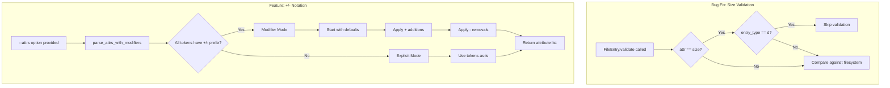

# ValidateCopy Bug Fix and --attrs Enhancement Plan

## Overview

This document outlines the implementation plan for two changes to the ValidateCopy tackle:

1. **Bug Fix**: Skip size validation for folders even when size is forced via `--attrs`
2. **Feature Enhancement**: Extend `--attrs` to support `+<option>` and `-<option>` notation

---

## Current Implementation Analysis

### 1. How --attrs is Currently Handled

**Location**: [`_init_validate_mode()`](tackles/ValidateCopy.py:930) in ValidateCopy.py

```python
# Default validate attributes (line 947)
default_validate_attrs = 'size,creation,permissions,uid,gid,checksum,entry_type,path'

# Simple comma-split parsing (lines 954-956)
self.validate_attrs = [
    a.strip() for a in attrs_raw.split(',') if a.strip()
]
```

**Current Behavior**:
- Accepts a comma-separated list of attribute names
- Replaces the entire default set when specified
- No support for incremental modifications (`+` or `-`)

### 2. Available Attributes

**Location**: [`VALID_ATTRS`](common/attr_map.py:17) in attr_map.py

```python
VALID_ATTRS: tuple[str, ...] = (
    'path', 'size', 'creation', 'access', 'modify',
    'permissions', 'uid', 'gid', 'checksum', 'entry_type',
)
```

### 3. Where Size Validation Occurs

**Location**: [`FileEntry.validate()`](common/FileEntry.py:317) in FileEntry.py

The validation logic at lines 391-401 performs generic attribute comparison:

```python
else:
    fs_val = getattr(fs_entry, attr, None)
    success = False
    if isinstance(my_val, datetime) and isinstance(fs_val, datetime):
        if fs_attrs.timestamps_are_close(my_val, fs_val):
            success = True
    elif my_val == fs_val:
        success = True

    if not success:
        errors.append(
            f"{attr} mismatch: entry={my_val}, fs={fs_val}"
        )
```

**Bug**: No special handling for `size` attribute when `entry_type == 'd'`. Directory sizes vary across filesystems and are unreliable for validation.

---

## Implementation Plan

### Part 1: Bug Fix - Skip Size Validation for Folders

#### Problem Statement
When validating a listing against the filesystem, the `size` attribute should not be checked for directories because:
- Directory sizes vary between filesystems
- Directory sizes can change when files are added/removed
- The reported size is often filesystem-dependent metadata, not content size

#### Solution
Modify [`FileEntry.validate()`](common/FileEntry.py:317) to skip size comparison when `entry_type == 'd'`.

#### Changes Required

**File**: [`common/FileEntry.py`](common/FileEntry.py)

**Location**: Inside the `validate()` method, around line 367 where the loop iterates over attributes

**Implementation**:

```python
for attr in attrs:
    # Skip size validation for directories - directory sizes vary by filesystem
    if attr == 'size' and self.entry_type == 'd':
        continue
        
    my_val = getattr(self, attr, None)
    # ... rest of validation logic
```

#### Test Cases
- Validate a directory with matching metadata but different size → should PASS
- Validate a file with mismatched size → should FAIL
- Validate a file with matching size → should PASS

---

### Part 2: Feature Enhancement - +/- Notation for --attrs

#### Problem Statement
Users need to selectively add or remove attributes from the default set without specifying the entire list.

**Current Usage** (verbose, error-prone):
```bash
# To add 'access' to defaults, must specify everything:
--attrs="size,creation,permissions,uid,gid,checksum,entry_type,path,access"

# To remove 'checksum' from defaults, must specify everything except it:
--attrs="size,creation,permissions,uid,gid,entry_type,path"
```

**Desired Usage** (concise, intuitive):
```bash
# Add 'access' to defaults:
--attrs="+access"

# Remove 'checksum' from defaults:
--attrs="-checksum"

# Combine operations:
--attrs="+access,-checksum"

# Mix with explicit list (start fresh, then modify):
--attrs="size,creation,+access"  # Explicit list wins, + is redundant but harmless
```

#### Solution
Create a new parsing function that:
1. Detects if the input contains `+` or `-` prefixed tokens
2. Starts with the default attribute set
3. Applies modifications in order

#### Design Decisions

1. **Pure +/- mode**: If ALL tokens start with `+` or `-`, start from defaults and apply modifications
2. **Explicit mode**: If NO tokens start with `+` or `-`, use the list as-is (current behavior)
3. **Mixed mode**: If some tokens have prefixes and others don't, treat unprefixed as explicit set, then apply `+/-` modifications

**Recommended approach**: Option 1 and 2 only - pure modes, no mixing. This keeps the behavior predictable.

#### Changes Required

**File 1**: [`common/attr_map.py`](common/attr_map.py)

Add new function for parsing attrs with +/- notation:

```python
def parse_attrs_with_modifiers(
    raw: str,
    defaults: tuple[str, ...],
    valid_attrs: tuple[str, ...] = VALID_ATTRS,
) -> list[str]:
    """Parse an --attrs string with optional +/- modifier notation.

    Supports two modes:
    1. **Explicit mode**: Simple comma-separated list replaces defaults entirely.
       Example: "size,creation,checksum" → ['size', 'creation', 'checksum']

    2. **Modifier mode**: Tokens prefixed with +/- modify the default set.
       Example: "+access,-checksum" → defaults + access - checksum

    The mode is auto-detected:
    - If ALL tokens start with + or -, modifier mode is used
    - Otherwise, explicit mode is used

    Args:
        raw: Comma-separated attribute specification string.
        defaults: Default attribute set to start from in modifier mode.
        valid_attrs: Tuple of valid attribute names for validation.

    Returns:
        List of attribute names after applying the specification.

    Raises:
        ValueError: If an attribute name is unknown or result is empty.
    """
```

**File 2**: [`tackles/ValidateCopy.py`](tackles/ValidateCopy.py)

Update [`_init_validate_mode()`](tackles/ValidateCopy.py:930) to use the new parsing function:

```python
from common.attr_map import parse_attrs_with_modifiers

# In _init_validate_mode():
DEFAULT_VALIDATE_ATTRS = ('size', 'creation', 'permissions', 'uid', 'gid', 'checksum', 'entry_type', 'path')

if options.attrs is not None:
    self.validate_attrs = parse_attrs_with_modifiers(
        options.attrs,
        defaults=DEFAULT_VALIDATE_ATTRS,
    )
else:
    self.validate_attrs = list(DEFAULT_VALIDATE_ATTRS)
```

#### Implementation Details

**Parsing Algorithm**:

```python
def parse_attrs_with_modifiers(raw, defaults, valid_attrs=VALID_ATTRS):
    tokens = [t.strip() for t in raw.split(',') if t.strip()]
    
    # Detect mode: all tokens must have +/- prefix for modifier mode
    all_have_prefix = all(t.startswith('+') or t.startswith('-') for t in tokens)
    
    if all_have_prefix:
        # Modifier mode: start with defaults, apply changes
        result = list(defaults)
        for token in tokens:
            if token.startswith('+'):
                attr = token[1:]
                if attr not in valid_attrs:
                    raise ValueError(f"Unknown attribute: {attr}")
                if attr not in result:
                    result.append(attr)
            elif token.startswith('-'):
                attr = token[1:]
                if attr not in valid_attrs:
                    raise ValueError(f"Unknown attribute: {attr}")
                if attr in result:
                    result.remove(attr)
    else:
        # Explicit mode: use tokens as-is
        result = []
        for token in tokens:
            attr = token.lstrip('+-')  # Strip any accidental prefix
            if attr not in valid_attrs:
                raise ValueError(f"Unknown attribute: {attr}")
            if attr not in result:
                result.append(attr)
    
    if not result:
        raise ValueError("--attrs produced an empty attribute set")
    
    return result
```

#### Test Cases

**Unit tests for `parse_attrs_with_modifiers()`**:

| Input | Defaults | Expected Output |
|-------|----------|-----------------|
| `"size,creation"` | `('a', 'b', 'c')` | `['size', 'creation']` |
| `"+access"` | `('size', 'creation')` | `['size', 'creation', 'access']` |
| `"-checksum"` | `('size', 'checksum')` | `['size']` |
| `"+access,-checksum"` | `('size', 'checksum')` | `['size', 'access']` |
| `"-nonexistent"` | `('size',)` | `['size']` (no error, already absent) |
| `"+invalid"` | `('size',)` | `ValueError` (invalid attr) |
| `""` | `('size',)` | `ValueError` (empty result) |

**Integration tests for ValidateCopy**:

```bash
# Test modifier mode
pyTackle ValidateCopy --validate listing.csv --attrs="+access" /path
pyTackle ValidateCopy --validate listing.csv --attrs="-checksum" /path
pyTackle ValidateCopy --validate listing.csv --attrs="+access,-size" /path

# Test explicit mode still works
pyTackle ValidateCopy --validate listing.csv --attrs="size,path" /path
```

---

## File Change Summary

| File | Change Type | Description |
|------|-------------|-------------|
| [`common/FileEntry.py`](common/FileEntry.py) | Bug Fix | Skip size validation for directories in `validate()` |
| [`common/attr_map.py`](common/attr_map.py) | Feature | Add `parse_attrs_with_modifiers()` function |
| [`tackles/ValidateCopy.py`](tackles/ValidateCopy.py) | Feature | Use new parser in `_init_validate_mode()` |
| [`tests/test_attr_map.py`](tests/test_attr_map.py) | Test | Add tests for `parse_attrs_with_modifiers()` |
| [`tests/test_file_entry.py`](tests/test_file_entry.py) | Test | Add test for directory size skip |

---

## Implementation Flow Diagram



---

## CLI Help Update

Update the `--attrs` argument help text in [`arg_parser()`](tackles/ValidateCopy.py:738):

```python
subparser.add_argument(
    '--attrs',
    type=str,
    default=None,
    help=(
        'Comma-separated attributes. Behavior depends on mode:\n'
        '  validate: attributes to compare (default: all except access/modify)\n'
        '  generate: attributes to include (default: all + checksum)\n'
        '  apply: attributes to set (default: creation,access,modify)\n'
        '\n'
        'Supports +/- notation to modify defaults:\n'
        '  +attr: Add attribute to default set\n'
        '  -attr: Remove attribute from default set\n'
        'Examples: --attrs="+access,-checksum" or --attrs="size,path"'
    ),
)
```

---

## Backward Compatibility

- **Explicit mode** (no `+/-` prefixes) maintains identical behavior to current implementation
- **New +/- notation** is opt-in - users who don't use it see no change
- No breaking changes to existing scripts or workflows

---

## Edge Cases and Error Handling

1. **Empty result**: If all attributes are removed via `-`, raise `ValueError`
2. **Duplicate additions**: `+size,+size` → only adds once (idempotent)
3. **Remove non-existent**: `-nonexistent_attr` → raise `ValueError` for unknown attrs
4. **Remove already-absent**: `-access` when access not in defaults → no error, no-op
5. **Invalid attribute name**: `+invalid` → raise `ValueError` with helpful message

---

## Acceptance Criteria

### Bug Fix
- [ ] Directories pass size validation even when listing and filesystem sizes differ
- [ ] Files still fail size validation when sizes don't match
- [ ] Size validation can still be explicitly requested for directories via --attrs

### Feature Enhancement
- [ ] `--attrs="+access"` adds access to default validation set
- [ ] `--attrs="-checksum"` removes checksum from default set
- [ ] `--attrs="+access,-checksum"` combines both operations
- [ ] `--attrs="size,path"` (explicit mode) still works as before
- [ ] Help text documents the new notation
- [ ] Unit tests cover all parsing scenarios
- [ ] Integration test verifies end-to-end behavior
