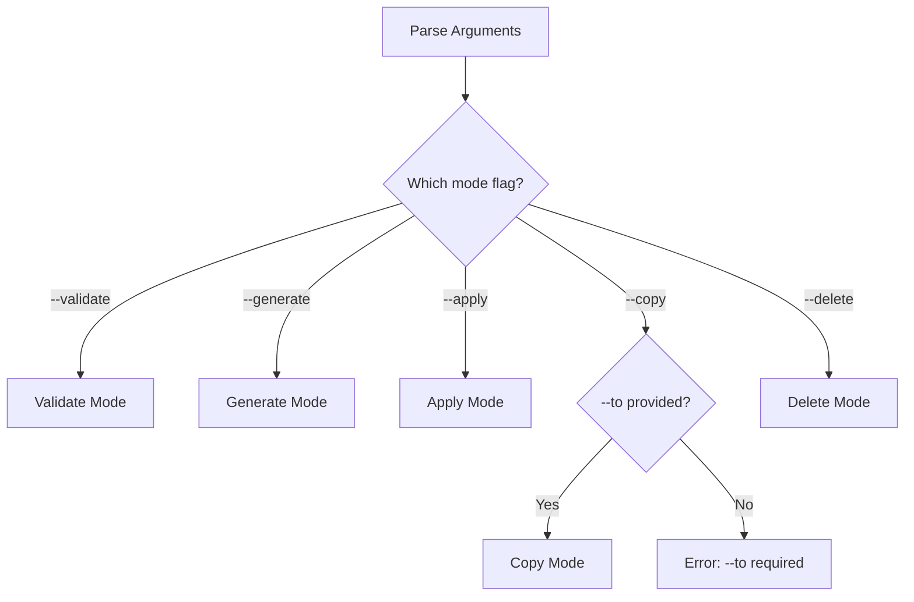
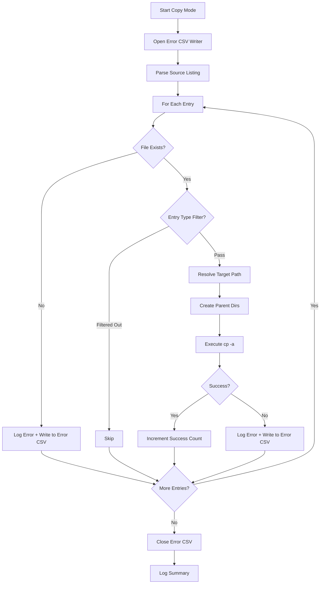
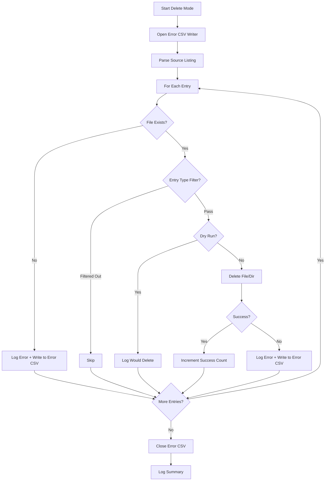

# ValidateCopy: Copy and Delete Modes Design

## Overview

This document describes the design for adding two new operational modes to the ValidateCopy tackle:

1. **Copy Mode** (`--copy <source.csv> --to <target-dir>`) — Copy files listed in a CSV to a target directory using system `cp -a` to preserve all attributes
2. **Delete Mode** (`--delete <source.csv>`) — Delete files listed in a CSV from the filesystem

Both modes include error handling that logs failed operations to an error CSV file.

## Requirements

### Functional Requirements

| Requirement | Description |
|-------------|-------------|
| Copy files from CSV list | Read source CSV, copy each file to target directory preserving attributes |
| Delete files from CSV list | Read source CSV, delete each file from filesystem |
| Preserve attributes on copy | Use `cp -a` to preserve all file attributes including timestamps, permissions, ownership |
| Error logging | Log errors to console and write failed entries to `<source>_error.csv` |
| Progress reporting | Show progress during long operations following existing patterns |

### Error Handling Requirements

| Scenario | Behavior |
|----------|----------|
| Source file not found | Log error, write to error CSV, continue |
| Permission denied | Log error, write to error CSV, continue |
| Target directory does not exist | Create it or fail with clear error |
| Disk full / write error | Log error, write to error CSV, continue |
| Invalid CSV format | Log warning, skip row, continue |

## Architecture Design

### CLI Argument Structure

The new modes integrate with the existing mutually exclusive mode group:

```
Mode Selection (mutually exclusive, one required):
  --validate LISTING    Validate filesystem against listing file
  --generate LISTING    Generate listing from filesystem to output file
  --apply LISTING       Apply metadata from listing to filesystem
  --copy LISTING        Copy files from listing to target directory  [NEW]
  --delete LISTING      Delete files from listing                    [NEW]

Copy Mode Options:
  --to TARGET_DIR       Target directory for copy operation (required with --copy)
```

### Mode Detection Flow



### Error CSV Filename Generation

The error CSV filename is derived from the source filename:

| Source Filename | Error Filename |
|-----------------|----------------|
| `files.csv` | `files_error.csv` |
| `listing.csv` | `listing_error.csv` |
| `data/files.csv` | `data/files_error.csv` |
| `backup.txt` | `backup_error.txt` |

Algorithm:
```python
def get_error_filename(source_path: str) -> str:
    base, ext = os.path.splitext(source_path)
    return f"{base}_error{ext}"
```

### Error CSV Format

The error CSV uses the same canonical format as regular listings, with an additional error column:

| Column | Index | Description |
|--------|-------|-------------|
| creation | 0 | Creation timestamp from source listing |
| access | 1 | Access timestamp from source listing |
| modify | 2 | Modification timestamp from source listing |
| checksum | 3 | Checksum from source listing |
| entry_type | 4 | Entry type from source listing |
| permissions | 5 | Permissions from source listing |
| uid | 6 | UID from source listing |
| gid | 7 | GID from source listing |
| size | 8 | Size from source listing |
| path | 9 | Path from source listing |
| error | 10 | Error message describing the failure |

### Copy Mode Processing Flow



### Delete Mode Processing Flow



## Implementation Components

### 1. StreamingErrorWriter Class

Extend the streaming CSV writer pattern to include an error column:

```python
class StreamingErrorWriter(StreamingCsvWriter[tuple[FileEntry, str]]):
    """Streaming CSV writer for error logging with FileEntry + error message."""
    
    def __init__(
        self,
        path: str,
        attr_map: Optional[Dict[str, str]] = None,
        flush_on_write: bool = True,
    ):
        # Extended header with 'error' column
        self.attr_map = attr_map or CANONICAL_MAP
        header = self._generate_header_with_error(self.attr_map)
        super().__init__(path, header=header, lazy_open=True, flush_on_write=flush_on_write)
    
    def _to_row(self, item: tuple[FileEntry, str]) -> List[str]:
        entry, error_msg = item
        row = entry.to_listing_row(self.attr_map)
        row.append(error_msg)
        return row
```

### 2. CLI Argument Parser Additions

Add to the existing mutually exclusive mode group in [`arg_parser()`](../tackles/ValidateCopy.py:395):

```python
# In the mode_group (existing mutually exclusive group):
mode_group.add_argument(
    '--copy',
    type=pathlib.Path,
    default=None,
    metavar='LISTING',
    help='Copy files from listing to target directory',
)
mode_group.add_argument(
    '--delete',
    type=pathlib.Path,
    default=None,
    metavar='LISTING',
    help='Delete files from listing',
)

# New argument for copy mode target:
subparser.add_argument(
    '--to',
    type=pathlib.Path,
    default=None,
    metavar='TARGET_DIR',
    help='Target directory for copy operation (required with --copy)',
)
```

### 3. Mode Initialization Methods

#### Copy Mode Initialization

```python
def _init_copy_mode(self, options) -> None:
    """Initialize copy mode settings."""
    self.listing_path = str(options.copy)
    self.validate_attrs: List[str] = []
    self.calculate_checksum: bool = False
    self.generate_listing_path: Optional[str] = None
    
    # Validate --to is provided
    if options.to is None:
        logger.error('--to TARGET_DIR is required with --copy')
        sys.exit(1)
    
    self.target_dir = str(options.to)
    
    # Validate listing file exists
    if not os.path.isfile(self.listing_path):
        logger.error('Listing file not found: %s', self.listing_path)
        sys.exit(1)
    
    # Generate error CSV path
    self.error_csv_path = get_error_filename(self.listing_path)
```

#### Delete Mode Initialization

```python
def _init_delete_mode(self, options) -> None:
    """Initialize delete mode settings."""
    self.listing_path = str(options.delete)
    self.validate_attrs: List[str] = []
    self.calculate_checksum: bool = False
    self.generate_listing_path: Optional[str] = None
    self.target_dir: Optional[str] = None
    
    # Validate listing file exists
    if not os.path.isfile(self.listing_path):
        logger.error('Listing file not found: %s', self.listing_path)
        sys.exit(1)
    
    # Generate error CSV path
    self.error_csv_path = get_error_filename(self.listing_path)
```

### 4. Main Processing Methods

#### Copy Mode Processing

```python
def _do_copy(self) -> int:
    """Copy files from listing to target directory.
    
    Returns:
        0 if all files copied successfully, 1 if any errors occurred.
    """
    progress_interval = 1000
    
    # Parse listing
    entries = parse_listing(
        self.listing_path,
        self.base_dir,
        self.script_base_path,
    )
    
    total = len(entries)
    success = 0
    failed = 0
    skipped = 0
    
    logger.info('Copying %d entries to %s...', total, self.target_dir)
    
    # Ensure target directory exists
    os.makedirs(self.target_dir, exist_ok=True)
    
    with StreamingErrorWriter(self.error_csv_path) as error_writer:
        for idx, fe in enumerate(entries, start=1):
            # Progress logging
            if idx % progress_interval == 0:
                pct = (idx / total) * 100
                logger.info(
                    'Copy progress: %d/%d (%.1f%%) — %d success, %d failed, %d skipped',
                    idx, total, pct, success, failed, skipped
                )
            
            # Type filter
            if fe.entry_type and fe.entry_type not in self.allowed_types:
                skipped += 1
                continue
            
            # Check source exists
            if not os.path.exists(fe.path):
                error_msg = f'Source file not found: {fe.path}'
                logger.error(error_msg)
                error_writer.write((fe, error_msg))
                failed += 1
                continue
            
            # Calculate target path (preserve relative structure from base_dir)
            rel_path = os.path.relpath(fe.path, self.base_dir)
            target_path = os.path.join(self.target_dir, rel_path)
            
            # Create parent directories
            target_parent = os.path.dirname(target_path)
            if target_parent:
                os.makedirs(target_parent, exist_ok=True)
            
            # Execute copy
            if self.dry_run:
                logger.info('[DRY-RUN] Would copy: %s -> %s', fe.path, target_path)
                success += 1
            else:
                try:
                    result = subprocess.run(
                        ['cp', '-a', fe.path, target_path],
                        capture_output=True,
                        text=True,
                    )
                    if result.returncode != 0:
                        error_msg = f'cp failed: {result.stderr.strip()}'
                        logger.error('%s: %s', fe.path, error_msg)
                        error_writer.write((fe, error_msg))
                        failed += 1
                    else:
                        logger.debug('Copied: %s -> %s', fe.path, target_path)
                        success += 1
                except OSError as exc:
                    error_msg = f'Copy failed: {exc}'
                    logger.error('%s: %s', fe.path, error_msg)
                    error_writer.write((fe, error_msg))
                    failed += 1
    
    # Log summary
    logger.info(
        'Copy complete: %d success, %d failed, %d skipped',
        success, failed, skipped
    )
    
    if failed > 0:
        logger.info('Errors written to: %s', self.error_csv_path)
    
    return 0 if failed == 0 else 1
```

#### Delete Mode Processing

```python
def _do_delete(self) -> int:
    """Delete files from listing.
    
    Returns:
        0 if all files deleted successfully, 1 if any errors occurred.
    """
    progress_interval = 1000
    
    # Parse listing
    entries = parse_listing(
        self.listing_path,
        self.base_dir,
        self.script_base_path,
    )
    
    total = len(entries)
    success = 0
    failed = 0
    skipped = 0
    
    logger.info('Deleting %d entries...', total)
    
    with StreamingErrorWriter(self.error_csv_path) as error_writer:
        for idx, fe in enumerate(entries, start=1):
            # Progress logging
            if idx % progress_interval == 0:
                pct = (idx / total) * 100
                logger.info(
                    'Delete progress: %d/%d (%.1f%%) — %d success, %d failed, %d skipped',
                    idx, total, pct, success, failed, skipped
                )
            
            # Type filter
            if fe.entry_type and fe.entry_type not in self.allowed_types:
                skipped += 1
                continue
            
            # Check file exists
            if not os.path.exists(fe.path):
                error_msg = f'File not found: {fe.path}'
                logger.error(error_msg)
                error_writer.write((fe, error_msg))
                failed += 1
                continue
            
            # Execute delete
            if self.dry_run:
                logger.info('[DRY-RUN] Would delete: %s', fe.path)
                success += 1
            else:
                try:
                    if os.path.isdir(fe.path) and not os.path.islink(fe.path):
                        os.rmdir(fe.path)  # Only removes empty directories
                    else:
                        os.remove(fe.path)
                    logger.debug('Deleted: %s', fe.path)
                    success += 1
                except OSError as exc:
                    error_msg = f'Delete failed: {exc}'
                    logger.error('%s: %s', fe.path, error_msg)
                    error_writer.write((fe, error_msg))
                    failed += 1
    
    # Log summary
    logger.info(
        'Delete complete: %d success, %d failed, %d skipped',
        success, failed, skipped
    )
    
    if failed > 0:
        logger.info('Errors written to: %s', self.error_csv_path)
    
    return 0 if failed == 0 else 1
```

### 5. Mode Detection Updates

Update [`_determine_mode()`](../tackles/ValidateCopy.py:553) to handle new modes:

```python
def _determine_mode(self, options) -> str:
    """Determine the operation mode from CLI arguments."""
    if options.validate is not None:
        return 'validate'
    if options.generate is not None:
        return 'generate'
    if options.apply is not None:
        return 'apply'
    if options.copy is not None:
        return 'copy'
    if options.delete is not None:
        return 'delete'
    
    logger.error('One of --validate, --generate, --apply, --copy, or --delete is required')
    sys.exit(1)
```

### 6. Main do() Method Updates

Update the [`do()`](../tackles/ValidateCopy.py:725) method:

```python
def do(self) -> int:
    if self.mode == 'validate':
        return self._do_validate()
    
    if self.mode == 'generate':
        count = generate_listing(...)
        return 0
    
    if self.mode == 'copy':
        return self._do_copy()
    
    if self.mode == 'delete':
        return self._do_delete()
    
    # Apply mode
    entries = parse_listing(...)
    self._do_attr_map(entries)
    return 0
```

## CLI Usage Examples

### Copy Mode

```bash
# Copy all files from listing to target directory
pyTackle ValidateCopy --copy files.csv --to /backup/destination /source/base

# Copy only files (no directories) with dry-run
pyTackle ValidateCopy --copy files.csv --to /backup --types f --dry-run /source

# Copy with path prefix stripping
pyTackle ValidateCopy --copy files.csv --to /backup \
    --script-base-path "server/share" /local/base
```

### Delete Mode

```bash
# Delete all files from listing
pyTackle ValidateCopy --delete files.csv /base/directory

# Delete only files (skip directories) with dry-run
pyTackle ValidateCopy --delete files.csv --types f --dry-run /base

# Delete with verbose output
pyTackle ValidateCopy --delete files.csv -v /base
```

### Error CSV Output Example

When errors occur, the error CSV contains:

```csv
creation,access,modify,checksum,entry_type,permissions,uid,gid,size,path,error
2024-01-15T10:30:00,2024-03-20T14:22:33,2024-01-15T10:30:00,md5:abc123,f,0644,501,20,1234,photos/missing.jpg,Source file not found: /base/photos/missing.jpg
2024-01-16T08:00:00,2024-03-21T09:00:00,2024-01-16T08:00:00,md5:def456,f,0644,501,20,5678,docs/readonly.pdf,Delete failed: [Errno 13] Permission denied: '/base/docs/readonly.pdf'
```

## Files to Modify

| File | Changes |
|------|---------|
| [`tackles/ValidateCopy.py`](../tackles/ValidateCopy.py) | Add CLI args, mode init, processing methods |
| [`common/streaming_csv.py`](../common/streaming_csv.py) | Add `StreamingErrorWriter` class |
| [`docs/ValidateCopy.md`](../docs/ValidateCopy.md) | Document new modes and usage examples |
| [`tests/test_tackles_integration.py`](../tests/test_tackles_integration.py) | Add tests for copy/delete modes |

## Implementation Tasks

### Task 1: Add StreamingErrorWriter to streaming_csv.py

- Create `StreamingErrorWriter` class extending `StreamingCsvWriter`
- Add `get_error_filename()` helper function
- Add tests for error writer

### Task 2: Add CLI Arguments

- Add `--copy` and `--delete` to mutually exclusive mode group
- Add `--to` argument for copy target directory
- Update help text

### Task 3: Add Mode Detection and Initialization

- Update `_determine_mode()` to handle new modes
- Add `_init_copy_mode()` method
- Add `_init_delete_mode()` method
- Update `_log_startup_settings()` for new modes

### Task 4: Implement Copy Mode Processing

- Implement `_do_copy()` method
- Handle path resolution and target directory creation
- Execute `cp -a` via subprocess
- Write errors to error CSV

### Task 5: Implement Delete Mode Processing

- Implement `_do_delete()` method
- Handle file vs directory deletion
- Write errors to error CSV

### Task 6: Update do() Method

- Add routing for copy and delete modes

### Task 7: Update Documentation

- Add copy and delete mode sections to docs/ValidateCopy.md
- Add CLI reference for new arguments
- Add usage examples

### Task 8: Add Tests

- Test copy mode with valid files
- Test copy mode with missing files
- Test delete mode with valid files
- Test delete mode with missing files
- Test error CSV generation
- Test dry-run behavior

## Platform Considerations

### macOS/Linux

- `cp -a` works identically on both platforms
- `os.remove()` and `os.rmdir()` are cross-platform

### Windows

- `cp -a` is not available; would need alternative approach
- Consider using `shutil.copy2()` for cross-platform compatibility
- Alternative: detect platform and use `xcopy /e /h /k` on Windows

**Recommendation**: Use `subprocess` for `cp -a` as specified in requirements, but document that this mode is Unix-only. Future enhancement could add Windows support via `shutil.copy2()` or `robocopy`.

## Exit Codes

| Code | Meaning |
|------|---------|
| 0 | Success - all operations completed without errors |
| 1 | Partial failure - some operations failed, errors logged to CSV |

## Risk Assessment

| Risk | Impact | Mitigation |
|------|--------|------------|
| Accidental deletion | High | Require `--dry-run` first, clear logging |
| Disk space exhaustion on copy | Medium | Log clear error, continue with other files |
| Permission errors | Medium | Log and continue, write to error CSV |
| Symlink handling | Low | `cp -a` handles symlinks correctly |

## Future Enhancements

1. **Windows support** — Add `shutil.copy2()` fallback for Windows
2. **Recursive directory delete** — Add `--recursive` flag for non-empty directories
3. **Move mode** — Add `--move` as combination of copy + delete
4. **Parallel processing** — Add `--jobs N` for parallel copy operations
5. **Checksum verification** — Add `--verify` to verify copied files
