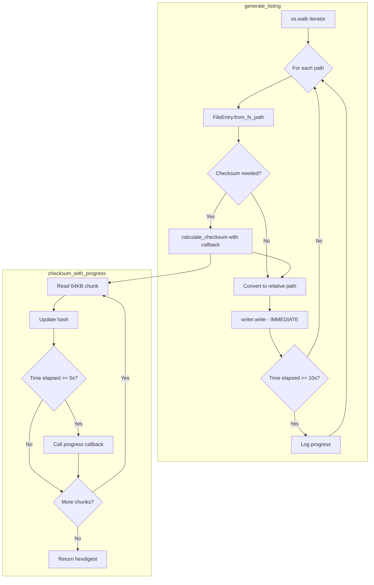

# ValidateCopy Refactoring Plan: Streaming & Progress Improvements

## Executive Summary

This plan addresses three key issues with the current `ValidateCopy` tackle:

1. **StreamingListingWriter inefficiency** — Currently writes entries only after all processing completes
2. **Step-based progress** — Reports progress every N entries instead of time-based updates
3. **No intermediate progress** — Heavy operations like checksum calculation appear frozen

---

## 1. Current State Analysis

### 1.1 StreamingListingWriter Usage Problem

**Location:** [`generate_listing()`](tackles/ValidateCopy.py:277) (lines 277-411)

**Current Flow:**
```
┌─────────────────────────────────────────────────────────────────────┐
│                     CURRENT: Buffered Approach                       │
├─────────────────────────────────────────────────────────────────────┤
│                                                                      │
│   os.walk() ──► _collect_entries() ──► List[FileEntry] (in memory)  │
│                      │                        │                      │
│                      │                        ▼                      │
│                      │              calculate_checksum() loop        │
│                      │                        │                      │
│                      │                        ▼                      │
│                      │              StreamingListingWriter.write()   │
│                      │                  (AFTER all done!)            │
│                      ▼                                               │
│              Progress: every 1000 entries                            │
│                                                                      │
└─────────────────────────────────────────────────────────────────────┘
```

**Problem Code (lines 368-411):**
```python
logger.info("Collecting fs...")
entries = _collect_entries()  # ← Collects ALL entries first
logger.info(f"Collected {len(entries)} entries")

if calculate_checksum:
    logger.info(f"Calculating checksums...")
    for entry in entries:  # ← Processes ALL entries
        entry.calculate_checksum(algorithm=checksum_algorithm)

# Convert all paths to relative (after checksum calculation)
for entry in entries:
    entry.path = os.path.relpath(entry.path, base)

# Write using streaming writer ← TOO LATE!
with StreamingListingWriter(output_path) as writer:
    for entry in entries:  # ← Writes ALL at once
        writer.write(entry)
```

**Impact:**
- Memory usage scales with total files (not streaming)
- No output until 100% complete
- Crash loses all progress
- User sees "frozen" status during checksum phase

### 1.2 Step-Based Progress Pattern

**Current Implementation (multiple locations):**

| Location | Code | Issue |
|----------|------|-------|
| [`parse_listing()`](tackles/ValidateCopy.py:159) line 159 | `progress_interval = 1000` | Fixed count, not time-based |
| [`generate_listing()`](tackles/ValidateCopy.py:310) line 310 | `progress_interval = 1000` | Fixed count |
| [`_do_validate()`](tackles/ValidateCopy.py:926) line 926 | `progress_interval = 1000` | Fixed count |
| [`_do_attr_map()`](tackles/ValidateCopy.py:1042) line 1042 | `progress_interval = 1000` | Fixed count |
| [`_do_copy()`](tackles/ValidateCopy.py:1156) line 1156 | `progress_interval = 1000` | Fixed count |
| [`_do_move()`](tackles/ValidateCopy.py:1252) line 1252 | `progress_interval = 1000` | Fixed count |
| [`_do_delete()`](tackles/ValidateCopy.py:1343) line 1343 | `progress_interval = 1000` | Fixed count |

**Current Pattern:**
```python
progress_interval = 1000
processed = 0
for entry in entries:
    processed += 1
    if processed % progress_interval == 0:  # ← Count-based
        logger.info('Progress: %d/%d', processed, total)
```

**MediaIntegrityCheck Time-Based Pattern (reference):**
```python
last_progress = time.monotonic()
progress_interval = 10  # seconds

for entry in entries:
    # ... process ...
    
    now = time.monotonic()
    if now - last_progress >= progress_interval:  # ← Time-based
        logger.info('Progress: %d/%d (%.1f%%)', processed, total, pct)
        last_progress = now
```

### 1.3 Heavy Operations Without Progress

**Checksum Calculation:** [`common/checksum.py`](common/checksum.py:83) (lines 83-108)

```python
def _run_hashlib(path: str, algorithm: str) -> str:
    file_hash = hashlib.new(algorithm)
    with open(path, "rb") as f:
        while chunk := f.read(8192):  # ← No progress callback!
            file_hash.update(chunk)
    return file_hash.hexdigest()
```

**For a 10GB file:** This loop runs ~1.2 million times with zero feedback.

**Validation Checksum:** [`FileEntry.validate()`](common/FileEntry.py:317) (lines 378-390)

```python
if attr == 'checksum':
    try:
        fs_digest = fs_entry.calculate_checksum(algorithm=algo)  # ← Can take minutes
        if fs_digest != expected:
            errors.append(...)
```

---

## 2. Proposed Changes

### 2.1 Streaming Write During Processing

**New Flow:**
```
┌─────────────────────────────────────────────────────────────────────┐
│                     PROPOSED: True Streaming                         │
├─────────────────────────────────────────────────────────────────────┤
│                                                                      │
│   StreamingListingWriter.open()                                      │
│         │                                                            │
│         ▼                                                            │
│   os.walk() ──► FileEntry.from_fs_path() ──► calculate_checksum()   │
│                        │                            │                │
│                        └────────────────────────────┘                │
│                                    │                                 │
│                                    ▼                                 │
│                        path = os.path.relpath()                      │
│                                    │                                 │
│                                    ▼                                 │
│                        writer.write(entry)  ← IMMEDIATE!             │
│                                    │                                 │
│                                    ▼                                 │
│                        Time-based progress check                     │
│                                                                      │
└─────────────────────────────────────────────────────────────────────┘
```

**Key Changes to [`generate_listing()`](tackles/ValidateCopy.py:277):**

```python
def generate_listing(
    base_dir: str,
    output_path: str,
    allowed_types: set,
    calculate_checksum: bool = False,
    checksum_algorithm: str = 'md5',
    error_csv_path: Optional[Path] = None,
    progress_interval: float = 10.0,  # NEW: seconds
    checksum_progress_callback: Optional[Callable] = None,  # NEW
) -> int:
    """Walk *base_dir* and write entries as they are processed."""
    base = os.path.normpath(base_dir)
    error_count = 0
    
    if error_csv_path is None:
        error_csv_path = get_error_filename(output_path)
    
    # Time-based progress tracking
    last_progress = time.monotonic()
    processed = 0
    
    with (
        StreamingErrorWriter(error_csv_path) as error_writer,
        StreamingListingWriter(output_path) as writer,  # ← Open at start
    ):
        for dirpath, dirnames, filenames in os.walk(base):
            # ... collect paths for this directory ...
            
            for full_path in paths:
                try:
                    fe = FileEntry.from_fs_path(full_path)
                except OSError as exc:
                    # ... error handling ...
                    continue
                
                # Calculate checksum immediately (if requested)
                if calculate_checksum and fe.entry_type == 'f':
                    try:
                        fe.calculate_checksum(
                            algorithm=checksum_algorithm,
                            progress_callback=checksum_progress_callback,  # NEW
                        )
                    except OSError as exc:
                        # ... error handling ...
                        continue
                
                # Convert to relative path BEFORE writing
                fe.path = os.path.relpath(full_path, base)
                
                # Write immediately! ← KEY CHANGE
                writer.write(fe)
                processed += 1
                
                # Time-based progress
                now = time.monotonic()
                if now - last_progress >= progress_interval:
                    logger.info(
                        'Generating listing: %d entries written',
                        processed
                    )
                    last_progress = now
    
    return writer.count
```

### 2.2 Time-Based Progress System

**Create a Progress Helper Class:**

```python
# Add to tackles/ValidateCopy.py or common/progress.py

class ProgressTracker:
    """Time-based progress reporting with optional file-level detail."""
    
    def __init__(
        self,
        total: int,
        operation: str,
        interval_seconds: float = 10.0,
        logger: Optional[logging.Logger] = None,
    ):
        self.total = total
        self.operation = operation
        self.interval = interval_seconds
        self.logger = logger or logging.getLogger(__name__)
        
        self.processed = 0
        self.success = 0
        self.failed = 0
        self.skipped = 0
        self.last_progress_time = time.monotonic()
        self.start_time = time.monotonic()
        self.current_file: Optional[str] = None
    
    def start_file(self, path: str) -> None:
        """Mark that we're starting to process a file."""
        self.current_file = path
    
    def complete(self, status: str = 'success') -> None:
        """Mark current file as complete."""
        self.processed += 1
        if status == 'success':
            self.success += 1
        elif status == 'failed':
            self.failed += 1
        elif status == 'skipped':
            self.skipped += 1
        
        self._maybe_log_progress()
    
    def _maybe_log_progress(self) -> None:
        """Log progress if interval has elapsed."""
        now = time.monotonic()
        if now - self.last_progress_time >= self.interval:
            pct = (self.processed / self.total * 100) if self.total > 0 else 0
            elapsed = now - self.start_time
            rate = self.processed / elapsed if elapsed > 0 else 0
            
            self.logger.info(
                '%s: %d/%d (%.1f%%) | '
                'Success: %d | Failed: %d | Skipped: %d | '
                '%.1f files/sec',
                self.operation,
                self.processed, self.total, pct,
                self.success, self.failed, self.skipped,
                rate,
            )
            self.last_progress_time = now
    
    def log_final(self) -> None:
        """Log final summary."""
        elapsed = time.monotonic() - self.start_time
        self.logger.info(
            '%s complete: %d success, %d failed, %d skipped (%.1fs)',
            self.operation,
            self.success, self.failed, self.skipped,
            elapsed,
        )
```

**Apply to All Processing Methods:**

```python
# Example: _do_validate() refactored
def _do_validate(self) -> int:
    # ... parsing code ...
    
    progress = ProgressTracker(
        total=len(entries),
        operation='Validation',
        interval_seconds=10.0,
        logger=logger,
    )
    
    with StreamingErrorWriter(self.error_csv_path) as error_writer:
        for fe in entries:
            progress.start_file(fe.path)
            
            # ... validation logic ...
            
            if errors:
                error_writer.write((fe, error_msg))
                progress.complete('failed')
            else:
                progress.complete('success')
    
    progress.log_final()
    return 0 if progress.failed == 0 else 1
```

### 2.3 Intermediate Progress for Heavy Operations

**Modify [`common/checksum.py`](common/checksum.py:83):**

```python
from typing import Callable, Optional

# Progress callback signature: (bytes_processed, total_bytes) -> None
ChecksumProgressCallback = Callable[[int, int], None]


def calculate(
    path: str,
    algorithm: str = 'md5',
    utility: str | None = None,
    progress_callback: ChecksumProgressCallback | None = None,
) -> str:
    """Calculate checksum with optional progress reporting."""
    if utility:
        # External utilities don't support progress
        return _run_external(path, utility)
    return _run_hashlib(path, algorithm, progress_callback)


def _run_hashlib(
    path: str,
    algorithm: str,
    progress_callback: ChecksumProgressCallback | None = None,
) -> str:
    """Calculate checksum with chunked progress updates."""
    file_hash = hashlib.new(algorithm)
    
    # Get file size for progress
    file_size = os.path.getsize(path)
    bytes_read = 0
    
    # Progress reporting interval (report every ~10MB or 5 seconds)
    last_progress_time = time.monotonic()
    progress_interval = 5.0  # seconds
    
    with open(path, "rb") as f:
        while chunk := f.read(65536):  # Increased chunk size: 64KB
            file_hash.update(chunk)
            bytes_read += len(chunk)
            
            # Time-based progress callback
            if progress_callback:
                now = time.monotonic()
                if now - last_progress_time >= progress_interval:
                    progress_callback(bytes_read, file_size)
                    last_progress_time = now
    
    # Final callback at 100%
    if progress_callback:
        progress_callback(bytes_read, file_size)
    
    return file_hash.hexdigest()
```

**Modify [`FileEntry.calculate_checksum()`](common/FileEntry.py:416):**

```python
def calculate_checksum(
    self,
    algorithm: str = 'md5',
    utility: str | None = None,
    progress_callback: Callable[[int, int], None] | None = None,
) -> str:
    """Return the hexdigest with optional progress reporting."""
    # ... existing cache check ...
    return self._compute_and_store(algorithm, utility, progress_callback)


def _compute_and_store(
    self,
    algorithm: str,
    utility: str | None,
    progress_callback: Callable[[int, int], None] | None = None,
) -> str:
    """Compute checksum with progress callback support."""
    hexdigest = checksum.calculate(
        self.path,
        algorithm,
        utility,
        progress_callback=progress_callback,
    )
    self.checksum = f'{algorithm}:{hexdigest}'
    return hexdigest
```

**Integration in ValidateCopy:**

```python
def _create_checksum_progress_callback(self, path: str) -> Callable[[int, int], None]:
    """Create a progress callback that logs during long checksum operations."""
    last_log_time = time.monotonic()
    
    def callback(bytes_read: int, total_bytes: int) -> None:
        nonlocal last_log_time
        now = time.monotonic()
        
        # Only log every 10 seconds
        if now - last_log_time >= 10.0:
            pct = (bytes_read / total_bytes * 100) if total_bytes > 0 else 0
            size_mb = bytes_read / (1024 * 1024)
            total_mb = total_bytes / (1024 * 1024)
            logger.info(
                '  Checksum progress: %.1f/%.1f MB (%.1f%%) — %s',
                size_mb, total_mb, pct,
                os.path.basename(path),
            )
            last_log_time = now
    
    return callback
```

---

## 3. Implementation Details

### 3.1 File Changes Summary

| File | Changes |
|------|---------|
| [`tackles/ValidateCopy.py`](tackles/ValidateCopy.py) | Major refactoring of `generate_listing()`, all `_do_*` methods |
| [`common/checksum.py`](common/checksum.py) | Add progress callback support |
| [`common/FileEntry.py`](common/FileEntry.py) | Add progress callback to checksum methods |
| [`docs/ValidateCopy.md`](docs/ValidateCopy.md) | Document new progress behavior |

### 3.2 Refactored [`generate_listing()`](tackles/ValidateCopy.py:277) (Full)

```python
def generate_listing(
    base_dir: str,
    output_path: str,
    allowed_types: set,
    calculate_checksum: bool = False,
    checksum_algorithm: str = 'md5',
    error_csv_path: Optional[Path] = None,
    progress_interval: float = 10.0,
) -> int:
    """Walk *base_dir* and write a canonical CSV listing to *output_path*.
    
    Entries are written as they are processed — true streaming output.
    Progress is logged every *progress_interval* seconds.
    """
    base = os.path.normpath(base_dir)
    error_count = 0
    
    if error_csv_path is None:
        error_csv_path = get_error_filename(output_path)
    
    # Time-based progress
    start_time = time.monotonic()
    last_progress = start_time
    processed = 0
    checksum_count = 0
    
    logger.info('Starting listing generation from: %s', base)
    
    with (
        StreamingErrorWriter(error_csv_path) as error_writer,
        StreamingListingWriter(output_path) as writer,
    ):
        for dirpath, dirnames, filenames in os.walk(base):
            # Collect paths for this directory
            paths: List[str] = []
            
            if 'd' in allowed_types:
                paths.extend(os.path.join(dirpath, d) for d in dirnames)
            if 'f' in allowed_types:
                paths.extend(
                    os.path.join(dirpath, f) for f in filenames
                    if not os.path.islink(os.path.join(dirpath, f))
                )
            if 'l' in allowed_types:
                paths.extend(
                    os.path.join(dirpath, f) for f in filenames
                    if os.path.islink(os.path.join(dirpath, f))
                )
                paths.extend(
                    os.path.join(dirpath, d) for d in dirnames
                    if os.path.islink(os.path.join(dirpath, d))
                )
            
            # Include base directory itself
            if dirpath == base and 'd' in allowed_types:
                paths.insert(0, dirpath)
            
            for full_path in paths:
                # Read filesystem attributes
                try:
                    fe = FileEntry.from_fs_path(full_path)
                except OSError as exc:
                    error_msg = f'Cannot stat: {exc}'
                    logger.error('%s: %s', full_path, error_msg)
                    error_fe = FileEntry(path=full_path)
                    error_writer.write((error_fe, error_msg))
                    error_count += 1
                    continue
                
                # Calculate checksum for files (with progress for large files)
                if calculate_checksum and fe.entry_type == 'f':
                    try:
                        # Create progress callback for this file
                        progress_cb = _create_file_progress_callback(
                            full_path, fe.size
                        )
                        fe.calculate_checksum(
                            algorithm=checksum_algorithm,
                            progress_callback=progress_cb,
                        )
                        checksum_count += 1
                    except OSError as exc:
                        error_msg = f'Cannot calculate checksum: {exc}'
                        logger.error('%s: %s', full_path, error_msg)
                        error_writer.write((fe, error_msg))
                        error_count += 1
                        continue
                
                # Convert to relative path and write immediately
                fe.path = os.path.relpath(full_path, base)
                writer.write(fe)
                processed += 1
                
                # Time-based progress logging
                now = time.monotonic()
                if now - last_progress >= progress_interval:
                    elapsed = now - start_time
                    rate = processed / elapsed if elapsed > 0 else 0
                    logger.info(
                        'Listing progress: %d entries written | '
                        '%d checksums calculated | %.1f entries/sec',
                        processed, checksum_count, rate,
                    )
                    last_progress = now
    
    # Final summary
    elapsed = time.monotonic() - start_time
    logger.info(
        'Listing complete: %d entries, %d errors (%.1fs)',
        writer.count, error_count, elapsed,
    )
    
    if error_count > 0:
        logger.info('Errors written to: %s', error_csv_path)
    
    return writer.count


def _create_file_progress_callback(
    path: str,
    size: Optional[int],
) -> Optional[Callable[[int, int], None]]:
    """Create checksum progress callback for large files only.
    
    Only shows progress for files >= 100MB to avoid log spam.
    """
    MIN_SIZE_FOR_PROGRESS = 100 * 1024 * 1024  # 100 MB
    
    if size is None or size < MIN_SIZE_FOR_PROGRESS:
        return None
    
    last_log = [time.monotonic()]  # Use list for closure mutation
    
    def callback(bytes_read: int, total_bytes: int) -> None:
        now = time.monotonic()
        if now - last_log[0] >= 10.0:  # Log every 10 seconds
            pct = (bytes_read / total_bytes * 100) if total_bytes > 0 else 0
            mb_read = bytes_read / (1024 * 1024)
            mb_total = total_bytes / (1024 * 1024)
            logger.info(
                '  Checksum: %.0f/%.0f MB (%.0f%%) — %s',
                mb_read, mb_total, pct,
                os.path.basename(path),
            )
            last_log[0] = now
    
    return callback
```

### 3.3 Updated Methods Summary

All these methods need the same pattern applied:

| Method | Current Lines | Changes Needed |
|--------|---------------|----------------|
| [`parse_listing()`](tackles/ValidateCopy.py:155) | 155-218 | Time-based progress |
| [`_do_validate()`](tackles/ValidateCopy.py:920) | 920-1038 | Time-based + checksum progress |
| [`_do_attr_map()`](tackles/ValidateCopy.py:1040) | 1040-1145 | Time-based progress |
| [`_do_copy()`](tackles/ValidateCopy.py:1147) | 1147-1241 | Time-based progress |
| [`_do_move()`](tackles/ValidateCopy.py:1243) | 1243-1332 | Time-based progress |
| [`_do_delete()`](tackles/ValidateCopy.py:1334) | 1334-1408 | Time-based progress |

---

## 4. Documentation Updates

### 4.1 Changes to [`docs/ValidateCopy.md`](docs/ValidateCopy.md)

Add a new section after "Overview":

```markdown
## Progress Reporting

ValidateCopy provides time-based progress updates during all operations:

- **Default interval:** 10 seconds between progress messages
- **Large file progress:** Files over 100MB show intermediate checksum progress
- **Streaming output:** In generate mode, entries are written as processed

### Progress Message Format

```
2024-01-15 10:30:45 - INFO - Listing progress: 5000 entries written | 
    3500 checksums calculated | 125.3 entries/sec
2024-01-15 10:30:55 - INFO -   Checksum: 512/1024 MB (50%) — large_video.mp4
```

### Memory Efficiency

The `--generate` mode now uses true streaming:
- Entries are written to the output CSV as they are processed
- Memory usage is constant regardless of directory size
- Progress is saved incrementally (crash recovery possible)
```

---

## 5. Testing Considerations

### 5.1 Test Cases to Add/Update

1. **Streaming behavior verification:**
   - Generate listing for large directory, verify file grows incrementally
   - Interrupt mid-generation, verify partial output is valid CSV

2. **Time-based progress:**
   - Mock `time.monotonic()` to verify progress logs at correct intervals
   - Verify no progress spam for fast operations

3. **Checksum progress callback:**
   - Test with large file (mock), verify callback is called
   - Test with small file, verify no callback overhead

4. **Integration tests:**
   - Verify identical output before/after refactoring
   - Performance comparison (streaming should use less peak memory)

### 5.2 Backward Compatibility

- No CLI changes required
- Output format unchanged
- All existing tests should pass

---

## 6. Risks and Edge Cases

| Risk | Mitigation |
|------|------------|
| Path conversion timing | Ensure `os.path.relpath()` called AFTER checksum but BEFORE write |
| Error during checksum doesn't orphan entry | Use proper exception handling, write to error CSV |
| Progress callback overhead | Only enable for files >= 100MB |
| `time.monotonic()` availability | Standard in Python 3.3+, no concern |
| StreamingListingWriter flush behavior | Already has `flush_on_write=True` by default |

---

## 7. Implementation Order

1. **Phase 1: Checksum progress** (low risk)
   - Add progress callback to `common/checksum.py`
   - Add progress callback to `FileEntry.calculate_checksum()`
   - Test in isolation

2. **Phase 2: Time-based progress** (medium risk)
   - Create `ProgressTracker` helper class
   - Update all `_do_*` methods to use time-based progress
   - Update `parse_listing()` for time-based progress

3. **Phase 3: Streaming generation** (higher risk)
   - Refactor `generate_listing()` to true streaming
   - Test thoroughly with various directory sizes
   - Verify crash recovery (partial output is valid)

4. **Phase 4: Documentation**
   - Update `docs/ValidateCopy.md`
   - Add inline code comments

---

## 8. Mermaid Diagram: New Data Flow



---

## Summary

This refactoring plan transforms `ValidateCopy` from a batch-oriented tool to a true streaming processor with:

1. **Immediate writes** — No more buffering entire directories in memory
2. **Time-based progress** — Consistent UX regardless of file count
3. **Large file feedback** — Users see progress during multi-GB checksum calculations

The changes are backward-compatible and should improve both perceived performance and actual memory efficiency.
